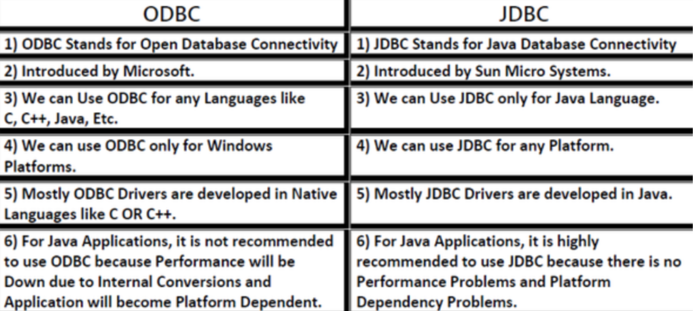

```{r include = FALSE}
colorize <- function(x, color) {
  if (knitr::is_latex_output()) {
    sprintf("\\textcolor{%s}{%s}", color, x)
  } else if (knitr::is_html_output()) {
    sprintf("<span style='color: %s;'>%s</span>", color, 
      x)
  } else x
}
```

## Advanced SQL

What is this section about? Advanced SQL is a pretty generic title, but hey that's what the slides were named. In this chapter we are concerned about 4 topics:

* Accessing SQL from a programming language
* Functions and Procedures
* Triggers
* Recursive Queries

## Why do we need a programming language?

SQL is a powerful language, but a database programmer needs a general purpose programming language for at least two reasons:

* SQL cannot express every query. Often, SQL is used in an embedded fashion with general purpose programming language for such queries.
* Doing meaningful stuff with the data, i.e. showing it to a user via an interface. Querying data is just one task in an application.

## Approaches for accessing SQL from a programming language

There are two:

* Dynamic SQL
  * Dynamically build SQL queries at runtime as character strings and send them to the server
  * APIs: JDBC for Java, ODBC for C/C++/PHP/Visual Basic
* Embedded SQL
  * At compile time, SQL statements are translated to function calls which connnect to the dabatase using an API that provides dynamic SQL facilities.

One issue: A challenge with mixing SQL with a programming language is how data is handled in each. In SQL, we work with **relations** which are tables; in programming languages, we work with **variables** which roughly corresponds to attributes of a tuple in a relation. There needs to be a mechanism so that the programming language can handle the result of a query.

## JDBC

We will be going over JDBC, which an API for Java which allows it to communicate to database systems using SQL. It supports querying/updating/retrieving data and metadata retrieval.

How JDBC communicates with the server:

* Opens a connection to the server
* App creates a $\texttt{Statement}$ object
* Executes queries using the object by sending the SQL query and fetching the results
* Exception mechanism to handle errors

JDBC sections:

* Connecting to the Database
* Shipping SQL Statements to the Database System
* Exceptions and Resource Management
* Retrieving the Result of a Query
* Prepared Statements
* Callable Statements
* Metadata Features
* Other Features
* Database Access from Python

## Connecting to the Database

Well, to use SQL we need a database server. This can be a PostgreSQL server running on another machine or something else. Then, you must connect. In JDBC you can do this using the $\texttt{DriverManager.getConnection()}$ method.

## Creating a Statement Object

When there is a database connection, you can start interacting with the database using the **Statement** class. A Statement represents a SQL statement (with no parameters).

There are three kinds of **Statement** objects:

* Statement: Simple SQL query with no params
* PreparedStatement: subclass of Statement that can have params
* CallableStatement: subclass of PreparedStatement that can have a stored procedure that can have parameters

## Executing the statement

The **Statement** class has a $\texttt{executeQuery()}$ method and a $\texttt{executeUpdate()}$ method. Depending on whether the statement is a query or nonquery, you choose the respective one.

* $\texttt{executeQuery()}$ returns a **ResultSet** object (the relation returned).
* $\texttt{executeUpdate()}$ returns number of rows/tuples affected, if it's a DDL statement it returns 0.

Examples:

```{java}
// Returns ResultSet object with appropriate tuples
statement.executeQuery("SELECT * FROM INSTRUCTOR");
```
```{java}
// Returns number of tuples affected (inserted in this case)
statement.executeUpdate("INSERT INTO instructor VALUES('77987', 'Kim', 'Physics', 98000)");
```

## Exception and Resource Management

You can use Java's *try {...} catch {...}* for handling exceptions. Two classes
of exceptions for JDBC

* SQLException - specific SQL exception
* Exception - General Java exception

With JDBC 4.1 and higher, you can use Java's *try-with-resources* syntax to
close *ResultSet*, *Statement*, and *Connection* objects automatically.

## Retrieving the Result of a Query

Essentially, when you do a query you'll get back a relation. A relation is a
set of tuples. The **RelationSet** object has an internal cursor which is like
some internal state to dictate what row it is currently looking at in the set.
Then, you can use methods such as $\texttt{getString()}$ and
$\texttt{getFloat()}$ which take in a column index or name as a parameter, and
get the appropriate value. Can use the $\texttt{wasNull()}$ method to see if
the value was null.

## Prepared Statement

Remember, this is the statement that has the parameters. Prepared statements
have $\texttt{?}$ for values that will be provided later. You use the methods
such as $\texttt{setString()}$ and $\texttt{setInt()}$. Here is an example.

```{java}
// where conn is a Connection instance
PreparedStatement pStmt = conn.prepareStatement("INSERT INTO instructor VALUES (?,?,?,?)");

pStmt.setString(1, "8877");
pStmt.setString(2, "Alice");
pStmt.setString(3, "Finance");
pStmt.setInt(3, 125000);

pStmt.executeUpdate();

pStmt.setString(1, "888");
pStmt.executeUpdate();
```

`r colorize("WARNING:", "red")` **DO NOT** create SQL queries by concatenating SQL.
This can open the door for **SQL Injection**, a malicious attack. You have been
warned. Always use PreparedStatements instead.


## Update Data in a Table using JDBC

This is pretty straightforward if you understood the concepts from before.
Create a PreparedStatement, make a connection, set the values using the
appropriate methods, and use $\texttt{executeUpdate()}$ to execute the
statement.

## Metadata

**What is it?**

Data, about the data. Like the name of each data field.

**Why should I care about it?**

The Java application (in our scenario) doesn't really know anything about the target database unless it is hardcoded. A Java program would otherwise need to determine the information at runtime to figure out information about the database schema. This approach (determining info at runtime) is preferred since it makes the app more flexible and robust to changes in the database schema.

**How do I use it in JDBC?**

Well, a query result is given in the form of a $\texttt{ResultSet}$ object. It is defined to have a method called $\texttt{getMetadata()}$ which returns a $\texttt{ResultSetMetaData}$ object that contains metadata about the result set. This includes methods such as $\texttt{getColumnCount()}$ and $\texttt{getColumnName()}$ and $\texttt{getColumnTypeName()}$. This is very useful since you do not need to hardcode the schema into the application.

There is also a $\texttt{DatabaseMetaData}$ interface which provides methods to get metadata of the database itself. This includes data such as the db product name, product version, driver name, number of tables, etc. It can be accessed through the $\texttt{Connection}$ interface, which has a $\texttt{getMetaData}$ which returns a $\texttt{DatabaseMetaData}$ object, which has many methods to get metadata of the database and DBMS the app is connected to.

## Transaction Control in JDBC

By default, each SQL statement is treated as a transaction that's committed automatically. Automatic commit can be turned off at the connection level.

```java
conn.setAutoCommit(false);
```

Transactions then need to be committed or rolled back explicitly

```java
conn.commit();
conn.rollback();
```

To turn auto commit back on:

```java
conn.setAutoCommit(false);
```

## Other JDBC features

Calling functions and procedures

```java
CallableStatement cStmt1 = conn.prepareCall("{? = call some function(?)}");
CallableStatement cStmt2 = conn.prepareCall("{call some procedure(?,?)}");
```

## ODBC

**What is it?** It stands for Open DataBase Connectivity Standard. It is a standard API for connecting to a database, sending queries/updates to it, and getting results back.

<span></span>

## Embedded SQL

An Embedded SQL approach involves having direct SQL code in the host language. The SQL standard defines a set of embeddings of SQL in a variety of languages. The way it is processed though is different from how Dynamic SQL is done. Embedded SQL is translated at compile time by a preprocessor to constructs in the host lanaguage so the compiler of the host language can compile it.

Typically, the way Embedded SQL is written is the following:

```SQL
EXEC SQL <SQL STATEMENT>:
```

Where the statement starts with $\texttt{EXEC SQL}$ and terminates with a $\texttt{;}$. This does vary by language though, so this is not the exact way embedded SQL is written across languages.

Before executing SQL though, the program needs to connect to the database. This is done by doing the following:

```SQL
EXEC SQL connect to <server> user <username> using <password>;
```

Variables in the host language can be used in the Embedded SQL. They are preceded with a colon to denote that they are variables of the host language.

Variables though must be declared in a DECLARE section. Example:

```SQL
EXEC SQL BEGIN DECLARE SECTION;
  int credit_amount;
EXEC SQL END DECLARE SECTION;
```

There's also a concept of cursors in embedded SQL. These are just like pointers to a row. Basic overview of how they work:

* Declare a cursor that defines a result set.
* Open the cursor to establush the result set.
* Fetch the data into locals, one row at a time.
* Close the cursor when done.

## SQL Functions and Procedures

Allows developers to write their own functions and store them in the database. Can invoke them from SQL statements. This is good for a few reasons:

* Multiple applications can access the procedures
* Single source of truth
* Apps can call the procedures instead of directly updating DB relations

Example SQL function

```SQL
CREATE FUNCTION dept_count(dept_name varchar(20))
RETURNS integer
BEGIN
DECLARE d_count integer;
  SELECT COUNT (*) INTO d_count
  FROM instructor
  WHERE instructor.dept_name = dept_name
RETURN d_count;
END;
```

There are also SQL procedures and pgSQL (PostgreSQL) functions which are similar in nature. 

One drawback to user-defined functions is that they can't execute transactions. You can't commit inside a function or rollback. PistgreSQL 11 did introduce stored procedures which supported transactions, so that allowed for commiting and rolling back inside of procedures.

You can even create external language routines, where you can use a language such as Java, C#, C, or C++. This is nice since it is typically more efficient and more expressive. Though, there are a few drawbacks.

* Code needed for the function might have to be loaded into the database system, which can lead to accidental corruption of the DB structures. It is also a security risk.
* There are alternatives which could be less performant but have better security.
* Direct execution in the database system's address space is used when efficiency is more important than security.

There are ways to deal with the security problems.

* Use sandbox echniques within the database query execution process. This includes using a safe language like Java or having the code have its own memory area.
* Running the external functions in a separate process, so that it does not have access to the database process's memory.
  * Parameters and results are then communicated via IPC (Inter-process communication).

These are good but they come with their performance costs. Many database systems support both approaches but also allow for direct execution if needed.

## Triggers

Triggers are like callbacks that are called when certain modifications are made to the database. They can be used to implement integrity constraints that SQL can't express. These were introduced to the SQL standard in SQL:1999.

Triggering events can include **insert**, **delete**, or **update**. Triggers can be restricted to specific attributes, and the value can be accessed in the trigger.

Triggers can be activated before the event actually happens, to prevent invalid updates or modify it so it is valid.

  - For example, if a grade is set to $\texttt{F}$ for a student, we could have a trigger that updates their `tot_creds` so that their credit hours reflect the change.

## When to not use Triggers

* Maintaining summary data
* Replicating databases by recording changes to special relations, and having another process apply the changes over to a replica

Nowadays, there are better ways for these

* Databases now provide ways to maintain summary data
* Databases provide built-in support for replication

Triggers can be useful, but they are best avoided when alternatives exist.

## References

[JDBC API Docs](https://docs.oracle.com/javase/8/docs/technotes/guides/jdbc/)

[PreparedStatement](https://docs.oracle.com/javase/7/docs/api/java/sql/PreparedStatement.html)
