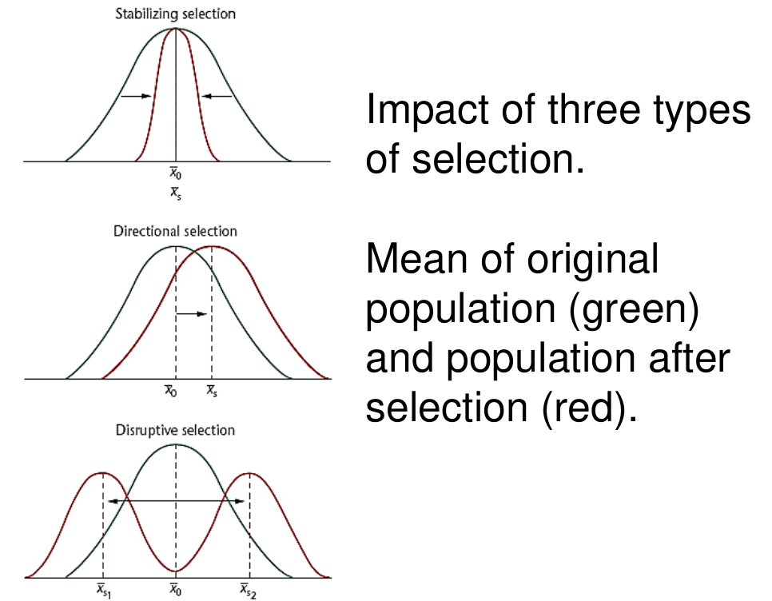

## Overview

* Genetic Variation
* Hardy Weinberg Law
* Allele and Genotype Frequencies
* Forces Acting on Gene Pools
  * Mutation
  * Migration
  * Non-Random Mating
  * Drift
  * Selection

## Population Genetics

* Population Genetics aims to analyze genetic variation in populations, and the forces that affect the variation.
* Uses mathematics to study the changes in allele and genotype frequencies over time.
* Forces include selection, migration, stochastic events (change), which change allele and genotype frequencies.

## Hardy-Weinberg Law (HWL)

* **Gene pool?** -- The total of all alleles in a population.
* HWL is responsible for describing genotype and allele frequences for randomly mating populations.
* If no forces act on a population in *HWL equillibrium*, the proportion of genotypes and alleles will remain the same in the next generation.
The HWL model makes a few assumptions
  * Equal rate of survival and reproduction (no selection)
  * No new alleles arise from mutation
  * No migration into or out of the population
  * Infinitely large population
  * Random mating

## Single Gene Two-Allele System

* Suppose we have two alleles: *A* and *a*
  * If the frequency of A is 0.7 and the frequency of a is 0.3, we can observe:
    * $0.7 + 0.3 = 1$ -- all the alleles of A are accounted for
    * The probability **a gamete** will contain *A* is 0.7
    * The probability **a gamete** will contain *a* is 0.3

* For diploid organisms we can use probability (specifically the multiplication route, since we are dealing with "AND"s) to see the chance of having two certain alleles
* Some calculations of gametes:
  * $AA = 0.7 \times 0.7 = 0.49$
  * $Aa = 0.3 \times 0.7 = 0.21$
  * $aa = 0.3 \times 0.3 = 0.09$
* What do these mean? In the next generation:
  * Frequency of AA is **49%**
  * Frequency of Aa is **42%**
  * Frequency of aa is **9%**

## Taking a look into the Hardy-Weinburg Equation

The distribution of genotypes is:

$$
p^{2} + 2pq + q^{2} = 1
$$

Where:

* $p^{2}$ is the frequency of *AA*
* $2pq$ is the frequency of *Aa*
* $q^{2}$ is the frequency of *aa*

This should make sense, since the sum represents the frequency of each of the homozygotes (dominant and recessive) and the heterozygotes. If $p$ and $q$ represent the frequency of the dominant and recessive allele respectively, it makes since that $pp = p^{2}$ represents the frequency of the *AA* genotype. It also makes sense that $p + q = 1$, since the frequencies of each allele should add up to 1.

From the Hardy-Weinburg equation, it can be seen that if we know the frequency of one genotype, it is possible to find the frequencies of other genotypes. 

## Frequencies of Multiple Alleles

When there are more than two alleles present, we use additional variables in the equation

Example, for three genes: $p + q + r = 1$.

And:
$$
(p + q + r)^{2}
$$

## An example: CF Heterozygote Frequency

* CF is an autosomal recessive disorder
* It affects $1/2500$ in northern Europe
  * This means, assuming $C$ and $c$ are the dominant and recessive alleles respectively, the probability of $cc$ is $1/2500 = 0.0004$. The probability of the recessive allele is given by $q$, so the value of $0.0004$ represents $q^{2}$
  * $q = \sqrt{q^{2}} = \sqrt{0.0004} = 0.02$
  * We also know that $p + q = 1$. So $p = 1 - q = 1 - 0.02 = 0.98$. $p$ represents the frequency of the dominant allele
  * The heterozygote genotype is $Cc$, which is represented by $2pq = 2 (0.98) (0.02) = 0.0392 = 4\%$.

## Changes in Allele Frequency

If the population is not in equillibrium, the HWL assumptions do not hold, and the alleles frequencies can change in future generations. The change in allele frequency is called **microevolution**.

## Forces Acting on Gene Pools

* Mutation
* Migration (gene flow)
* Non-random mating
* Genetic drift (chance), founder effects & bottlenecks
* Selection

## Allele Replacement by Mutation

The recessive allele *d* is the only allele in the population initially. It can be changed to *D* via mutation.

Replacement is high initially but it will take 70,000 generations or 1.4 million years to drive the frequency from 1.0 to 0.5.

## Genetic Drift

* A stochastic process -- occurs randomly through time.
* By change some alleles can be lost from a population and some genotypes can become fixed in a population
* Generally only the case for small populations (with or without random mating)

## Founder Effect

The founder effect is when a small population leaves a large population and establishes a new population. The allele frequencies are determined by the new gene pool, which can differ from the initial large population. Rare alleles can become frequent if one of the founders contains the rare allele.

Amish descended from 30 Swiss founders. One of the founders had Ellis-van Creveld Syndrome (autosomal recessive) which causes short stature, extra fingers and toes, and heart defects. Today, about 1 in 200 Amish are homozygous for the syndrome, which is veyr rare in the larger US population (1 in 60 million).

Isolation and inbreeding can lead to the condition -- the recessive nature of the disorder becomes homozygous through the mating of closely related people.

## Population Bottlenecks

In a bottleneck, most members of a species are wiped out except for a small group of survivors, and hence the smaller group which are the survivors determine the allele frequency from its gene pool when the population expands again.

## Example: Human Bottleneck

Typhoon killed all but 25 people on Pingelap atoll. A single survivor was heterozygous for the recessive disorder *achromatopsia*. The population is now ~250. 30% of them are heterozygotes.

About 10% of the population is homozygous for achromatopsia, compared to a global frequency of 0.003%.

## Fitness and Selection

Advantages in survival and/or reproduction means increased genetic contribution. **Fitness** is an individual's genetic contribution to future generations. Selection of advantageous individuals can vary from less than 1% to 100%.

## Types of Selection

* **Directional**: phenotypes at one end become selected for or against
* **Stabilizing**: favors intermediate phenotypes, against extremes phenotypes
* **Disruptive**: Against intermediate phenotypes, favors **both** extreme phenotypes

```{r, fig.align="center", out.width = "200px", out.height = "200px", echo = FALSE}

```
