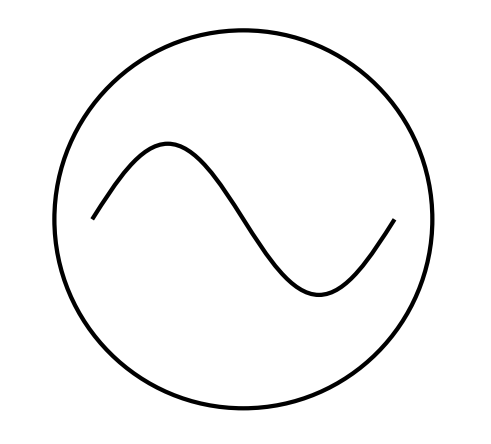

## AC Circuits

Alternating current is what it sounds like. The current and voltage change direction constantly in an AC circuit.

**Why do we use AC?** AC is very efficient in transmitting over long distances.

**What's a sinusoid?** It's a sine wave, you can imagine we will come across sine waves when it comes to alternating current, given how a sine wave oscillates.

**Is there a symbol for it like DC?** Yes, it has a cool sinusoid in it.

```{r, fig.align="center", out.width = "100px", out.height = "100px", echo = FALSE}

```

## Generator and Resistor circuit

Point of the circuit is to implement a generator that will oppose resistive dampening (LC circuits) by sustaining voltage and current oscillations.

Kirchoff's Voltage rule applied to the circuit

$$
I_{R}R = \varepsilon_{m} sin( \omega t )
$$

In other words, the voltage of the generator is equal to the voltage drop of the resistor.

If you plot both the voltage and current for a generator and resistor circuit, they are in phase (aligned).

## Formulas

**Concerning Generator and Capacitor Circuit**

Reactance of Capacitor

$$
X_{c} = \frac{1}{\omega C}
$$

Current for Capacitor

$$
I_{c} = \frac{\varepsilon_{m}}{X_{C}} cos( \omega t )
$$

Voltage for Capacitor

$$
V_{c} = \frac{Q}{C} = \varepsilon_{m} sin( \omega t )
$$

Notes:

* $V_{L}(t)$ **lags** $I_{L}(t)$ by 90$^\circ$ for Generator and Capacitor circuit.

***

**Concerning Generator and Inductor Circuit**

Reactance of Inductor

$$
X_{L} = \omega L
$$

Current for Inductor

$$
I_{L} = - \frac{\varepsilon_{m}}{X_{L}} cos( \omega t )
$$

Voltage of Inductor

$$
V_{L} = L \frac{dI_{L}}{dt} = \varepsilon_{m} sin( \omega t )
$$

***

LCR circuit formulas

$$
I = I_{m} sin( \omega t - \phi )
$$

$$
tan \phi = \frac{X_{L} - X_{C}}{R}
$$

$$
I_{m} = \frac{\varepsilon_{m}}{\sqrt{R^{2} + ( X_{L} - X_{C} )^{2}}} = \frac{\varepsilon_{m}}{Z}
$$

$$
Z = \sqrt{R^{2} + ( X_{L} - X_{C} )^{2}}
$$

Notes:

* $V_{L}(t)$ **leads** $I_{L}(t)$ by 90$^\circ$ for Generator and Inductor circuit.

