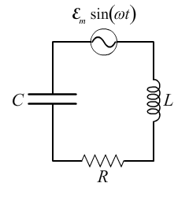

## AC Circuits

Alternating current is what it sounds like. The current and voltage change direction constantly in an AC circuit.

**Why do we use AC?** AC is very efficient in transmitting over long distances.

**What's a sinusoid?** It's a sine wave, you can imagine we will come across sine waves when it comes to alternating current, given how a sine wave oscillates.

**Is there a symbol for it like DC?** Yes, it has a cool sinusoid in it.

```{r, fig.align="center", out.width = "100px", out.height = "100px", echo = FALSE}
knitr::include_graphics("../../../../img/ac_symbol.png")
```

## Generator and Resistor circuit

Point of the circuit is to implement a generator that will oppose resistive dampening (LC circuits) by sustaining voltage and current oscillations.

Kirchoff's Voltage rule applied to the circuit

$$
I_{R}R = \varepsilon_{m} sin( \omega t )
$$

In other words, the voltage of the generator is equal to the voltage drop of the resistor.

If you plot both the voltage and current for a generator and resistor circuit, they are in phase (aligned).

## Analyzing an AC Circuit Question

### Problem

First, consider the following circuit:

```{r, fig.align="center", out.width = "100px", out.height = "100px", echo = FALSE}

```

This circuit is composed of a generator, resistor, inductor, and capacitor.

Here are relevant values:

* $\varepsilon_{m}$ -- 9V (Maximum Voltage of Generator)
* $\omega$ -- $300 \frac{rad}{sec}$ (Frequency of Generator)
* R -- 2 $\Omega$ (Resistance of Resistor)
* L -- 5 mH (Inductance of Inductor)
* C -- 700 $\mu F$ (Capacitance of capacitor)

**Question:** What is the maximum voltage across the inductor, $V_{L_{max}}$?

### Explained Solution

Well, first it's important to note that **any** circuit problem can be done using Kirchoff's Laws. However, this in particular is an AC circuit problem. For these problems, we take an approach that uses **phasors**. Phasors are a form of geometric analysis which will allow us to form an **impedance triangle** using the voltage drops of the individual components (resistor, inductor, and capacitor in this case). Recall that the impedance is simply the measure of opposition a circuit presents when a voltage is applied. The impedance triangle will allow us to calculate the **impedance of the circuit**. When the impedance of the circuit is obtained, we can essentially compute **any circuit value** we need, including but not limited to the **phase, maximum voltages, and maximum current**.

So, with all that being said, it's obvious we first want to create our impedance triangle. To construct the triangle, we first need to determine the reactances of both the inductor and capacitor. These parameters are trivial to find, as they are functions of the **frequency of the generator, capacitance, and inductance**. Once those numeric values are found, the geometric triangle can actually be constructed by drawing out the phasors. A valid question to ask is what the orientation of the vectors in the phasor diagram will be. These are determined by the actual phase relationships of the voltages of the components. In our scenario:

* The voltage across the inductor is going to lead the resistor by 90$^\circ$
* The voltage across the resistor is going to lead the capacitor by 90$^\circ$

The phasors are then added **as vectors**. Since we are dealing with an LCR circuit, the vectors in question are the following:

* The resistance of the resistor
* The reactance of the inductor
* The reactance of the capacitor

The sum of the vectors gets us the **impedance of the circuit**:

$$
\vec{Z} = \vec{R} + \vec{X_{L}} + \vec{X_{C}}
$$

Since we are adding these **as vectors**, calculating the magnitude is done as so:

$$
Z = \sqrt{R^{2} + ( X_{L} - X_{C} )^{2}}
$$

Then, the maximum current in the circuit can be calculated using the impedance value.

$$
I_{m} = \frac{\varepsilon_{m}}{Z}
$$

Then, finding the voltage across the inductor is simple -- **Ohm's law**. Instead of a resistance, we use a reactance. Reactance is similar to resistance, but it differs in the fact that the energy is not dissipated as heat, but rather the energy is stored in the reactance (think of inductors and capacitors).

$$
V_{L_{max}} = I_{m} X_{L}
$$

### Implementation of Explained Solution

Find reactances of inductor and capacitor:

$$
X_{L} = \omega L = ( 300 \frac{rad}{sec} ) ( 0.005H ) = 1.5 \Omega
$$
$$
X_{C} = \frac{1}{\omega C} = \frac{1}{( 300 \frac{rad}{sec} )(0.7 \times 10^{-3} F)} = 4.76 \Omega
$$

Find magnitude of circuit impedance:

$$
Z = \sqrt{2^{2} + 3.26^{2}} \Omega = 3.83 \Omega
$$

Find maximum value of current:

$$
I_{m} = \frac{\varepsilon_{m}}{Z} = \frac{9V}{3.83 \Omega} = 2.35 A
$$

Find maximum voltage of inductor:

$$
V_{L_{max}} = I_{m} X_{L} = (2.35 A)(1.5 \Omega ) = 3.53 V
$$

**Answer:** 3.53 V

### Summary

Generally, if you want to **find a circuit parameter in an LCR circuit**, you are going to **want to use phasors**. Use the frequency to determine the reactances of the inductor and capacitor, and then once you have those you can find the impedance of the circuit pretty easily (see equation). After you get the impedance, you can find the maximum current of the circuit, which will allow you to find any circuit parameter, at any time.

## Formulas

**Concerning Generator and Capacitor Circuit**

Reactance of Capacitor

$$
X_{c} = \frac{1}{\omega C}
$$

Current for Capacitor

$$
I_{c} = \frac{\varepsilon_{m}}{X_{C}} cos( \omega t )
$$

Voltage for Capacitor

$$
V_{c} = \frac{Q}{C} = \varepsilon_{m} sin( \omega t )
$$

Notes:

* $V_{L}(t)$ **lags** $I_{L}(t)$ by 90$^\circ$ for Generator and Capacitor circuit.

***

**Concerning Generator and Inductor Circuit**

Reactance of Inductor

$$
X_{L} = \omega L
$$

Current for Inductor

$$
I_{L} = - \frac{\varepsilon_{m}}{X_{L}} cos( \omega t )
$$

Voltage of Inductor

$$
V_{L} = L \frac{dI_{L}}{dt} = \varepsilon_{m} sin( \omega t )
$$

***

LCR circuit formulas

$$
I = I_{m} sin( \omega t - \phi )
$$

$$
tan \phi = \frac{X_{L} - X_{C}}{R}
$$

$$
I_{m} = \frac{\varepsilon_{m}}{\sqrt{R^{2} + ( X_{L} - X_{C} )^{2}}} = \frac{\varepsilon_{m}}{Z}
$$

$$
Z = \sqrt{R^{2} + ( X_{L} - X_{C} )^{2}}
$$

Notes:

* $V_{L}(t)$ **leads** $I_{L}(t)$ by 90$^\circ$ for Generator and Inductor circuit.

