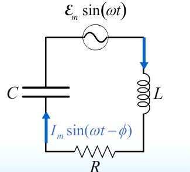

What this section is about:

* Resonance
* Power
* Transformers

## Some Review from AC Circuits

Properties of Phase:

* $\phi$ is positive when $X_{L} > X_{C}$ ($I$ lags $\varepsilon$)
* $\phi$ is negative when $X_{L} < X_{C}$ ($I$ leads $\varepsilon$)

## Resonance

$I_{m}$ is maxed out when:

* $\omega$ = $\omega_{0}$
* $Z$ (impedance) is minimized ($X_{L} = X_{C}$)
* $\omega_{0} = \frac{1}{\sqrt{LC}}$
* Maximum current is delivered to the circuit when **the driving frequency is set to the natural frequency of the corresponding LC circuit**.
  * At this frequency it is as if the resistor is the only element present.
  * The current through the resistor would also be at phase with the generator.
  * $\phi$ is 0 when in resonance

## Formulas

"Frequency dependence of the maximum current"

$$
cos( \phi ) = \frac{1}{\sqrt{1+Q^{2} \frac{( x^{2} - 1 )^{2}}{x^{2}}}}
$$

$$
I_{m} = \frac{\varepsilon_{m}}{R} \frac{1}{\sqrt{1+Q^{2} \frac{( x^{2} - 1 )^{2}}{x^{2}}}}
$$

Where:

$x$ is...

$$
x = \frac{ \omega }{ \omega_{0} }
$$

$\omega_{0}$ is...

$$
\omega_{0} = \frac{1}{\sqrt{LC}}
$$

$Q^{2}$ is...

$$
Q^{2} = \frac{L}{R^{2} C}
$$

***

Average Power per Cycle

$$
P_{generator} = P_{resistor} = \frac{1}{2} I_{m} \varepsilon_{m} cos( \phi ) = \varepsilon_{rms} I_{rms} cos( \phi ) = \frac{\varepsilon_{rms}^{2}}{R} cos^{2}( \phi )
$$

Notes:

* Power of generator is equal to power of resistor
* $cos ( \phi )$ is also known as power factor.
* $rms$ is Root Mean Squared

***

*Transformer Equations*

$$
V_{S} = \frac{N_{S}}{N_{P}} V_{P}
$$

$$
I_{P} = \frac{N_{S}}{N_{P}} I_{S}
$$

Where:

* $V_{S}$ is the induced voltage in the secondary coil
* $V_{P}$ is the voltage of the generator for the primary coil
* $N_{P}$ is the number of turns in the primary coil
* $N_{S}$ is the number of turns in the secondary coil
* $I_{P}$ is current of primary coil
* $I_{S}$ is current of secondary coil

Notes:

* Transformer only works for changing currents. Induced voltage of secondary coil for DC is 0 since there will not be any change in flux.

## Worked Out Example

Consider the circuit below:

```{r, fig.align="center", out.width = "100px", out.height = "100px", echo = FALSE}

```

It is composed of a generator, a resistor, an inductor, and a capacitor.

Here are some values associated with this problem:

* $\varepsilon_{m}$ = 100 V
* $L$ = 3 mH
* $C$ = 5 $\mu$F
* $I_{m}( \omega_{0} )$ = 4 A

## Question

What is the peak current, $I_{m} ( \omega_{0} / 2 )$, when the frequency is half the resonant frequency?

## Scoping out the problem

Since this is an AC circuit, we can usually determine any unknown circuit parameter using phasors. First, it is good to know that at the resonant frequency, the maximum peak current is reached. This is when $X_{L} = X_{C}$, in other words this is when the impedance of the circuit is solely due to the resistor (since $X_{L} - X_{C}$ is `0`, that means the impedance only depends on the resistor).

## Analyzing how to tackle the problem

Our plan of attack will be the following

* Find the resonant frequency (by setting the reactances equal to each other)
* Create Impedance Triangle when the frequency is half
  * To do this, we need to know the resistance in the circuit.
  * Determine reactances
  * Add Phasors as Vectors
* Find maximum current at $\omega_{0} / 2$ using the calculated Impedance value

## Implementation of plan

Find resonant frequency

$$
X_{L} = X_{C}
$$
$$
\omega L = \frac{1}{ \omega C }
$$
$$
\omega_{0} = \frac{1}{ \sqrt{LC} }
$$
$$
\omega_{0} = 8165\ rad/sec
$$

Finding resistance of circuit. We know at resonant frequency this is just equal to:

$$
R = \frac{\varepsilon_{m}}{I_{m} ( \omega_{0} )} = \frac{100 V}{4 A} = 25 \Omega
$$

Find new reactances:

$$
X_{L} = 0.5 \omega_{0} C
$$
$$
X_{C} = \frac{1}{0.5 \omega_{0} C}
$$

Find reactance component in impedance formula:

$$
X_{L} - X_{C} = -36.7 \Omega
$$

Find max current at $\omega_{0} / 2$:

$$
I_{max} = \frac{\varepsilon_{m}}{Z} = 2.25 A
$$

Problem solved! Let's summarize what we did so this might help for future problems:

* As an AC circuit problem (LCR), we can use phasors
* Understand properties of circuit when the frequency is at the resonant frequency
  * The reactances are equal to each other
  * The resistance can be found using the maximum current at resonant frequency and maximum voltage.
* Using impedance triangle, we can find any circuit parameter
