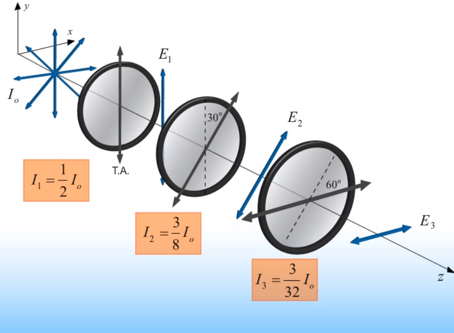

The purpose of this is to discuss possible polarizations of EM waves.

## Linear Polarization

Polarizations are defined using one field: **the E-field**.

## Linear Polarizer Example

```{r, fig.align="center", out.width = "400px", out.height = "350px", echo = FALSE}

```

## Other Polarization States

For linear polarization, we say that $\phi \equiv \phi_{x} - \phi_{y} = 0$. This is not always the case, however.

In fact, a different type of polarization, **circular polarization**, requires the relative phase ($\phi$) abides to the following: $\phi \equiv \phi_{x} - \phi_{y} = \pm \frac{\pi}{2}$. In the scenario that the $\pm \frac{\pi}{2}$ is *positive*, it can be observed that the x component of the electric field would be proportional to the $cos$, whereas the y component would be proportional to the $sin$. Otherwise, if $\pm \frac{\pi}{2}$ was *negative*, the x component of the electric field would be proportional to the $sin$, whereas the y component would be proportional to the $cos$.

## Circular Polarization

Two types:

* Right-handed circular polarization
* Left-handed circular polarization

Assuming a wave is going in the positive Z direction:

* **Right-handed circular polarization** is when the $\phi$ component ($\frac{\pi}{2}$) is **positive**
* **Left-handed circular polarization** is when the $\phi$ component ($\frac{\pi}{2}$) is **negative**

The terminology for these makes sense since for the right-handed circular polarization, the E-field goes up and to the right (since $cos$ corresponds to $E_{x}$), whereas for the left-handed circular polarization, the E-field goes down and to the left (since $cos$ corresponds to $E_{y}$).

## Birefringence

Birefringent materials can change an individual component's speed. Therefore, if a wave entered the material in phase, it can exit the material with the components out of phase. Thus, we can produce a circular polarized wave.

To determine the handedness of a wave after passing through a birefringent material, simply curl your fingers from the "slow" component to the "fast" component. If your thumb points in the direction of the wave propagation, then it is right-handed circular polarization, otherwise it is left-handed circular polarization.

## Formulas

E-field defined using a unit vector $\hat{e}$ which defines the direction of polarization. $\phi$ specifies E-field strength at $z=t=0$

$$
E = \hat{e} E_{0} sin ( kz - \omega t + \phi )
$$

X and Y component magnitudes, where $\theta$ is the angle between the unit vector $\hat{e}$ and x axis.

$$
E_{x} =  E_{0} cos \theta sin ( kz - \omega t + \phi )
$$

$$
E_{y} =  E_{0} sin \theta sin ( kz - \omega t + \phi )
$$

*Polarizers*

Final Intensity after unpolarized light through polarizer

$$
I_{final} = \frac{1}{2} I_{0}
$$

Final Intensity after polarized light through polarizer

$$
I_{final} = I_{0} cos^{2} \theta
$$

Birefringent Phase Difference between components

$$
\Delta \phi = \phi_{y} - \phi_{x} = \omega d ( \frac{1}{v_{fast}} - \frac{1}{v_{slow}} )
$$

Where:

* $d$ is the thickness of the birefringent material.
* $\omega$ is the angular frequency
* $v_{fast}$ is the "fast" velocity resulting from the birefringent material.
* $v_{slow}$ is the "slow" velocity resulting from the birefringent material.
