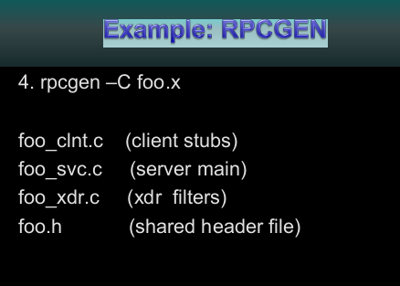

## Remote Procedure Call

* Client-Server provides a mechanism for services in distributed systems BUT
  * requires explicit-communication (send-receive)
* How do we make distributed computing look like normal?
* Can we use procedure calls?

### Parameter Passing

* RPC has to pass parameters
* RPC can simulate through
  * Stubs -- proxies
  * Marshaling
* What about globals?

### Stubs

* Client makes a procedure call to the client stub
* Defined from an IDL (Interface Definition Language)
* Stubs take care of the marshaling and sending over the network
* **Marshaling** -- Packaging of the arguments

### RPC Steps

* Client call stub
* Client Stub does marshalling
* Client OS sends to Remote OS
* Server stub unpacks params
* Server does work and returns to stub
* Server stub does marshaling
* Server OS sends to Client OS
* Client OS gives to Client stub
* Client Stub unpacks and returns to app

### Problems in Marshalling

* Different machines can have different archs and data formats
  * i.e.: little endian, SPARC: big endian
* How do we pass pointers
  * What it it points to a struct
  * What if it points to a struct with pointers
* Marshalling transforms the params into a **byte stream**

### Failure Semantics

* Server can crash, client can crash, etc.

Client and Server should be cognizant of these failure semantics.

### SUNRPC - Binder: Port Mapper

* On start up, the server creates port.
* Server stub calls *svc_register* to register program #, version #, with local port mapper.
* Port mapper stores prog #, version #, and port.
* On start up client will call *clnt_create* to locate the server port
* Upon return, the client can now call procedures on the server.

