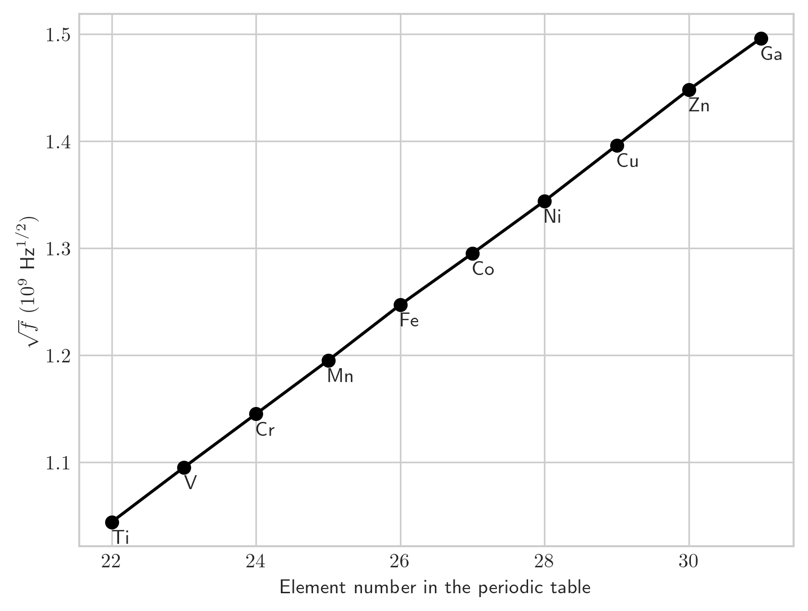

## Formulas

### Properties of Atoms

Magnitude of the **orbital angular momentum** of an electron trapped in an atom has quantized values given by:

$$
L = \sqrt{\ell ( \ell + 1 )} \hbar
$$

Where:

* $\hbar$ is reduced Planck's constant $\frac{h}{2 \pi}$
* $\ell$ is the orbital quantum number and has values $0, 1, 2, \dots , (n - 1)$
  * $n$ is the electron's principal quantum number

The **component** $L_{z}$ of the **orbital angular momentum** on a $z$ axis is quantized and given by:

$$
L_{z} = m_{\ell} \hbar
$$

Where:

* $m_{\ell}$ is the orbital magnetic quantum number and has values $0, \pm 1, \pm 2, \dots , \pm \ell$

The magnitude $\mu_{orb}$ of the **orbital magnetic moment** of the electron is quantized with the values given by:

$$
\mu_{\text{orb}} = \frac{e}{2m} \sqrt{\ell ( \ell + 1)} \hbar
$$

Where:

* $m$ is the electron mass

The **component** $\mu_{\text{orb},z}$ on a $z$ axis is also quantized according to:

$$
\mu_{\text{orb},z} = - \frac{e}{2m} m_{\ell} \hbar = - m_{\ell} \mu_{B}
$$

Where:

* $\mu_{B}$ is the Bohr magneton:

  $$
  \mu_{B} = \frac{eh}{4 \pi m} = \frac{e \hbar}{2m} = 9.274 \times 10^{-24} \text{J/T}
  $$

Every electron, whether trapped or free, has an intrisic **spin angular momentum** $\vec{S}$ with a magnitude that is quantized as:

$$
S = \sqrt{s (s + 1)} \hbar
$$

Where:

* $s$ is the spin quantum number ($s = \frac{1}{2}$)
* An electron is said to be a spin-$\frac{1}{2}$ particle.

The component $S_{z}$ on a $z$ axis is also quantized according to:

$$
S_{z} = m_{s} \hbar
$$

For:

* $m_{s} = \pm s = \pm \frac{1}{2}$

Where:

* $m_{s}$ is the spin magnetic quantum number

Every electron, whether trapped or free, has an intrinsic spin magnetic dipole moment $\vec{\mu_{s}}$ with a magnitude that is quantized as:

$$
\mu_{s} = \frac{e}{m} \sqrt{s (s + 1)} \hbar
$$

For:

* $s = \frac{1}{2}$

The component $\mu_{s,z}$ on a $z$ axis is also quantized according to:

$$
\mu_{s,z} = -2 m_{s} \mu_{B}
$$

For:

* $m_{s} = \pm \frac{1}{2}$

### The Stern-Gerlach Experiment

An atom with a magnetic dipole moment experiences a force in a nonuniform magnetic field. If the field changes at the rate $dB/dZ$ along a $z$ axis, then the force along the $z$ axis and its magnitude is related to the component $\mu_{z}$ of the dipole moment:

$$
F_{z} = \mu_{z} \frac{dB}{dz}
$$

The energy required of a photon to spin-flip the proton between the two orientation is:

$$
hf = 2 \mu_{z} B
$$

Where:

* $\mu_{z}$ is the magnetic dipole moment in the $z$ axis

The **Pauli exclusion principle** states that electrons in a trap (such as an atom) require that they do not have the same set of the quantum numbers.

### Building the Periodic Table

States with the same value of quantum number $n$ form a shell.

States with the same values of quantum numbers $n$ and $\ell$ form a subshell $n$ and $\ell$ form a subshell.

### X-Rays and the ordering of the elements

The shortest wavelength in the spectrum is the cutoff wavelength $\lambda_{\text{min}}$ which is emitted when an incident electron loses its full kinetic energy $K_{0}$ in a single collision:

$$
\lambda_{\text{min}} = \frac{hc}{K_{0}}
$$

## Problems

## Problem 1

This problem is regarding **properties of atoms**. 

> An electron in a hydrogen atom is in state with $\ell = 5$. What is the minimum possible value of the semiclassical angle between $\vec{L}$ and $L_{z}$?

For this question, we use:

$$
cos\ \theta = \frac{L_{z}}{L}
$$

We know $L$ is given by:

$$
\sqrt{\ell (\ell + 1 )} \hbar = \sqrt{5 * 6} \hbar = \sqrt{30} \hbar
$$

We know $L_{z}$ is given by:

$$
m_{\ell} \hbar
$$

Where:

$$
m_{\ell} = 0, \pm 1, \pm 2, \dots , \pm \ell
$$

To minimize the semi-classical angle $\theta$, we then expect $cos\ \theta$ to be close to 1 since $cos\ 0 = 1$. Considering $\sqrt{30} \approx 5.5$, we should choose the magnetic quantum number $m_{\ell}$ closest to this to get the ratio of 1. We can choose from $-5 \dots 5$, so we choose $5$. Now, we can solve for $\theta$:

$$
cos\ \theta = \frac{5 \hbar}{\sqrt{30} \hbar}
$$

$$
cos\ \theta = \frac{5 }{\sqrt{30}}
$$

$$
\theta = cos^{-1}\ \frac{5}{\sqrt{30}}
$$

Thus, our answer is $\theta = 24.1^{\circ}$.

## Problem 4

This problem is regarding **properties of atoms**. 

> How many electron states are there in the following shells:
> 
> * $n = 4$
> * $n = 1$
> * $n = 3$
> * $n = 2$

We know the number of electron states in a shell can be found by using the following:

$$
2n^{2}
$$

I will prove this; this is because, for a shell $n$ we can find the number of electrons by summing up electrons in the subshells (Recall for each there are $n$ subshells for a shell ($\ell$ can be $0, \dots , n - 1$), and $2 \ell + 1$ possible values for $m_{\ell}$ for any subshell, and 2 possible spin magnetic quantum number values):

$$
\sum_{\ell = 0}^{n - 1} 2 (2 \ell + 1)
$$

$$
2(2*0 + 1) + 2(2*0 + 1) + \dots + 2(2*(n-1) + 1)
$$

We can rearrange this as:

$$
2n + 4 * \sum_{\ell = 0}^{n - 1} \ell
$$

Using Gauss' Trick, we can evaluate the sum in the expression as:

$$
\sum_{\ell = 0}^{n - 1} \ell = n * \frac{n - 1}{2}
$$

$$
2n + 4n * \frac{n - 1}{2}
$$

$$
2n + 2n (n - 1)
$$

$$
2n (1 + n - 1)
$$

$$
2n^{2}
$$

Thus, our answers are:

* $2 * (4^{2}) = 32$
* $2 * (1^{2}) = 2$
* $2 * (3^{2}) = 18$
* $2 * (2^{2}) = 8$

## Problem 10

This problem is regarding **properties of atoms**. 

> An electron is in a state with $n = 3$. What are
> 
> * the number of possible values of $\ell$
> * the number of possible values of $m_{\ell}$
> * the number of possible values of $m_{s}$
> * the number of states in the $n = 3$ shell
> * the number of subshells in the $n = 3$ shell?

The possible values for $\ell$ are $0 \dots n - 1$, so there are **3** possible values.

The possible values of $m_{\ell}$ is dependent on $\ell$, the orbital quantum number. The number of values of $m_{\ell}$ for any $\ell$ is $2 \ell + 1$ (since the range is from $- \ell, \dots , \ell$). We know $\ell$ can be $0, 1, 2$ in this question, so:

$$
(2 * 0 + 1) + (2 * 1 + 1) + (2 * 2 + 1) = 9
$$

Thus, the number of possible values of $m_{\ell}$ is **9**.

The electron is said to be a spin-$\frac{1}{2}$ particle. There are **two** possible spin quantum numbers for electrons (spin up/spin down), which is our answer.

The number of states in the $n = 3$ shell is $2n^{2} = 2 * 3^{2} =$ **18**, our answer.

The number of subshells in the $n = 3$ state corresponds to the number of possible values for the orbital quantum number, which was **3** as we calculated previously. This is our answer for this part as well.

## Problem 13

This problem is regarding **properties of atoms**. 

> What is the acceleration of a silver atom as it passes through the deflecting magnet in the Stern-Gerlach experiment of Fig. 40-8 if the magnetic field gradient is 1.4 T/mm?

For this question, we can assume that the field gradient has the same value throughout the region, so the force component and the acceleration are constant:

$$
a_{z} = \frac{F_{z}}{M} = \frac{\mu_{B} (\frac{dB}{dz})}{M}
$$

$$
\frac{(9.27 \times 10^{-24}) * (1400)}{1.8 \times 10^{-25}}
$$

Thus, our answer is $72\ \text{km/s}^{2}$.

## Problem 18

This problem is regarding **magnetic resonance**. 

> A hydrogen atom in its ground state actually has two possible, closely spaced energy levels because the electron is in the magnetic field B of the proton (the nucleus). Accordingly, an energy is associated with the orientation of the electron's magnetic moment $\mu$ relative to B, and the electron is said to be either spin up (higher energy) or spin down (lower energy) in that field. If the electron is excited to the higher-energy level, it can de-excite by spin-flipping and emitting a photon. The wavelength associated with that photon is 21 cm. (Such a process occurs extensively in the Milky Way galaxy, and reception of the 21 cm radiation by radio telescopes reveals where hydrogen gas lies between stars.) What is the effective magnitude of B as experienced by the electron in the ground-state hydrogen atom?

To solve this question, we can use the fact that we know the energy needed to spin-flip the electron:

$$
hf = 2 \mu_{z} B
$$

Solve for $B$:

$$
\frac{hc}{\lambda} = 2 \mu_{z} B
$$

$$
B = \frac{hc}{2 \lambda \mu_{z}} 
$$

Using $\mu_{z} = \mu_{b}$ (Bohr magneton):

$$
B = \frac{1240}{2 * (21 \times 10^{7}) * (5.788 \times 10^{-5})} 
$$

Thus, our answer is $51\ \text{mT}$.

## Problem 21

This problem is regarding **the exclusion principle and multiple electrons in a trap**. 

> Seven electrons are trapped in a one-dimensional infinite potential well of width L. What multiple of $\frac{h^{2}}{8mL^{2}}$ gives the energy of the ground state of this system? Assume that the electrons do not interact with one another, and do not neglect spin.

Considering the electrons are trapped in a one-dimensional infinite potential well, we only have to consider one quantum number $n$. For each quantum number can exist two electrons that have two different spins (spin-up, spin-down). Thus, we will have 4 energy levels, 3 of which are filled with 2, and the last with 1. We can represent the energy like so:

$$
2 * ( (1)^{2} * \frac{h^{2}}{8mL^{2}}) + 2 * ( (2)^{2} * \frac{h^{2}}{8mL^{2}}) + 2 * ( (3)^{2} * \frac{h^{2}}{8mL^{2}}) + 1 * ( (4)^{2} * \frac{h^{2}}{8mL^{2}})
$$

$$
44 \frac{h^{2}}{8mL^{2}}
$$

Thus, $44$ is our answer.

## Problem 32

This problem is regarding **building the periodic table**. 

> Suppose two electrons in an atom have quantum numbers $n = 2$ and $\ell = 1$.
> 
> * How many states are possible for those two electrons? (Keep in mind that the electrons are indistinguishable.)
> * If the Pauli exclusion principle did not apply to the electrons, how many states would be possible?

Notice that the quantum magnetic number can only be $m_{\ell} = -1, 0, 1$, and the spin only can have two values (positive half or negative half). This is a total of 6 arrangements per electron. Per the Pauli exclusion principle, electrons in a trap (such as an atom) require that they do not have the same set of the quantum numbers. So, we can model this using a combination (namely, 6 states choose 2), since doing it without replacement will enforce this principle. 6 choose 2 is **15**, which is our answer.

If the Pauli exclusion principle did not apply, we have an extra 6 states because the two electrons can have the same state, per state (1 * 6 = 6). Thus, our answer is 15 + 6 = **21** for this question.

## Problem 35

This problem is regarding **X Rays and the Ordering of the Elements**. 

> In Fig. 40-13, the x rays shown are produced when 35.0 keV electrons strike a molybdenum (Z = 42) target. If the accelerating potential is maintained at this value but a silver (Z = 47) target is used instead, what values of
> 
> * $\lambda_{\text{min}}$
> * the wavelength of the $K_{\alpha}$ line
> * the wavelength of the $K_{\beta}$ line result? The K, L, and M atomic x-ray levels for silver (compare Fig. 40-15) are 25.51, 3.56, and 0.53 keV.

For this question, we know:

$$
K_{0} = \frac{hc}{\lambda_{\text{min}}}
$$

So, solve for $\lambda_{\text{min}}$:

$$
\lambda_{\text{min}} = \frac{1240 \times 10^{-9}}{35 \times 10^{3}}
$$

This comes out to be $\lambda_{\text{min}} = 35.4\text{ pm}$, our answer.

Now, we need to solve for $K_{\alpha}$, which is the wavelength of the emitted photon when an L shell electron occupies a vacancy of a K shell electron:

$$
K_{\alpha} = \frac{hc}{(25.51 - 3.56) \times 10^{3}} = \frac{1240 \times 10^{-9}}{21.95 \times 10^{3}}
$$

Thus, our answer is $K_{\alpha} = 56.5\text{ pm}$

Now, we need to solve for $K_{\beta}$, which is the wavelength of the emitted photon when an M shell electron occupies a vacancy of a K shell electron:

$$
K_{\beta} = \frac{hc}{(25.51 - 0.53) \times 10^{3}} = \frac{1240 \times 10^{-9}}{24.98 \times 10^{3}}
$$

Thus, our answer is $K_{\beta} = 49.6\text{ pm}$

## Problem 38

This problem is regarding **X Rays and the Ordering of the Elements**. 

> Make a Moseley plot (like that in Fig. 40-16) from these data and verify that its slope agrees with the value given for $C$ in Module 40-6.

Notice that:

$$
\frac{(1.496 - 1.044) * 10^{9}}{(31 - 22)} \approx 4.96 \times 10^{7}\text{ Hz}^{1/2}
$$

## Problem 48

This problem is regarding **lasers**.

> A high-powered laser beam ($\lambda = 600\text{ nm}$) with a beam diameter of $12\text{ cm}$ is aimed at the Moon, $3.8 \times 10^{5}\text{ km}$ distant. The beam spreads only because of diffraction. The angular location of the edge of the central diffraction disk (see Eq. 36‑12) is given by
> 
> $$
> \sin \theta = \frac{1.22}{d}
> $$
> 
> where $d$ is the diameter of the beam aperture. What is the diameter of the central diffraction disk on the Moon's surface?

From the given wavelength of the laser beam, we can see that $\theta$ is very small, so the small angle approximation applies here (namely, $sin \theta \approx tan \theta \approx \theta$). Thus:

$$
\theta = \frac{1.22 \lambda}{d}
$$

Notice:

$$
\theta \approx (tan \theta = \frac{r_{\text{moon}}}{d_{\text{moon}}})
$$

Where $r_{\text{moon}}$ and $d_{\text{moon}}$ are the radius of the diffraction disk on the moon and distance to the moon respectively.

We can set these two expressions for $\theta$ equal to each other:

$$
\frac{1.22 \lambda}{d} = \frac{r_{\text{moon}}}{d_{\text{moon}}}
$$

Now, we can simply solve for $r_{\text{moon}}$:

$$
\frac{1.22 \lambda d_{\text{moon}}}{d} = r_{\text{moon}}
$$

Furthermore, we can double this radius for the distance of the central diffraction disk:

$$
d_{\text{moon}} = \frac{2 * 1.22 \lambda d_{\text{moon}}}{d}
$$

$$
d_{\text{moon}} = \frac{2.44 * (600 \times 10^{-9}) * (3.8 \times 10^{8})}{0.12}
$$

Thus, our answer is 4636 m.

## Problem 50

This problem is regarding **lasers**.

> A hypothetical atom has only two atomic energy levels, separated by 3.2 eV. Suppose that at a certain altitude in the atmosphere of a star there are $6.1 \times 10^{13}/\text{cm}^{3}$ of these atoms in the higher-energy state and $2.5 \times 10^{15}/\text{cm}^{3}$ in the lower-energy state. What is the temperature of the star's atmosphere at that altitude?

We can solve this equation using Eq 40-29:

$$
N_{x} = N_{0} e^{\frac{-(E_{x} - E_{0})}{kT}}
$$

Solve for $T$:

$$
T = \frac{E_{x} - E_{0}}{- \ln \frac{N_{x}}{N_{0}} k}
$$

$$
T = \frac{3.2}{- \ln \frac{6.1 \times 10^{13}}{2.5 \times 10^{15}} * 8.617 \times 10^{-5}}
$$

Thus, our answer is $1.0 \times 10^{4}\text{ K}$.
