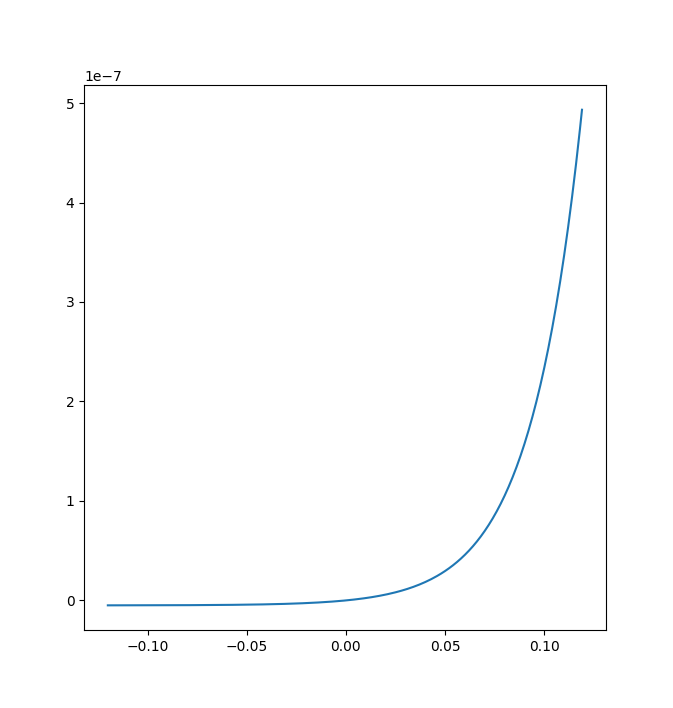

## Formulas

### Electrical Properties of Metals

**Crystalline solids**

Quantized energy levels for a crystalline solid form bands that are separated by gaps. In a metal, the highest band is partially filled with electrons, and the highest filled level at a temperature of 0K is called the Fermi level $E_{F}$.

_Conduction electrons_

Number density of conduction electrons (number per unit volume):

$$
n = \frac{\text{material's density}}{M/N_{A}}
$$

Where:

* $M$ is the material's molar mass
* $N_{A}$ is Avogadro's number

Number density of states of the allowed energy levels per unit volume and per unit energy interval is:

$$
N(E) = \frac{8 \sqrt{2} \pi m^{3/2}}{h^{3}} E^{1/2}
$$

Where:

* $m$ is the electron mass
* $E$ is the energy _in joules_ at which $N(E)$ is to be evaluated

Occupancy probability $P(E)$ tells us that a given available state will be occupied by an electron:

$$
P(E) = \frac{1}{e^{\frac{E - E_{F}}{kT}} + 1}
$$

The density of occupied states $N_{O}(E)$ is given by:

$$
N_{O}(E) = N(E) P(E)
$$

Fermi energy $E_{F}$:

$$
E_{F} = \frac{0.121 h^{2}}{m} n^{2/3}
$$

## Problems

## Problem 1

This problem is regarding **the electrical properties of metals**.

> Show that Eq. 41-9 can be weitten as $E_{\rm F} = An^{\frac{2}{3}}$, where the constant $A$ has the value $3.65 \times 10^{-19}\ m^{2} \cdot \text{eV}$.

Eq 41-9 is as follows:

$$
E_{\rm F} = \frac{0.121 h^{2}}{m} n^{\frac{2}{3}}
$$

Let us express Planck's constant $h$ in terms of Joules, and the mass of the electron in kilograms.

$$
E_{\rm F} = \frac{0.121 * (6.626 \times 10^{-34})^{2}}{9.11 \times 10^{-31}} n^{\frac{2}{3}}
$$

Let us simplify the constants:

$$
E_{\rm F} = 5.83 \times 10^{-38} n^{\frac{2}{3}}
$$

The units of this constant $5.83 \times 10^{-38}$ are $\frac{J^{2} s^{2}}{kg}$, or $J \cdot m^{2}$. We can simply divide by $1.602 \times 10^{-19}$ to convert to $eV \cdot m^{2}$.

$$
E_{\rm F} = \frac{5.83 \times 10^{-38}}{1.602 \times 10^{-19}} n^{\frac{2}{3}}
$$

This reduces to a constant which matches the value of $A$, the constant given in the question:

$$
E_{\rm F} = (3.65 \times 10^{-19}) * n^{\frac{2}{3}}
$$

## Problem 6

This problem is regarding **the electrical properties of metals**.

> Use Eq. 41-9 to verify 7.0 eV as copper's Fermi energy.

Equation 41-9 is as follows

$$
E_{\rm F} = An^{\frac{2}{3}}
$$

Where $A = 3.65 \times 10^{-19}\rm{ eV} \cdot \rm{m}^{2}$

We need to find the number of conduction electrons in a unit volume $n$. To do this, we can use the following equation as an intermediary step (we first need the number of atoms in the sample to determine the conduction electron count):

$$
\text{number of atoms in sample} = \frac{\text{density of copper} * N_{A}}{\text{molar mass of copper}}
$$

We know the density of copper and the molar mass of copper (notice I use $g/m^{3}$ for my density units):

$$
\text{number of atoms in sample} = \frac{(8.96 \times 10^{6}) * (6.02 \times 10^{23})}{63.546}
$$

Evaluating this, we know there are $8.5 \times 10^{28}$ atoms per unit volume. We know that copper has 1 valence electron, so each atom contributes 1 conduction electron to the sample.

Now, we can use $n = 8.5 \times 10^{28}$ in Eq 41-9:

$$
E_{\rm F} = An^{\frac{2}{3}}
$$

$$
E_{\rm F} = (3.65 \times 10^{-19}) (8.5 \times 10^{28})^{\frac{2}{3}}
$$

This comes out to be $7.0\text{ eV}$, our answer.

## Problem 7

This problem is regarding **the electrical properties of metals**.

> What is the probability that a state 0.0620 eV above the Fermi energy will be occupied at
> 
> * T = 0 K 
> * T = 320 K?

For this question, we use Eq 41-6, which is the occupancy probability:

$$
P(E) = \frac{1}{e^{(E - E_{F})/kT} + 1}
$$

We know the difference $E - E_{F}$ is 0.0620 eV because it tells us in the question, so we can simply evaluate this expression inputting the temperatures.

Though, at absolute 0, there won't be any thermal agitation. Thus, we know $P(E) = 0$ at absolute 0 since the conduction band will be completely unoccupied. Thus, $P(E) = 0$ is our answer when $T = 0$.

When $T = 320$, then:

$$
\frac{1}{e^{0.0620/(8.617 \times 10^{-5} * 320)} + 1}
$$

Thus, our answer is 0.0955 when $T = 320$.

## Problem 10

This problem is regarding **the electrical properties of metals**.

> Show that the probability P(E) that an energy level having energy E is not occupied is
> 
> $$
> P(E) = \frac{1}{e^{- \Delta E/kT} + 1}
> $$
> 
> where $\Delta E = E - E_{\rm F}$.

The probability of _not_ having an energy level having enevery $E$ occupied is given by:

$$
P(E) = 1 - P'(E)
$$

Where I denote $P'(E) = \frac{1}{e^{(E - E_{F})/kT} + 1}$ as the occupancy probability (probability of an energy level having energy E occupied).

$$
1 - P'(E) = 1 - \frac{1}{e^{\Delta E/kT} + 1}
$$

Let $z = \Delta E/kT$:

$$
1 - P'(E) = 1 - \frac{1}{e^{z} + 1} = \frac{e^{z} + 1}{e^{z} + 1} - \frac{1}{e^{z} + 1}
$$

$$
1 - P'(E) = \frac{e^{z} + 1 - 1}{e^{z} + 1} = \frac{e^{z}}{e^{z} + 1}
$$

Multiply numerator and denominator by $\frac{1}{e^{z}}$:

$$
\frac{e^{z}}{e^{z} + 1} = \frac{1}{1 + \frac{1}{e^{z}}} = \frac{1}{e^{-z} + 1}
$$

Substitute $\Delta E/kT$ in for $z$:

$$
P(E) = 1 - P'(E) = \frac{1}{e^{- \Delta E/kT} + 1}
$$

## Problem 27

This problem is regarding **the electrical properties of metals**.

> Zinc is a bivalent metal. Calculate
> 
> * the number density of conduction electrons
> * the Fermi energy
> * the Fermi speed
> * the de Broglie wavelength corresponding to this electron speed.
>
> See Appendix F for the needed data on zinc.

First, let us find the number of atoms of Zinc per unit volume:

$$
\text{number of atoms in sample} = \frac{\text{density of zinc} * N_{A}}{\text{molar mass of zinc}}
$$

$$
\text{number of atoms in sample} = \frac{7.133 \times 10^{6} * (6.02 \times 10^{23})}{65.37}
$$

We find the number of atoms in sample to be $6.57 \times 10^{28}$. Now, we can find the number of conduction electrons per unit volume to be:

$$
\text{number of atoms in sample} * 2
$$

since the valence of Zinc is 2. This comes out to be $1.31 \times 10^{29}\text{ m}^{-3}$ (the number of conduction electrons per unit volume), our answer for the number density of conduction electrons.

We can calculate the Fermi energy using:

$$
E_{\rm F} = A n^{2/3}
$$

Where $A = 3.65 \times 10^{-19}\rm{ eV} \cdot \rm{m}^{2}$ and $n$ is the number of conduction electrons per unit volume.

$$
E_{\rm F} = 3.65 \times 10^{-19} * (1.31 \times 10^{29})^{2/3}
$$

This comes out to be $E_{\rm F} = 9.43\text{ eV}$, our answer for the Fermi energy.

We can then find the Fermi speed using:

$$
E_{\rm F} = \frac{1}{2} mv^{2}
$$

$$
v = \sqrt{\frac{E_{\rm F} * 2}{m}}
$$

$$
v = \sqrt{\frac{9.43 * (1.602 \times 10^{-19}) * 2}{9.11 \times 10^{-31}}}
$$

This comes out to be $1.82 \times 10^{6}$ m/s, our answer for the Fermi speed.

Now, we can find the de Broglie wavelength:

$$
\lambda = \frac{h}{p} = \frac{h}{mv} = \frac{6.626 \times 10^{-34}}{9.11 \times 10^{-31} * (1.82 \times 10^{6})} = 0.40\text{ nm}
$$

Thus, our answer for the de Broglie wavelength is $0.40\text{ nm}$.

## Problem 31

This problem is regarding **semiconductors and doping**.

> What maximum light wavelength will excite an electron in the valence band of diamond to the conduction band? The energy gap is 5.50 eV. In what part of the electromagnetic spectrum does this wavelength lie?

For this question we can use:

$$
E = \frac{hc}{\lambda}
$$

Solve for $\lambda$

$$
\lambda = \frac{hc}{E} = \frac{1240}{5.50}
$$

This comes out to be 225nm, our answer, which falls in the **ultraviolet** range in the electromagnetic spectrum.

## Problem 33

This problem is regarding **semiconductors and doping**.

> The occupancy probability function (Eq. 41-6) can be applied to semiconductors as well as to metals. In semiconductors the Fermi energy is close to the midpoint of the gap between the valence band and the conduction band. For germanium, the gap width is 0.67 eV. What is the probability that:
> 
> * a state at the bottom of the conduction band is occupied
> * a state at the top of the valence band is not occupied?
> 
> Assume that $T = 290 K$. (Note: In a pure semiconductor, the Fermi energy lies symmetrically between the population of conduction electrons and the population of holes and thus is at the center of the gap. There need not be an available state at the location of the Fermi energy.)

First, recognize that the difference $\Delta E = E - E_{F}$ is going to be $\Delta E = 0.67 / 2 = 0.335\text{ eV}$ when we are considering states at the bottom of the conduction band. Knowing, this, we can calculate the occupancy probability:

$$
P(E) = \frac{1}{e^{\frac{0.335}{(8.617 \times 10^{-5}) * 290}} + 1}
$$

This turns out to be $1.5 \times 10^{-6}$, our answer for the first part.

We can similarly calculate the second part, knowing that $\Delta E = E - E_{F}$ will be $\Delta E = -1 * (0.67 / 2) = -0.335\text{ eV}$. Since we want to find the complement of this, we will do $1 - P'(E)$ to find the value, where $P'(E)$ represents the probability that a state of the top of the valence band is occupied.

$$
P(E) = 1 - \frac{1}{e^{\frac{-0.335}{(8.617 \times 10^{-5}) * 290}} + 1}
$$

This turns out to be $1.5 \times 10^{-6}$, our answer for the second part.

## Problem 38

This problem is regarding **semiconductors and doping**.

> Pure silicon at room temperature has an electron number density in the conduction band of about $5 \times 10^{15}\text{ m}^{-3}$ and an equal density of holes in the valence band. Suppose that one of every $10^{7}$ silicon atoms is replaced by a phosphorus atom.
> 
> * Which type will the doped semiconductor be, n or p?
> * What charge carrier number density will the phosphorus add?
> * What is the ratio of the charge carrier number density (electrons in the conduction band and holes in the valence band) in the doped silicon to that in pure silicon?

The doped semiconductor will be **n-type** because Phosphorus has one more valence electron than Silicon.

The added charge carrier density is going to be the number of silicon atoms that are doped. To find this amount, we first can find the number density of silicon in a sample volume:

$$
n = \frac{\text{density of silicon} * N_{A}}{\text{molar mass of silicon}} = \frac{(2.33 \times 10^{6}) * (6.02 \times 10^{23})}{28.1}
$$

Now, we can find the number of doped atoms by multiplying by $10^{-7}$. This comes out to be $5.0 \times 10^{21}\text{ m}^{-3}$, our answer for the second part.

To find the ratio between the charge carrier number density in the doped and pure silicon, we do:

$$
\frac{5.0 \times 10^{21}\text{ m}^{-3}}{2 * (5.0 \times 10^{15}\text{ m}^{-3})}
$$

We multiply by two because holes from the valence and electrons in the conduction band both count to the charge carrier density. This comes out to be $5.0 \times 10^{5}$, our answer.

## Problem 40

This problem is regarding **the p-n junction and the transistor**.

> For an ideal p-n junction rectifier with a sharp boundary between its two semiconducting sides, the current I is related to the potential difference V across the rectifier by
> 
> $$
> I = I_{0} (e^{eV/kT} - 1)
> $$
> 
> where $I_{0}$, which depends on the materials but not on I or V, is called the reverse saturation current. The potential difference V is positive if the rectifier is forward-biased and negative if it is back-biased.
> 
> * Verify that this expression predicts the behavior of a junction rectifier by graphing I versus V from -0.12 V to +0.12 V. Take $T = 300 K$ and $I_{0} = 5.0$ nA.
> * For the same temperature, calculate the ratio of the current for a 0.50 V forward bias to the current for a 0.50 V back bias.

Here is my graph:

To calculate the ratio, we can do:

$$
\frac{I_{0} (e^{eV/kT} - 1)}{I_{0} (e^{eV/kT} - 1)} = \frac{e^{0.50/((8.62 \times 10^{-5}) * 300)} - 1}{e^{-0.50/((8.62 \times 10^{-5}) * 300)} - 1}
$$

This comes out to be $2.50 \times 10^{8}$, our answer. Recall, the back-bias corresponds to a negative voltage, which is why we use $-0.50$ as $V$ in the denominator.

## Problem 41

This problem is regarding **the p-n junction and the transistor**.

> In a particular crystal, the highest occupied band is full. The crystal is transparent to light of wavelengths longer than 295 nm but opaque at shorter wavelengths. Calculate, in electron-volts, the gap between the highest occupied band and the next higher (empty) band for this material.

For this question, we can solve this using:

$$
E = \frac{hc}{\lambda} = \frac{1240}{295}
$$

This comes out to be $4.20$ eV, our answer.
