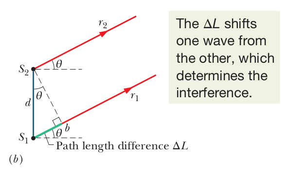

## Constants

**Avogadro's number**, a mole of a substance contains $N_{A}$ elementary units:

$$
N_{A} = 6.022 \times 10^{23}\text{ mol}^{-1}
$$

**Ideal Gas** constant:

$$
R = 8.31\text{ J/mol*K}
$$

**Stefan-Boltzmann** constant:

$$
\sigma = 5.670 \times 10^{-8}\text{ W * m}^{-2}\text{* K}^{-4}
$$

## Formulas -- Waves

Wave speed **across a string**

\begin{equation}
    \label{eq:wave_speed_string}
    v = \sqrt{\frac{\tau}{\mu}}
\end{equation}

Where:

* $\tau$ is the elastic property, or the **tension** in this case
* $\mu$ is the inertial property, or the **linear density** in this case

Sound level $\beta$ in decibels from an intensity $I$

\begin{equation}
    \label{eq:decibel_intensity}
    \beta = ( 10 dB ) log \frac{I}{I_{0}} 
\end{equation}

Where:

* $I_{0} = 10^{-12}\ W/m^{2}$; $I_{0}$ is a reference intensity level.

**Doppler Effect**

$$
f^{'} = f \frac{v \pm v_{D}}{v \pm v_{S}}
$$

Where:

* $v$ is the speed of sound
* $v_{D}$ is the speed of the detector
* $v_{S}$ is the speed of the source

Notes:

* `+` when receiver moves towards the source
* `-` when receiver moves away the source
* `+` when source moves away the receiver
* `-` when source moves towards the receiver

## Formulas -- Temperature

Formal definition of temperature (Intuition derived from Constant Volume Gas Thermometer)

$$
T = ( 273.16\ K ) ( \lim_{gas \to 0} \frac{p}{p_{3}} )
$$

Kelvin to Celsius:

$$
T_{C} = T - 273.15^{\circ}
$$

Celsius to Fahrenheit:

$$
T_{F} = \frac{9}{5} T_{C} + 32^{\circ}
$$

## Formulas -- Thermal Expansion

**Linear Expansion**

\begin{equation}
    \label{eq:linear_expansion}
    \Delta L = L \alpha \Delta T
\end{equation}

Where:

* $\alpha$ is the **coefficient of linear expansion**, this value depends on the material. It somewhat varies with temperature, but for most practical purposes it can be taken as a constant for a particular material.

**Volume Expansion**
Change in volume $V$ of a solid or liquid is given by:

\begin{equation}
    \label{eq:volume_expansion}
    \Delta V  = V \beta \Delta T
\end{equation}

Notes:

* $\beta = 3 \alpha$, this is the material's coefficient of volume expansion
* $\alpha$ is the coefficient of linear expansion

## Formulas -- Specific Heat

Heat capacity:

$$
C = cm
$$

Where:

* $c$ is the specific heat of the substance

Specific heat formula:

$$
Q = mc \Delta T = C \Delta T
$$

## Formulas -- Heats of Transformation

**Heat Transfer involved in Phase Changes**

\begin{equation}
    \label{eq:phase_change_heat_transfer}
    Q = Lm
\end{equation}

Where:

* For an object of mass $m$ and latent heat of $L$ (constant that can be found by a table as it depends on material), this formula gives the heat required $Q$ for a specific phase change

Work done by a gas as it expands/contracts from an initial to a final volume:

$$
dW = p dV
$$

\begin{equation}
    \label{eq:gas_work}
    W = \int_{}^{} dW = \int_{v_{i}}^{v_{f}} p dV
\end{equation}

## Formulas -- First law of Thermodynamics

First law of thermodynamics. This expresses how energy is conserved for a thermodynamic process:

\begin{equation}
    \label{eq:thermo_first}
    \Delta E_{int} = Q_{into} - W_{by}
\end{equation}

Notes:

* $\Delta E_{int}$ is the internal energy of the material, which depends only on the material's state (temp, volume, pressure) 
* $Q$ represents the energy exchanged as heat between the systems and its surroundings
  * It is **positive** when the system **absorbs** heat 
  * It is **negative** when the system **loses** heat 
* $W$ is the work done _by_ the system
  * It is **positive** when the system **expands** against an external force 
  * It is **negative** when the system **contracts** because of an external force 
* This makes sense, because if both ($Q$ and $W$) were positive, then the gas would be absorbing heat and expanding, which is definitely a net increase in the energy. Conversely, if the gas were losing heat and contracting it would make sense that it is losing energy.
* $Q$ and $W$ are also path dependent, whereas $\Delta E_{int}$ is path independent
  * This means that $Q$ and $W$ do depend on the process that caused the change. Think of it in terms of the integral -- the area under the curve can differ even if the starting and endpoint are the same. Conversely, $\Delta E_{int}$ is path independent.

## Formulas -- Heat Transfer Mechanisms, Conduction

### Conduction Explained

Conduction is when energy is transferred between an environment and an object via a conducting material.

---

Rate at which energy is conducted from a hot reservoir to a cold reservoir via a conducting slab:

\begin{equation}
    \label{eq:thermal_conduction}
    P_{cond} = \frac{Q}{t} = kA \frac{T_{H} - T_{C}}{L}
\end{equation}

Where:

* $P_{cond}$ is the rate which energy conducts through the slab (conduction rate)
* $t$ is the time of the process
* $Q$ is the energy transferred (as heat)
* Each face of the conducting slab has an area $A$
* $L$ is the length of the slab
* $k$ is the **thermal conductivity**, which is a constant that depends on the material of the slab. A material that can readily transfer energy conduction is naturally a good thermal conductor, and has a high value of $k$. There is a table for this for common metals, gases, and building materials in the textbook.

Thermal resistance to conduction (R-value)

"R-value" insulation formula

\begin{equation}
    \label{eq:r_insulation_formula}
    R = \frac{L}{k}
\end{equation}

Where:

* $L$ refers to the thickness of the material
* $k$ is the thermal conductivity of the material

Notes:

* High R-value is a poor conductor (good insulator)
* Low R-value is a good conductor (poor insulator)

## Formulas -- Heat Transfer Mechanisms, Radiation

### Radiation Explained

An environment and an object can also exchange energy by radiation. Meaning, energy as heat can be transferred via electromagnetic waves. This radiation is often called thermal radiation to distinguish it from other waves on the electromagnetic spectrum, say the ones used in nuclear radiation and electromagnetic signals. For example, when you stand in front of a fire, you absorb heat energy from the fire via thermal radiation -- the thermal energy of the fire thus decreases. **No medium** is required to transfer heat via radiation, which is why the Sun can transport thermal radiation through a vacuum.

---

**Rate of Thermal Radiation Energy Emission**

\begin{equation}
    \label{eq:radiation_energy_emission_rate}
    P_{rad} = \sigma \varepsilon A T^{4}
\end{equation}

Notes:

* $\sigma$ is $5.6704 \times 10^{-8}\ W/m^{2} \cdot K^{4}$. This is called the _Stefan-Boltzmann_ constant.
* $\varepsilon$ is the _emissivity_ of the object's surface. It has a value between 0 and 1. It depends on the composition of the surface.
  * A surface with an emissivity of 1.0 (the max) is better at radiating energy, because emissivity is the measure of an object's ability to emit infrared energy.
* $T$ must be in Kelvins, it is the temperature of the area of the object
* Similarly, $A$ is the object's surface area.

Similarly, there is a formula for the **rate of thermal radiation energy absorption**:

\begin{equation}
    \label{eq:radiation_energy_absorption_rate}
    P_{abs} = \sigma \varepsilon A T^{4}_{env}
\end{equation}

Notes:

* The emissivity is the same as the respective emission equation.

We can then determine the net heat transfer rate:

\begin{equation}
    \label{eq:net_heat_transfer_rate}
    P_{net} = \sigma \varepsilon A T^{4}_{env} - \sigma \varepsilon A T^{4} = \sigma \varepsilon A (T^{4}_{env} - T^{4})
\end{equation}

Notes:

* $P_{net}$ is positive if energy gained by radiation (absorption)
* $P_{net}$ is negative if energy lost by radiation (emission)

## Formulas -- Kinetic Theory, Avogadro's number

Molar mass (mass, to mass per mole):

\begin{equation}
    \label{eq:molar_mass}
    M = m N_{A}
\end{equation}

Moles per mass sample:

\begin{equation}
    \label{eq:moles_per_mass_sample}
    n = \frac{N}{N_{A}} = \frac{M_{sam}}{M} = \frac{M_{sam}}{m N_{A}}
\end{equation}

## Formulas -- Kinetic Theory, Ideal Gases

Ideal Gas formula

\begin{equation}
    \label{eq:ideal_gas_law}
    pV = nRT
\end{equation}

Where:

* $p$ is the pressure of the gas
* $V$ is the volume of the gas
* $n$ is the number of moles of the gas
* $R$ is known as the gas constant ($8.31$ J/mol * k)
* $T$ is the temperature of the gas

Ideal gas law in terms of elementary units, $N$:

\begin{equation}
    \label{eq:ideal_gas_law_molecules}
    pV = NkT
\end{equation}

Where:

* $N$ is the number of elementary units
* $k$ is the Boltzmann constant ($1.38 \times 10^{-23}$ J/K)

The **work done** when **volume of an ideal gas changes** (and **temperature stays constant** [isothermal]):

\begin{equation}
    \label{eq:isothermal_process_work}
    W = nRT ln ( \frac{V_{f}}{V_{i}} )
\end{equation}

## Formulas -- Kinetic Theory; Pressure, Temp, and RMS speed

Pressure exerted by $n$ moles of an ideal gas

\begin{equation}
    \label{eq:ideal_gas_pressure}
    p = \frac{n M v^{2}_{rms}}{3V}
\end{equation}

Where:

* $v_{rms} = \sqrt{(v^{2})_{avg}}$, this is the root-mean-squared speed of the gas molecules
* $M$ is the molar mass of the gas
* $V$ is the volume of the gas
* $n$ is the number of moles

**RMS (root-mean-squared) speed** expressed in terms of temperature and molar mass:

\begin{equation}
    \label{eq:rms_terms_temperature}
    v_{rms} = \sqrt{\frac{3RT}{M}}
\end{equation}

Where:

* $T$ is the temperature of the gas
* $R$ is known as the gas constant ($8.31$ J/mol * k)
* $M$ is the molar mass of the gas

## Formulas -- Kinetic Theory; Translational Kinetic Energy

Average **translational kinetic energy per molecule in an ideal gas** _in terms of temperature_:

\begin{equation}
    \label{eq:translational_kinetic_energy_temperature}
    K_{avg} = \frac{3}{2} k T
\end{equation}

Where:

* $k$ is the Boltzmann constant ($1.38 \times 10^{-23}$ J/K)

## Formulas -- Kinetic Theory; Mean Free Path

Mean free path of a molecule (average distance traveled between collisions of a molecule):

\begin{equation}
    \label{eq:mean_free_path}
    \lambda = \frac{1}{\sqrt{2} \pi d^{2} N/V}
\end{equation}

Where:

* $d$ is the diameter of the molecule
* $N/V$ is the number of molecules per unit volume

## Formulas -- Kinetic Theory; Maxwell Distribution

\begin{equation}
    \label{eq:maxwell_speed_distribution}
    P(v) = 4 \pi ( \frac{M}{2 \pi RT} )^{\frac{3}{2}} v^{2} e^{\frac{-M v^{2}}{2RT}}
\end{equation}

Based on this distribution, we can find a few speeds of interest relative to the distribution:

The average speed of the distribution is given by

\begin{equation}
    \label{eq:avg_speed_maxwell_dist}
    v_{avg} = \sqrt{\frac{8RT}{\pi M}}
\end{equation}

The most probable speed of the distribution is given by

\begin{equation}
    \label{eq:probable_speed_maxwell_dist}
    v_{p} = \sqrt{\frac{2RT}{M}}
\end{equation}

## Formulas -- Kinetic Theory; Molar Specific Heats for Ideal Gases

### Molar Specific Heats

For an ideal monatomic gas:

$$
C_{v} = \frac{3}{2} R = 12.5\text{J/mol * k}
$$

For a gas that is diatomic and molecules that rotate and do not oscillate:

$$
C_{v} = \frac{7}{2} R
$$

Molar specific heat from constant volume to constant pressure

$$
C_{p} = C_{v} + R
$$

---

Molar specific heat at **constant volume**:

$$
C_{v} = \frac{Q}{n \Delta T}
$$

Molar specific heat at **constant pressure**:

$$
C_{p} = \frac{Q}{n \Delta T}
$$

Change in internal energy due to temp change of an ideal gas:

\begin{equation}
    \label{eq:work_ideal_gas_deltatemp}
    \Delta E_{int} = n C_{v} \Delta T
\end{equation}

Where:

* $Q$ is the energy transferred as heat to or from a sample of $n$ moles.
* $\Delta T$ is the resulting temperature change from the energy transfer

Work related to ideal gas law:

$$
W = p \Delta V = n R \Delta T
$$

## Formulas -- Kinetic Theory; Adiabatic Expansion of an Ideal Gas

When an ideal gas undergoes a slow adiabatic volume change (Q = 0):

$$
p V^{\gamma} = \text{a constant}
$$

Where:

* $\gamma = \frac{C_{p}}{C_{v}}$ (ratio of molar specific heats)

For free expansion:

$$
pV = \text{a constant}
$$

## Formulas -- Entropy and the Second Law; Entropy

Entropy change $\Delta S$ for a reversible process that takes a system between the initial to final (or vice versa) state:

$$
\Delta S = S_{f} - S_{i} = \int_{i}^{f} \frac{dQ}{T}
$$

Where:

* $Q$ is the energy transferred as heat to or from the system during the process
* $T$ is the temperature of the system in kelvins during the process

When an ideal gas (reversibly) changes from an initial state, with changes to temp and volume, the change in entropy of the gas is:

$$
\Delta S = S_{f} - S_{i} = nR ln \frac{V_{f}}{V_{i}} = n C_{v} ln \frac{T_{f}}{T_{i}}
$$

## Formulas -- Entropy and the Second Law; Engines

Efficiency $\varepsilon$ of an engine:

$$
\varepsilon = \frac{\text{energy we get}}{\text{energy we pay for}} = \frac{\lvert W \rvert}{\lvert Q_{H} \rvert}
$$

Carnot engine efficiency

$$
\varepsilon_{C} = 1 - \frac{\lvert Q_{L} \rvert}{\lvert Q_{H} \rvert} = 1 - \frac{T_{L}}{T_{H}}
$$

Where:

* $T_{H}$ is the temperature of the high-temperature reservoir
* $T_{L}$ is the temperature of the low-temperature reservoir

Notes:

* Real Carnot engines always have an efficient lower than that of a Carnot engines. Even ideal engines that are not Carnot engines also have efficiencies that are lower than a Carnot engine
* A perfect engine is where we extract heat from a hot reservoir and convert it straight into work. Though, an engine like this would violate the second law of thermodynamics.

## Formulas -- Entropy and the Second Law; Refrigerators and Real Engines

Coefficient of performance $K$ for a refrigerator:

$$
K = \frac{\text{what we want}}{\text{what we pay for}} = \frac{\lvert Q_{L} \rvert}{\lvert W \rvert}
$$

A Carnot refrigerator is a Carnot engine in reverse:

$$
K_{C} = \frac{\lvert Q_{L} \rvert}{\lvert Q_{H} \rvert - \lvert Q_{L} \rvert} = \frac{T_{L}}{T_{H} - T_{L}}
$$

The perfect refrigerator is when the energy extracted (as heat) from the low-temp reservoir is converted completely to heat _discharged_ to the high-temperature reservoir without the need to do any work. This would violate the second law of thermodynamics though.

## Formulas -- Entropy and the Second Law; Statistical View of Entropy

Multiplicity $W$ of a configuration fo a system and the entropy $S$ of the system in that configuration are related by Boltzmann's entropy equation:

$$
S = k ln W
$$

Where:

* $k = 1.38 \times 10^{-23}\text{ J/K}$ -- this is the Boltzmann constant

For a system of $N$ molecules, that may be distributed between two halves of a box, the **multiplicity** is given by:

$$
W = \frac{N!}{n_{1}! n_{2}!}
$$

Where:

* $n_{1}$ is the number of molecules in one half of the box
* $n_{2}$ is the number of molecules in the other half

## Formulas -- Interference; Light as a Wave

Index of refraction of a medium can be found by:

$$
n = \frac{c}{v}
$$

Where:

* $n$ is the index of refraction
* $c$ is the speed of light in vacuum
* $v$ is the speed of light in the medium

Law of refraction, or snell's law:

$$
n_{1} sin \theta = n_{2} sin \theta
$$

* Where $n$ represents an index of refraction for some media

## Formulas -- Interference; Young's Interference experiment

Path length difference:

$$
\Delta L = d sin \theta
$$

Where:

* $L$ is the path length difference between the two paths
* $d$ is the slit separation

To find the **maximum intensity** of an interference for Young's experiment:

$$
d sin \theta = m \lambda
$$

Where:

* $\theta$ is the angle the light path makes with the central axis 
* $d$ is the slit separation

Picture:

Similarly, To find the **minimum intensity** of an interference for Young's experiment:

$$
d sin \theta = (m + \frac{1}{2}) \lambda
$$

## Formulas -- Interference; Interference and Double Slit Intensity

In Young's interference experiment, two waves of intensity $I_{0}$ will yield a resulting wave of intensity $I$ at the viewing screen:

$$
I = 4 I_{0} cos^{2} \frac{1}{2} \phi
$$

Where:

* $\phi = \frac{2 \pi d}{\lambda} sin \theta$

## Formulas -- Interference; Interference from thin films

Maxima for light incident on a thin transparent film (bright film in air):

$$
2L = (m + \frac{1}{2} ) \frac{\lambda}{n_{2}}
$$

Minima (dark film in air):

$$
2L = m \frac{\lambda}{n_{2}}
$$

Where:

* $n_{2}$ is the index of refreaction of the film
* $L$ is the thickness of the film
* $\lambda$ is the wavelength of the light in air

## Formulas -- Interference; Michelson's Interferometer

If a transparent material of index $n$ and thickness $L$ is in one path, the **phase difference (in terms of wavelength)** in the recombining beams (for Michelson's interferometer) is equal to:

$$
\text{phase difference} = \frac{2L}{\lambda} (n - 1)
$$

Where:

* $\lambda$ is the wavelength of light
