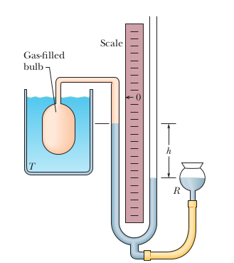

Science of how:

* Temperature differences can be used to do work
  * Heat Engines
* Work can be used to make temperature differences
  * Refrigerators

* "Invented" by Sadi Carnot (_Reflections on the Motive Power of Fire_, Carnot 1824)
  * after early investigations by others

* But 1st, we need to understand **temperature**

## Zeroth law of Thermodynamics

* The zeroth law of thermodynamics helps us define temperature.
* Define Kelvin temperature scale:
  * Absolute 0 = $0 K$
  * Based on the $H_{2}O$ triple point $T_{3}$ = $273.16 K$
* 1 K = $\frac{T_{3}}{273.16}$
* If two bodies are in thermal equilibrium with a third body, they are also in thermal equilibrium with each other
* Enables use of thermometers -- gives meaning to "temperature"
  * What do we mean by thermal equlibrium
    * Condition such that all the physical properties have stopped changing with time

**How do we measure temperature?** -- Constant-Volume Gas Thermometer

* Immerse bulb in liquid, wait until quilibrium
* Use Hg (mercury) manometer to measure change in gas pressure:
  * Adjust the height of the Hg reservoir $R$ to maintain constant gas volume
  * Use Hg height difference $h$ from left side to right side to determine $p$
* Then the desired temperature is $T = (273.16K) (\frac{p}{p_{3}})$
  * $p$ is the pressure of the gas at the measured temperature.
  * $p_{3}$ is the pressure at the triple point of water (273.16 K).
  * **More precisely** we use a limit for the fractional component, where gas approaches 0
  * $T = ( 273.16\ K ) ( \lim_{gas \to 0} \frac{p}{p_{3}} )$

## Celsius and Fahrenheit

* Celsius and Fahrenheit exist
* Conversions are simple

$$
T_{C} = T - 273.15^{\circ}
$$
$$
T_{F} = \frac{9}{5} T_{C} + 32^{\circ}
$$

Note that $T$ is implictly Kelvin.

## Thermal Expansion

* Atoms and molecules are in constant motion
* As $T$ increases, their **kinetic energies** increase
  * Equilibrium intermolecular and interatomic separations increase
  * objects expand
* Length increase described by $\Delta L$ = $L \alpha \Delta T$ where $\alpha$ is the coefficient of linear expression, $\approx$ constant (small temperature dependence)
    * There is a table for $\alpha$ for substances in the slide (Units are given as $10^{-6}/C^{\circ}$)
* Volume expansion: consider cube with sides of length $L$
  * $V = L^{3}$
  * $\beta \approx 3 \alpha$
    * Good approximation

## Heat Absorption

* Heat $\equiv$ energy transferred from one body to another due to a temperature difference
  * e.g. from a system to its environment, or v.v.
* Units: joules (J), BTU, cal, or kcal
  * 1 cal = $3.968 \times 10^{-3}\ Btu$ = 4.1868 J

## Specific Heat

* **Heat capacity** $C$ of an object is proportionality constant between heat $Q$ absorbed or lost and resulting temperature change $\Delta T$ of object

$$
Q = mc\Delta T
$$

* Heat capacity per unit mass is the specific heat: $c = \frac{C}{m}$
  * Also useful is the **molar specific heat**, the heat capacity per mole
    * The specific heat across substances for molar units $\approx$ constant for metals.
  * Water has an unusually high specific heat
    * $C_{H_{2}0} = 1$ defines the calorie

## Heats of Transformation

* Phase changes (vaporizing, freezing, melting) occur at _constant_ $T$
  * But still involves heat transfer $Q = Lm$
* Heat of vaporization: $L_{V}$
  * This is the amount of energy per unit mass that must be
    * added to vaporize a liquid (phase change liquid to gas)
    * removed to condense a gas (phase change gas to liquid)
* Heat of fusion: $L_{F}$
  * This is the amount of energy per unit mass that must be
    * added to melt a solid (phase change solid to liquid)
    * removed to freeze a liquid (phase change liquid to solid)

## Conduction

Energy is transferred between an environment and an object via a conducting material.

## Convection

Convection occurs when there are temperature differences that cause an energy transfer by motion within a fluid. The process is described in detail in the textbook. In short, when a fluid comes in contact with an object that has a much higher temperature, the fluid expands (particles move faster) and it becomes less dense, and thus lighter. Buoyant forces make it rise, so then the cooler fluid flows, which is the motion.

## Radiation

An environment and an object can also exchange energy by radiation. Meaning, energy as heat can be transferred via electromagnetic waves. This radiation is often called thermal radiation to distinguish it from other waves on the electromagnetic spectrum, say the ones used in nuclear radiation and electromagnetic signals. For example, when you stand in front of a fire, you absorb heat energy from the fire via thermal radiation -- the thermal energy of the fire thus decreases. **No medium** is required to transfer heat via radiation, which is why the Sun can transport thermal radiation through a vacuum. See the Formulas section for the rate at thermal radiation happens.

## Formulas

**Linear Expansion**

\begin{equation}
    \label{eq:linear_expansion}
    \Delta L = L \alpha \Delta T
\end{equation}

Where:

* $\alpha$ is the **coefficient of linear expansion**, this value depends on the material. It somewhat varies with temperature, but for most practical purposes it can be taken as a constant for a particular material.

**Volume Expansion**
Change in volume $V$ of a solid or liquid is given by:

\begin{equation}
    \label{eq:volume_expansion}
    \Delta V  = V \beta \Delta T
\end{equation}

Notes:

* $\beta = 3 \alpha$, this is the material's coefficient of volume expansion
* $\alpha$ is the coefficient of linear expansion

Work done by a gas as it expands/contracts from an initial to a final volume:

\begin{equation}
    \label{eq:gas_work}
    W = \int_{}^{} dW = \int_{v_{i}}^{v_{f}} p dV
\end{equation}

First law of thermodynamics. This expresses how energy is conserved for a thermodynamic process:

\begin{equation}
    \label{eq:thermo_first}
    \Delta E_{int} = E_{int,\ f} - E_{int,\ i} = Q - W
\end{equation}

Notes:

* $\Delta E_{int}$ is the internal energy of the material, which depends only on the material's state (temp, volume, pressure) 
* $Q$ represents the energy exchanged as heat between the systems and its surroundings
  * It is **positive** when the system **absorbs** heat 
  * It is **negative** when the system **loses** heat 
* $W$ is the work done _by_ the system
  * It is **positive** when the system **expands** against an external force 
  * It is **negative** when the system **contracts** because of an external force 
* This makes sense, because if both ($Q$ and $W$) were positive, then the gas would be absorbing heat and expanding, which is definitely a net increase in the energy. Conversely, if the gas were losing heat and contracting it would make sense that it is losing energy.
* $Q$ and $W$ are also path dependent, whereas $\Delta E_{int}$ is path independent
  * This means that $Q$ and $W$ do depend on the process that caused the change. Think of it in terms of the integral -- the area under the curve can differ even if the starting and endpoint are the same. Conversely, $\Delta E_{int}$ is path independent.

Rate at which energy is conducted from a hot reservoir to a cold reservoir via a conducting slab:

\begin{equation}
    \label{eq:thermal_conduction}
    P_{cond} = \frac{Q}{t} = kA \frac{T_{H} - T_{C}}{L}
\end{equation}

Where:

* $P_{cond}$ is the rate which energy conducts through the slab (conduction rate)
* $t$ is the time of the process
* $Q$ is the energy transferred (as heat)
* Each face of the conducting slab has an area $A$
* $L$ is the length of the slab
* $k$ is the **thermal conductivity**, which is a constant that depends on the material of the slab. A material that can readily transfer energy conduction is naturally a good thermal conductor, and has a high value of $k$. There is a table for this for common metals, gases, and building materials in the textbook.

**Rate of Thermal Radiation Energy Emission**

\begin{equation}
    \label{eq:radiation_energy_emission_rate}
    P_{rad} = \sigma \varepsilon A T^{4}
\end{equation}

Notes:

* $\sigma$ is $5.6704 \times 10^{-8}\ W/m^{2} \cdot K^{4}$. This is called the _Stefan-Boltzmann_ constant.
* $\varepsilon$ is the _emissivity_ of the object's surface. It has a value between 0 and 1. It depends on the composition of the surface.
  * A surface with an emissivity of 1.0 (the max) is better at radiating energy, because emissivity is the measure of an object's ability to emit infrared energy.
* $T$ must be in Kelvins, it is the temperature of the area of the object
* Similarly, $A$ is the object's surface area.

Similarly, there is a formula for the **rate of thermal radiation energy absorption**:

\begin{equation}
    \label{eq:radiation_energy_absorption_rate}
    P_{abs} = \sigma \varepsilon A T^{4}_{env}
\end{equation}

Notes:

* The emissivity is the same as the respective emission equation.
