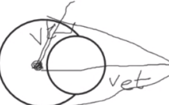

* Types of Waves
  * Mechanical, EM, Matter
  * Transverse
  * Longitudinal

## Wave Properties

* **Wavelength** - The distance $\lambda$ between identical points on the wave
* **Amplitude** - The maximum displacement $A = y_{m}$ of a point on the wave
* **Period** - Time $T$ it takes for an element of the medium to make a complete oscillation
* **Harmonic waves** - $y(x,t) = y_{m} sin(kx - \omega t)$

## Superposition and Standing waves

* Add the amplitudes
* Multiple harmonic waves can propagate on a string independently of each other

## Sound Waves

* Two constant tones at slightly different frequencies:
  * Interference alternately, constructive and destructive

### Doppler Effect

* Car horns and sirens sound higher-pitched when approaching us, lower-pitched when going away from us. That's the Doppler effect
* Mathematically you take in an input frequency, the speed of sound, and the speeds of both the detector and source. An output frequency is given from the function, see formulas for the Doppler Effect
* This equation does not apply when moving faster than the speed of sound

### Shock Waves

Cause of sonic boom -- the source outruns its own sound:

$$
sin \theta = \frac{v}{v_{s}}
$$

## Formulas

Doppler Effect

$$
f^{'} = f \frac{v \pm v_{D}}{v \pm v_{S}}
$$

Where:

* $v$ is the speed of sound
* $v_{D}$ is the speed of the detector
* $v_{S}$ is the speed of the source

Notes:

* The signs for this are a headache to remember in my opinion
* `+` when receiver moves towards the source
* `-` when receiver moves away the source
* `+` when source moves away the receiver
* `-` when source moves towards the receiver
* The gigachad way to remember this is to say the receiver is a thief and the source is a victim. The thief sees it as a positive `+` if it gets closer to the victim, but a negative `-` if they going away from the victim. The victim, the source of the thief's desired goods, sees it as a positive `+` if it can get away from the thief, but as a negative `-` if they get closer to the thief.

Shape of a sinusoidal wave moving in the positive direction of an $x$ axis

\begin{equation}
    \label{eq:sine_shape}
    y(x, t) = y_{m} sin( kx - \omega t )
\end{equation}

Where:

* $y_{m}$ is the maximum displacement (amplitude) of the wave
* $k$ is the angular wave number
* $\omega$ is the angular frequency
* $kx - \omega t$ is the phase

Angular wave number in terms of the wavelength

\begin{equation}
    \label{eq:wave_number}
    k = \frac{2 \pi}{\lambda}
\end{equation}

Period $T$ and frequency $f$ of the wave are related to $\omega$ by

\begin{equation}
    \label{eq:frequency_omega}
    \frac{\omega}{2 \pi} = f = \frac{1}{T}
\end{equation}

Wave speed $v$ is related to parameters like the wavelength, frequency, angular frequency, and angular wave number by the following

\begin{equation}
    \label{eq:wave_speed}
    v = \frac{\omega}{k} = \frac{\lambda}{T} = \lambda f
\end{equation}

Wave speed **across a string**

\begin{equation}
    \label{eq:wave_speed_string}
    v = \sqrt{\frac{\tau}{\mu}}
\end{equation}

Where:

* $\tau$ is the elastic property, or the **tension** in this case
* $\mu$ is the inertial property, or the **linear density** in this case

Rate of energy transmission (rate at which kinetic energy is carried along by the wave) is given by:

\begin{equation}
    \label{eq:energy_transmission}
    \frac{dK}{dT} = \frac{1}{1} \mu v \omega^{2} y^{2}_{m} cos^{2}(kx - \omega t)
\end{equation}

Average power of transverse wave

\begin{equation}
    \label{eq:avg_power_transverse_1}
    P_{avg} = 2 (\frac{dK}{dt})_{avg}
\end{equation}

\begin{equation}
    \label{eq:avg_power_transverse_2}
    P_{avg} = \frac{1}{2} \mu v \omega^{2} y^{2}_{m}
\end{equation}

Principle of superposition for waves

\begin{equation}
    \label{eq:superposition_waves}
    y'(x,t) = y_{1}(x,t) + y_{2}(x,t)
\end{equation}

If the two waves are out of phase by some difference $\phi$, the resulting amplitude by superposition is:

\begin{equation}
    \label{eq:phase_diff_amplitude}
    y'(x,t) = [ 2y_{m} cos ( \frac{1}{2} \phi ) ] sin (kx - \omega t + \frac{1}{2} \phi )
\end{equation}

Notes:

* This equation can be derived using some trigonometric formulas, it is best to have it as a reference instead of actually deriving it

Equation describing a standing wave

\begin{equation}
    \label{eq:standing_wave}
    y'(x, t) = [ 2 y_{m} sin kx ] cos ( \omega t )
\end{equation}

A standing wave can be setup on a string of length $L$, if its wavelength is related to $L$ in the following fashion

\begin{equation}
    \label{eq:standing_wave_wavelength}
    \lambda = \frac{2L}{n}
\end{equation}

General intensity of a sound wave. Intensity at a surface is defined as the average rate per unit area at which energy is transferred by a sound wave through or onto the surface.

\begin{equation}
    \label{eq:general_intensity}
    I = \frac{P}{A}
\end{equation}

Intensity $I$ in terms of the respective sound wave's amplitude, $s_{m}$

\begin{equation}
    \label{eq:intensity_amplitude}
    I = \frac{1}{2} \rho v \omega^{2} s^{2}_{m}
\end{equation}

Where:

* $\rho$ is the density of the medium in which the sound is traveling

Intensity $I$ at a distance $r$ from a point source that emits sound waves of power $P_{s}$ isotropically (this means it emits sound waves of the power equally in all directions)

\begin{equation}
    \label{eq:isotropic_intensity}
    I = \frac{P_{s}}{4 \pi r^{2}}
\end{equation}

Sound level $\beta$ in decibels from an intensity $I$

\begin{equation}
    \label{eq:decibel_intensity}
    \beta = ( 10 dB ) log \frac{I}{I_{0}} 
\end{equation}

Where:

* $I_{0} = 10^{-12}\ W/m^{2}$; $I_{0}$ is a reference intensity level.

Beats arise when two slightly different frequencies, $f_{1}$ and $f_{2}$, are detected together. The beat frequency is given by:

\begin{equation}
    \label{eq:beats}
    f_{beat} = f_{1} - f_{2}
\end{equation}

Standing sound wave patterns can be set up in pipes. Though, this is conditional on if a proper wavelength is introduced.

A pipe **open** at both ends will have resonant frequencies:

\begin{equation}
    \label{eq:open_pipe_resonance}
    f = \frac{v}{\lambda} = \frac{nv}{2L}
\end{equation}

Where:

* $n$ is a natural number, so 1, 2, 3, ...
* $v$ is the speed of sound in the air of the pipe

A pipe **closed at one end and open at the other** will have resonant frequencies:

\begin{equation}
    \label{eq:kinda_closed_resonance}
    f = \frac{v}{\lambda} = \frac{nv}{4L}
\end{equation}

Where:

* $n$ is 1, 3, 5... so a positive odd integer.
* $v$ is the speed of sound in the air of the pipe

Frequency for a fixed string is given by:

\begin{equation}
    \label{eq:fixed_string_resonance}
    f = \frac{nv}{2L}
\end{equation}

Where:

* $n$ is 1, 2, 3, ... so a natural number.

## Problems

### Chapter 16

#### Question 21

This is a problem regarding **wave speed on a stretched string**.

> A 100 g wire is held under a tension of 250 N with one end at $x=0$ and the other at $x = 10.0m$. At time $t = 0$, pulse 1 is sent along the wire from the end at $x = 10.0m$. At time $x = 30.0ms$, pulse 2 is sent along the wire from the end at $x = 0$. At what position $x$ do the pulses begin to meet?

This question asks for the position of which two waves will meet along a wire. First, let us find the speed of the waves as this will help in seeing how much distance the first wave travels, since it is sent along the wire first. For this, equation \ref{eq:wave_speed_string} can be used. Though, the linear density first needs to be found as a prerequisite to the equation. To find this, we divide the mass of the wire (0.1kg) by the length (10.0m). After plugging the values into equation \ref{eq:wave_speed_string}, it turns out the speed of both of the waves are `158.11 m/s`. Now, to find the distance traveled of pulse 1, we multiply that velocity by the time elapsed before pulse 2 is sent, which is 30.0ms, or .03s.

The distance traveled of pulse 1 in 30 milliseconds turns out to be 4.743m. Subtract this from 10m and it can be understood that pulse 1 is now 5.2567m displaced from the origin $x = 0$. Now, we know pulse 2 is sent along the wire, and that both of the pulses have the same velocity. In other words, the pulses will both travel the same distance in the same amount of time. Thus, we simply divide 5.2567m by 2 to find where they will meet, and the answer is `2.63m`.

#### Question 27

_This question has a figure necessary to solve the problem, see the book for the figure_

This is a problem regarding **energy and power of a wave traveling along a string**.

> A sinusoidal wave is sent along a string with a linear density of $2.0 g/m$. As it travels, the kinetic energies of the mass elements along the string vary. Figure 16-37a gives the rate $dK/dt$ at which kinetic energy passes through the string elements at a particular instant, plotted as a function of distance $x$ along the string. Figure 16-37b is similar except that it gives the rate at which kinetic energy passes through a particular mass element (at a particular location), plotted as a function of time $t$. For both figures, the scale on the vertical (rate) axis is set by $R_{s}$ = 10 W. What is the amplitude of the wave?

Here are a few quantities we can identify before solving the problem:

* **Frequency** -- $\frac{1}{0.002} = 500 Hz$
  * Notice the period is given to us in Figure 16-37b
* **Angular Frequency** -- 3141.59 rad/sec
  * This can be derived from frequency, using equation \ref{eq:frequency_omega}
* **Wavelength** -- 0.20m
  * Notice this is given to us in Figure 16-37a
* **Wave Speed** -- 200 m/s
  * From the wavelength and frequency, we can find the wave speed using equation \ref{eq:wave_speed}
* **Max value of the rate of kinetic energy** -- 10W
  * Notice this is given to us in the figures

Using equation \ref{eq:energy_transmission}, we can determine that the cosine squared term will evaluate to one if the rate is at its maximum. This is because the maximum of the cosine squared function will be 1. Thus, the cosine squared term goes away.

Now, we left with an equation with parameters of which we all have:

* Maximum value of rate of kinetic energy
* Linear Density
* Wave Speed
* Angular Frequency

We rearrange the equation like so:

$$
y_{m} = \sqrt{\frac{2 \frac{dK}{dt}}{\mu v \omega^{2}}}
$$

Recall $y_{m}$ is the maximum displacement, or the amplitude, of a mass element on the string which is what we are looking for.

Answer: `0.0032m`

#### Question 31

This is a problem regarding **interference of waves**.

> Two identical traveling waves, moving in the same direction, are out of phase by $\frac{\pi}{2}$ rad. What is the amplitude of the resultant wave in terms of the common amplitude $y_{m}$ of the two combining waves?

For this question we simply use equation \ref{eq:phase_diff_amplitude}

In specific, we focus on this term:

$$
[ 2y_{m} cos ( \frac{1}{2} \phi ) ]
$$

Plugging in $\phi$, this simplifies to $2 cos( \frac{\pi}{4} ) y_{m}$, or $1.41 y_{m}$, which is our answer

#### Question 49

_This question has a figure necessary to solve the problem, see the book for the figure_

This is a problem regarding **standing waves and resonance**.

> A nylon guitar string has a D linear density of 7.20 g/m and is under a tension of 150 N. The fixed supports are distance D = 90.0 cm apart. The string is oscillating in the standing wave pattern shown in Fig. 16-39. Calculate the
> 
> * speed
> * wavelength
> * frequency
> 
> of the traveling waves whose superposition gives this standing wave.

The speed can be calculated using equation \ref{eq:wave_speed_string}. This comes out to be `144.33 m/s`. Then, the wavelength can be found by noticing that this standing wave is resonating at the third harmonic (see equation \ref{eq:standing_wave_wavelength}). Thus, the wavelength can be found:

$$
\lambda = \frac{2L}{n}
$$

Where $n = 3$. So $\lambda = \frac{2L}{3}$. Thus, $\lambda$ is `60.0cm`.

Finally, finding the frequency is simple, using equation \ref{eq:wave_speed}. This comes out to be `241 Hz`.

#### Question 10

_This question has a figure necessary to solve the problem, see the book for the figure_

This is a problem regarding **traveling sound waves**.

> One clue used by your brain to determine the direction of a source of sound is the time delay $\Delta$t between the arrival of the sound at the ear closer to the source and the arrival at the farther ear. Assume that the source is distant so that a wavefront from it is approximately planar when it reaches you, and let D represent the separation between your ears.
> 
> * If the source is located at angle $\theta$ in front of you (Fig. 17-31), what is $\Delta$t in terms of D and the speed of sound $v$ in air?
> * If you are submerged in water and the sound source is directly to your right, what is $\Delta$t in terms of D and the speed of sound $v_{w}$ in water?
> * Based on the time-delay clue, your brain interprets the submerged sound to arrive at an angle $\theta$ from the forward direction. Evaluate $\theta$ for fresh water at $20^{\circ}C$.

* The question first asks for the time delay between the arrival of the sound at the right ear and the arrival of the sound at the left ear (based on the figure, it comes to the right ear first) in terms of $D$ and the speed of sound $v$ in the air. \
\
For this, we simply use $t = \frac{d}{v}$. The distance ($d$) the wavefront will travel to the left ear is given by $D sin ( \theta )$. This is because the wavefront is planar and makes an angle $\theta$ with the right ear. We find $d$, which is the side opposite to the angle using sine. Thus, $\Delta t = \frac{D sin ( \theta )}{v}$.

* For this question, we just extend the answer from the first part, but we now know that $\theta = 90^{\circ}$ and $v$ is now the speed of sound in water, or $v_{w}$. Thus, we get: \
\
$$
\frac{D sin ( 90^{\circ} )}{v_{w}}
$$
\
This simplifies to:
\
$$
\frac{D}{v_{w}}
$$

* This part of the question ties in both of the previous parts -- it tells us that while the wavefront that was in the submerged wave was coming at $\theta = 90^{\circ}$, our brain interprets this as coming from the angle described in the first part of the question, hence the label _Underwater illusion_ for the question. We know that $v$ is `343 m/s` and $v_{w}$ is `1481 m/s`, and intuitively the $\Delta t$ has to be the same for both. Thus, we can determine the following: \
\
$$
\frac{D}{v_{w}} = \frac{D sin ( \theta )}{v}
$$
\
This is because the $\Delta t$ is the same, so we can set the expressions equal to each other. Solving this equation for $\theta$:
\
$$
\theta = sin^{-1} ( \frac{v}{v_{w}} )
$$
\
$$
\theta = sin^{-1} ( \frac{343\ m/s}{1481\ m/s} )
$$
\
$$
\theta = 13.4^{\circ}
$$

#### Question 33

This is a problem regarding **intensity and sound level**.

> Male _Rana catesbeiana_ bullfrogs are known for their loud mating call. The call is emitted not by the frog's mouth but by its eardrums, which lie on the surface of the head. And, surprisingly, the sound has nothing to do with the frog’s inflated throat. If the emitted sound has a frequency of 260 Hz and a sound level of 85 dB (near the eardrum), what is the amplitude of the eardrum’s oscillation? The air density is 1.21 kg/$m^{3}$.

Knowing the sound level (85 dB), we can determine the intensity using formula \ref{eq:decibel_intensity}.

$$
\beta = ( 10 dB ) log \frac{I}{I_{0}}
$$

$$
10^{\frac{\beta}{10 dB}} * I_{0} = I
$$

$$
10^{\frac{85\ dB}{10\ dB}} * 10^{-12} = 3.16 * 10^{-4}
$$

Now, since we have $I$, we can use \ref{eq:intensity_amplitude} to find the amplitude of the sound wave

$$
I = \frac{1}{2} \rho v \omega^{2} s^{2}_{m}
$$

$$
\sqrt{\frac{2I}{\rho v \omega^{2}}} = s_{m}
$$

Notice, we can find $\omega$ since we have `f = 260 Hz`, using equation \ref{eq:frequency_omega}.

$$
\omega = 2 \pi * 260 = 1633.63
$$

Now, we have all the values to solve for $s_{m}$. Answer comes out to be $7.6 \times 10^{-7}\ m$, or $0.76\ \mu m$.

#### Question 71

This is a problem regarding **intensity and sound level**.

> At a distance of 10km, a `100 Hz` horn, assumed to be an isotropic point source, is barely audible. At what distance would it begin to cause pain?

First, pain threshold is `130 dB`; we can refer to this quantity as $\beta_{p}$. For an isotropic source, the intensity is given by formula \ref{eq:isotropic_intensity}.

So:

$$
\beta = ( 10\ dB ) log \frac{I}{I_{0}}
$$

$$
\beta_{p} - \beta_{a} = ( 10\ dB ) log \frac{I_{p}}{I_{0}} - ( 10\ dB ) log \frac{I_{a}}{I_{0}}
$$

From log properties we can conclude:

$$
\beta_{p} - \beta_{a} = ( 10\ dB ) log \frac{I_{p}}{I_{a}}
$$

Notice that $\beta_{p} - \beta_{a} = 130$, since $\beta_{a} = 0$.

$$
13 = log \frac{I_{p}}{I_{a}}
$$

Consider the relationship between intensity and radius:

$$
I = \frac{P_{s}}{4 \pi r^{2}}
$$

All quantities besides the radius in this expression are constant between $\beta_{a}$ and $\beta_{p}$. This means that $I_{p} \propto \frac{1}{r^{2}_{p}}$ and $I_{a} \propto \frac{1}{r^{2}_{a}}$ ($\propto$ means proportional). Moreover, we can drop-in replace the intensities with their respective proportional expressions

$$
13 = log \frac{\frac{1}{r^{2}_{p}}}{\frac{1}{r^{2}_{a}}}
$$
$$
13 = log \frac{r^{2}_{a}}{r^{2}_{p}}
$$

Notice, with another log property, we can simplify this

$$
13 = log ( ( \frac{r_{a}}{r_{p}} )^{2} )
$$

$$
13 = 2 log \frac{r_{a}}{r_{p}}
$$

From here, we can just solve

$$
10^{\frac{13}{2}} = \frac{r_{a}}{r_{p}}
$$

$$
r_{p} = \frac{r_{a}}{10^{\frac{13}{2}}}
$$

$$
r_{p} = \frac{10000}{10^{\frac{13}{2}}}
$$

Thus, $r_{p}$ is 0.00316, our answer.

#### Question 72

This is a problem regarding **intensity and sound level**.

> A bullet is fired with a speed of 685 m/s. Find the angle made by the shock cone with the line of motion of the bullet.

Notice that this speed is greater than the speed of sound, thus the formation of the shock cone. This question is better to visualize and have a diagram to supplement understanding, but I will try to explain in text. If the bullet is traveling 685 meters per second, let us say after a second ($t=1$) it has traveled 685 meters. At $t=0$ the bullet was fired and the wavefront was emitted. The wavefront travels at 343 meters per second radially. At $t=1$, consider the right triangle formed by the distance traveled by the bullet and the radial distance of the wavefront. This part is best suited with a diagram, here is a rough sketch.

In the sketch, notice the right triangle formed. The bottommost side is the distance traveled by the bullet ($d_{b}$), which is 685 meters at $t=1$. And, the adjacent side to the bottommost side is the distance traveled by the wavefront ($d_{w}$), which is 343 meters at $t=1$ (speed of sound is roughly 343 m/s). Using basic trigonometry, we can determine the angle ($\theta$).

$$
sin \theta = \frac{d_{w}}{d_{b}}
$$

$$
\theta = sin^{-1} (\frac{d_{w}}{d_{b}})
$$

Our answer is thus $\theta = 30.05^{\circ}$

#### Question 91

This is a problem regarding **beats**.

> Two identical tuning forks can oscillate at 440 Hz. A person is located somewhere on the line between them. Calculate the beat frequency as measured by this individual if she is standing still and the tuning forks move in the same direction along the line at 3.00 m/s.

First, let us question why a beat frequency would even occur. After all, the frequency is not apparently changing given the context of the question, thus a beat frequency would not occur (a beat frequency requires two slightly different frequencies). However, notice that the problem says the tuning forks move in the same direction along the line at a certain velocity, $v_{s}$. This means the destination (person) will experience the Doppler effect, which means the observed frequency is actually different. Considering that both of the tuning forks are moving, and thus both forks are subject to the Doppler effect in the context of the person, this means there will be a beat frequency. Moreover, we need to determine what the frequencies according to the Doppler effect will be.

$$
f^{'}_{D} = f_{s} \frac{v \pm v_{D}}{v \pm v_{S}}
$$

$$
f^{'}_{D} = f_{s} \frac{v + 0}{v \pm 3}
$$

Recall, `+` in this context is used because the source moves away from the receiver, so the tuning fork that is getting further away from the person would have a `+` sign for its Doppler effect expression; conversely, the tuning fork that is approaching the person would have a `-` sign (source approaches receiver). Now, it is simple to calculate the frequencies, but let us first look at the beats frequency expression

$$
f_{beats} = f_{1} - f_{2}
$$

Now, we just substitute the appropriate frequencies in the beats expression

$$
f_{beats} = f_{s} \frac{v}{v - 3} - f_{s} \frac{v}{v + 3}
$$

$$
f_{beats} = f_{s} ( \frac{v}{v - 3} - \frac{v}{v + 3} )
$$

$$
f_{beats} = 440 ( \frac{343}{340} - \frac{343}{346} )
$$

Thus, $f_{beats}$ is 7.7 Hz, our answer. 

#### Question 39

This is a problem regarding **sources of musical sound**.

> * Find the speed of waves on a violin string of mass 800mg and length 22.0 cm if the fundamental frequency is 920 Hz.
> * What is the tension in the string?
> * For the fundamental [frequency], what is the wavelength of the waves on the string
> * For the fundamental [frequency], what is the wavelength of the sound waves emitted by the string?

First, we should recognize the fundamental frequency is the first harmonic; in other words, this means that $n = 1$ in the expression shown in equation \ref{eq:fixed_string_resonance}. With this formula, we know that the wavelength has a certain relationship with the frequency; we will figure out the speed in this scenario but the concept is the same.

$$
f = \frac{nv}{2L}
$$

Recall $n = 1$

$$
f = \frac{v}{2L}
$$

$$
v = f * 2L
$$

We find that $v$ is `404.8 m/s`, the answer to the first part of the question. The question then asks what the tension is. For this, we can simply apply formula \ref{eq:wave_speed_string}.

$$
v = \sqrt{\frac{\tau}{\mu}}
$$

Let us solve for tension $\tau$ now:

$$
\tau = v^{2} * \mu
$$

Recall that $\mu$ is the linear density and is just the mass per unit length. So we do the mass of the string over its length:

$$
\tau = v^{2} * \frac{(800 / \text{1e6})}{(22.0 / 100)}
$$

$$
\tau = 404.8^{2} * \frac{(800 / \text{1e6})}{(22.0 / 100)}
$$

Following through we find $\tau$ to be 595.87 N. Now the question asks us for the wavelength of the waves on the string. For this, we already know the speed of the waves and the frequency, so it is just a simple application of $v = \lambda f$. We find $\lambda$ to be 0.44 m.

Now the question asks us for the wavelength of the sound waves emitted from the string. This is like part c, however, instead of the speed we calculated earlier we use the speed of sound in air, 343 m/s. So we find $\lambda$ to be 0.37m.

#### Question 53

This is a problem regarding **beats**.

> Two identical piano wires have a fundamental frequency of 600 Hz when kept under the same tension. What fractional increase in the tension of one wire will lead to the occurrence of 6.0 beats/s when both wires oscillate simultaneously?

6.0 beats/s corresponds to this

$$
f_{beats} = x - 600Hz
$$

$$
6 = x - 600Hz
$$

We assign x to the frequency of the tuning fork that will be increased. We know that $x$ must be 606Hz.

Now, we must determine the tension increase to up that frequency to 606Hz from 600Hz. Turns out that $\frac{606}{600} = 1.01$. Recall that we can find the speed of a wave propagating through a string in terms of its tension -- notably the tension is under a square root. Consider:

$$
v = \lambda f
$$

$$
\sqrt{\frac{\tau}{\mu}} = \lambda f
$$

Let us consider a fractional increase to $\tau$. The fractional increase needed for the right hand side is 1.01, but a coefficient of 1.01 for $\tau$ results in multiplying $\sqrt{1.01}$ to each side, which is not what we want. Instead, we need a coefficient of $1.01^{2}$, so that this results in multiplying $\sqrt{1.01^{2}} = 1.01$ to each side. $1.01^{2} = 1.0201$ is the coefficient needed, and thus $0.020$ is the fractional increase necessary. This is our answer: `0.020`.

#### Question 60

This is a problem regarding **the Doppler effect**.

> A stationary motion detector sends sound waves of frequency 0.150 MHz toward a truck approaching at a speed of 45.0 m/s. What is the frequency of the waves reflected back to the detector?

For this, we have to do the Doppler effect twice:

* The truck is going to observe a frequency subject to the Doppler effect
* The motion detector will observe a frequency subject to the Doppler effect

So, we must go in order. First, the truck acts as the receiver/destination and the motion detector acts as the source.

$$
f^{'} = 0.150 \frac{343 + 45}{343}
$$

Recall the **gigachad way** to remember this: the truck as the receiver is a thief, and since it is gaining on the source that's a `+` for them. So the sign is a `+`.

$f^{'}$ comes out to be 0.170 MHz. Now we use this observed frequency to determine the observed frequency of the reflected wave for the motion sensor.

$$
f^{''} = 0.170 \frac{343}{343 - 45}
$$

Again, the gigachad way tells us that the truck as the source is a victim, and the fact that the truck is getting closer to the thief is bad. So that's a negative `-`. $f^{''}$ comes out to be 0.195 MHz, our answer.
