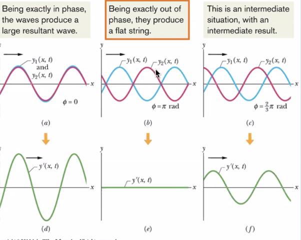

* Types of Waves
  * Mechanical, EM, Matter
  * Transverse
  * Longitudinal

## Wave Properties

* **Wavelength** - The distance $\lambda$ between identical points on the wave
* **Amplitude** - The maximum displacement $A = y_{m}$ of a point on the wave
* **Period** - Time $T$ it takes for an element of the medium to make a complete oscillation
* **Harmonic waves** - $y(x,t) = y_{m} sin(kx - \omega t)$

## Superposition and Standing waves

* Add thw amplitudes
* Multiple harmonic waves can propogate on a string independently of each other

## Sound Waves

* Two constant tones at slightly different frequencies:
  * Interference alternately, constructive and destructive
