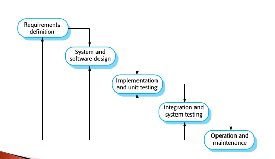
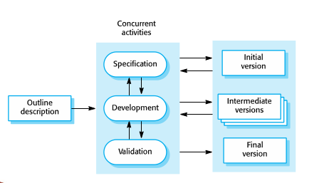

Topics Covered

* Software Process Models
* Process Activities
* Coping With Change
* Process improvement

## What is a Software Process?

* A structured set of activities required to develop a software system, such as specifying a data model, designing a user interface, etc. and the ordering of these activities.
* While these software processes are different, they all must include the four fundamental software engineering activities: specification, development, validation, and evolution.
* Process descriptions may include
  * **Products**, which are the outcomes of a process activity;
  * **Roles**, which reflect the responsibilities of the people involved in the process.
  * **Pre- and post-conditions**, statements that are true before and after (respectively) a process activity has been enacted or a product produced.

## Software Process Models

* The waterfall model
  * Plan-driven model. Separate and distinct phases of specification and development.
* Incremental development
  * Specification, development, and validation are **interleaved**. May be plan-driven or agile.
* Integration and configuration
  * The system is assembled from existing configurable components. May be plan-driven or agile.

Generally, for large systems, a balance between plan-driven and agile processes (incremental and "anticipated") should be found.

Waterfall Development

Incremental Development

See slides for detailed benefits/problems between these 3 process models.

Succinctly,

* The _waterfall model_ is gonna separate the fundamental activities into disparate phases.
* _Incremental development_ interleaves the first 3 activities, and then evolution follows
* _Integration and configuration_ relies on reuse, so development is focusing on configuring and integrating the software.

Some general instantiations of these models

* Safety-critical software is developed using a waterfall process (lots of specification/docs are needed before impl)
* Software products are largely incremental (agile)
* Business systems are increasingly developed by configuring and integrating existing systems

In practice, most large systems are developed using a process that incorporates elements across these models. 

### The waterfall model

In the waterfall model, we have well-defined stages, and we follow them sequentially, only proceeding when the post-condition is met and the pre-condition of the next is met.

The stages of the waterfall model reflect the fundamentals:

* _Requirements analysis and definition_ -- Users, constraints, goals, etc. influence a system specification.
* _System and software design_ -- Determine the architecture, abstractions, and relationships of the software/hardware systems to meet the requirements laid out.
* _Implementation and unit testing_ -- Realize the design into program units, and test the units with unit testing. Unit testing involves making sure each unit meets its specification.
* _Integration and system testing_ -- Combine the units and make sure it works and meets the requirements as a complete system. After testing send that stuff straight to the customer.
* _Operation and maintenance_ -- This gonna be the longest phase obv cause you find errors over time and then fix em: i.e. improving the impl of units, enhancing units, fixing bugs.

This makes sense especially for hardware development since manufacturing costs are very real. For software stages do overlap.

From the description there is a vibe that the waterfall model gives and that is that it requires early commitment and system reworks when changes are made. So it's gonna only be appropriate for some types of systems:

* Embedded systems cause hardware
* Critical systems cause safety-related problems can be major and expensive so we kinda want to make sure that doesn't happen with the help of heavy specification and design
* Large systems developed across companies for a few reasons
  * If hardware involved then you want a common model so that's gonna be the waterfall model
  * Complete specifications may be needed for developing subsystems across companies

### Incremental development

Incremental development usually involves getting an initial implementation down, then getting feedback from users about the impl, and then evolve it. Keep doing that in a loop (hence this being an iterative process model) until the required system is developed. That's incremental development.

Incremental development in a way is the most common approach for developing application systems and software products. This is cause requirements usually change over time in these scenarios, so incremental development makes sense.

Benefits over waterfall:

* Cost of implementing requirements goes down cause the redoing of analysis and documentation doesn't cost as much in an incremental model
* Easier to get customer feedback cause they can see an implementation, a spec is just a spec.
* Versions of the product get to the customer faster even if 100% of the functionality isn't present.

Management tho gonna have two problems:

* Process isn't visible -- managers need deliverables to measure progress. With this quick development, it doesn't make sense to create docs (in terms of cost) that specifically outline what is expected for each version of the system.
* If you keep changing code it's going to get messy. Agile methods suggest refactoring the software regularly

### Integration and configuration

Three types of software components frequency reused:

* General purpose stand-alone application systems (HTTP servers)
* Collection of objects developed as a component/package like the Java Spring Framework
* Web services that are developed according to service standards

Stages of a general process model for reuse-based development:

* _Requirements spec_ -- brief descriptions of essential reqs for the system
* _Software discovery and evaluation_ -- search and evaluate potential candidate components/systems to see if they meet the requirements.
* _Requirements refinement_ -- Refine requirements now that we have info about the reusable components/systems.
* _Application system configuration_ -- If an off-the-shelf app does the job then it can be _configured_ for use to create the new system.
* _Component adaptation and integration_ -- If there isn't an off-the-shelf-system, then components can be modified and new ones developed. Then they can be _integrated_ to create the new system.

Some pitfalls to this is that it can lead to a system that does not meet the real needs of users, since some components will induce compromise. Control can also be lost since new versions of the components are not under the control of the organization using them.

## Software Specification

* The process of establishing what services are required, and what the constraints are on the system's operation and development.
* Requirements engineering process
  * What do the system stakeholders require/expect from the system?
  * Requirements Specification -- defining the requirements in detail
  * Requirements validation -- checking the validity of the requirements

### Software Design and Implementation

Four activities that may be part of the design process for information systems:

* _Architectural design_ -- Identifying the structure of the complete system.
* _Database design_ -- How to represent system data structures in database.
* _Interface design_ -- Specifications for interface for system components. This helps make the system modular and independent so they can be developed separately.
* _Component selection and design_ -- Design can include a component description with impl details left to the programmer.

After design naturally follows implementation to be done by the programmers. After developing the components, testing and debugging is done.

### Software Validation

Software validation consists of Verification and Validation (V & V). This includes writing tests to make sure the software operates as intended, at the component and system level. Customer testing can also occur as a beta release, so that devs can fix errors as they come by in real use.
