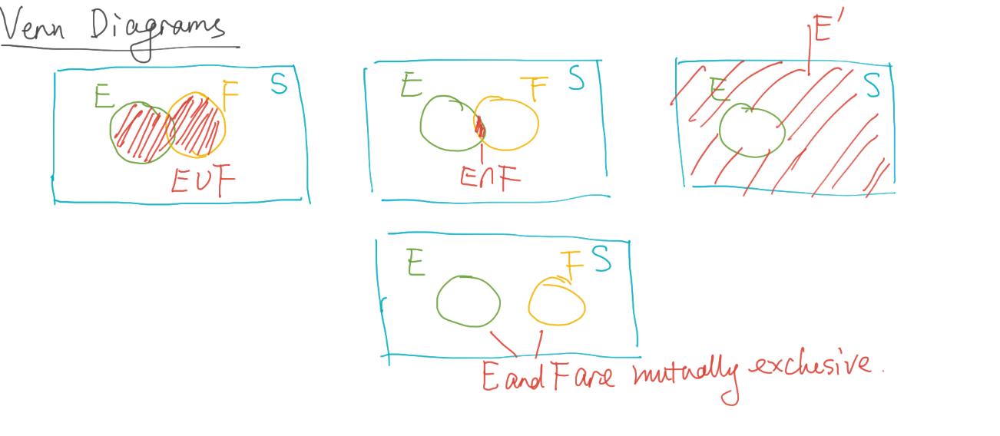

* Sample space and events
  * **Set**: Collection of distinct objects
    * Examples:
      * NBA teams: `{ Balls, Lakers }`
      * Fruits: `{ Kiwi, Watermelons, Orange}`
    * **Subset**:
      * Let A and B be two sets.
      * Every element of A is an element of B, then A is a subset of B ($A \subseteq B$)
      * If B does NOT contain additional elements, then A and B are equal
      * However, if B did contain additional elements, then A is a **proper subset** of B ($A \subset B$), because it is not equal to B and is a subset. A subset can include itself, a proper subset cannot.
  * **Experiment**: A process that generates a set of data
  * **Sample Space**: A set of all possible _outcomes_ of a statistical experiment
    * For example, for flipping a coin the *sample space* is `S = {H, T}`
    * Consider flipping two coins, our *sample space* would be `S = {HH, HT, TH, TT}`
    * Another example, tossing two die. The size of the sample space is $6^{2} = 36$
      * `S = {(1, 1), (1, 2), ..., (6, 6)}`
  * **Event**: A subset of *sample space* ($E \subseteq S$)
    * Considering the dice example, if the sum of the dice were 7:
      * `E = {(1, 6), (2, 5), (3, 4), (4, 3), (5, 2), (6, 1)}`
  * 01/26/2021
  * **Union**: Consider two events, `E` and `F`. The union is denoted by $E \cup F$. It is defined to consist of all outcomes that are either in E _or_ F _or_ in both E and F.
    * Example: The sample space of flipping two coins.
      * `S = {HH, HT, TH, TT}`
      * `E = {HH, HT}`
      * `F = {TH}`
      * Then $E \cup F = \{HH, HT, TH\}$
  * **Intersection**: Consider two events, `E` and `F`. The intersection is denoted by $E \cap F$. It is defined to consist of all outcomes that are _common_ to E and F.
    * Example: The sample space of flipping two coins. Consider the same sample space from the union example .
      * Intersection: $E \cap F = \varnothing$
    * Example:
      * `E = {HH, HT, TH}`
      * `F = {HT, TH, TT}`
      * Intersection: $E \cap F = \{HT, TH\}$
    * We say, when $E \cap F = \varnothing$, that E and F are **mutually exclusive** or **disjoint**.
  * **Complement** of E with respect to S is the subset of all elements of S that are not in E, denoted by $E^{'}$
    * Example:
      * `S = {HH, HT, TH, TT}`
      * `E = {HH, HT, TH}`
      * $E^{'} = \{TT\}$
      * `F = {HT, TH, TT}`
      * $F^{'} = \{HH\}$
    * $E$ and $E^{'}$ are mutually exclusive, meaning $E \cap E^{'} = \varnothing$
    * $S^{'} = \varnothing$: Recall $S$ was the set being complemented with respect to, so its complement is just $S \cap S^{'} = \varnothing$

## Venn Diagrams

* **Commutative Laws**: These apply to binary operators like intersection and union.
* **Association Laws**: Also apply to intersection and union.
  * $( E \cup F ) \cup G = E \cup ( F \cup G )$
  * $( E \cap F ) \cap G = E \cap ( F \cap G )$
* **Distributive Laws**
  * $( E \cup F ) \cap G = (E \cap G) \cup (F \cap G)$
  * $( E \cap F ) \cup G = (E \cup G) \cap (F \cup G)$

* **DeMorgan's Laws**:

$$
( \cup_{i=1}^{n} E_{i} )^{'} = \cap_{i=1}^{n} E_{i}^{'}
$$

$$
( \cup_{i=1}^{n} E_{i} )^{'} = \cap_{i=1}^{n} E_{i}^{'}
$$

* Like `!(false or false)` is equivalent to `(not true and not true)`
* I will not eat (ice cream or pizza) = I will (not eat ice cream) and I will (not eat pizza).

Practice: Consider tossing two dice. Let S denote the sample space.

* A: The number on the second die is even
* B: The sum of the two numbers is even
* C: At least one number in the pair is odd

Then:

* $C^{'}$ would be that both numbers are even
* $A \cap B$ would be that both numbers are even
* $A \cap B^{'}$ would be that the second die is even, the first die is odd
* $A^{'} \cup B$ would be the sample space that has:
  * All possibilities where the first and second dice are even (B)
  * All possibilities where the first and second dice are odd (B)
  * All possibilities where the first die is even and second die is odd. ($A^{'}$)
  * Succintly put, (the number on the second die is odd) or (the sum is even).
* $A^{'} \cap C$ would be where the first die can be whatever, but the second die has to be odd. $A^{'}$ would actually be a proper subset of C, so this just evaluates to $A^{'}$

01/28/2021

## Probability of an Event

`S = {a, b, c, d}`

Axioms: E is an event of a sample space S.

* $O \leq P(E) \leq 1$
* $P(S) = 1$
* A is a sequence of **mutually exclusive** events: $E_{1}$, $E_{2}$, ..., $E_{n}$
  * $E_{i} \cap E_{j} = \varnothing$ when $i \neq j$

**Partition**: A collection of events {$E_{1}$, $E_{1}$, ..., $E_{1}$} of a sample space S.

If $E_{1}$, $E_{2}$, ..., $E_{n}$ are mutually exclusive and the union of all the events is equal to S... then:

$$
\sum_{i=1}^{n} P(E_{i}) = 1
$$

## Counting Principles

**The Multiplication Rule**

Rule: An experiment consists of $k$ steps, where:

* The first step has $n_{1}$ possible outcomes
* The second step has $n_{2}$ possible outcomes

...

* The $k$th step has $n_{k}$ possible outcomes

So, the total number of experimental outcomes is given by $n_{1} * n_{2} * ... * n_{k}$

Example: Tossing a pair of dice

* Find the number of sample points in the sample space
  * $6 * 6 = 36$
* Find the probability that the sum of the two dice is 8
  * `8 = {(2, 6), (3, 5), (4, 4), (5, 3), (6, 2)}`, so $P(E) = \frac{5}{36}$

## Permutations

\begin{equation}
    \label{eq:permutation_def}
    \text{nPr} = \frac{n!}{(n - r!)}
\end{equation}

Where:

* $n$ is the number of total objects
* $r$ is the number of objects chosen

Notes:

* $4 \text{nPr} 4 = 4!$, makes sense because order matters in permutation.

Tips for permutation problems:

* Whether the objects are distinguishable or not
* Divide the solution into steps
* When the number is large, try with a smaller one

Example:

> There are five people, A, B, C, D, and E. You want to line them up but A and B has to stay together. How many possible ways can we arrange these five people?

First, we should view A and B as a single unit. This makes the problem considerably easier. From here, we can determine that we want to arrange 4 units with respect to order out of 4 total units. This is permute 4 4 (4 nPr 4). $4 nPr 4 = 4!$. Notice, though, that the A and B unit can take two forms (formally $2!$): AB or BA. To solve this, we just multiply our result by two -- this is because while the unit can take two forms, it is still one unit in any given sample point. So our answer is $2 * 4! = 48$.

If we had $n$ objects and divided them into $k$ groups. Suppose each $k$ group was non-distingushable, and each group has a size of $n_{1} ... n_{k}$. the multinomial theorem tells us the amount of permutations of the $n$ objects:

$$
\frac{n!}{n_{1}!n_{2}! ... n_{k}!}
$$

The following example should hopefully clear up what this implies.

### Example

> How many different letter arrangements are in the word KITTY?

Well, there are 5 letters, but there are two Ts. These two Ts are non distinguishable as a group. This means, when they appear together, there are technically two ways to arrange their order, however, it is only apparent as one (TT is TT no matter how you place the Ts). This means we have to exclude it using the division rule.

$$
\frac{5!}{2!} = 60
$$

Or more generally, we can use the multinomial theorem shown above, which I think is easier. A group of 1 letter is technically nondistiguishable, so we have these nondistinguishable groups:

* K
* I
* TT
* Y

Those are 4 groups, out of a total of 5 objects (letters). Applying the multinomial theorem, we have:

$$
\frac{5!}{1!1!2!1!} = 60
$$

## Combinations

Combinations are like permutations, but the ordre does not matter. The formula below then makes sense, because it divides out the repeats:

$$
\frac{n!}{(n-r)! r!}
$$
