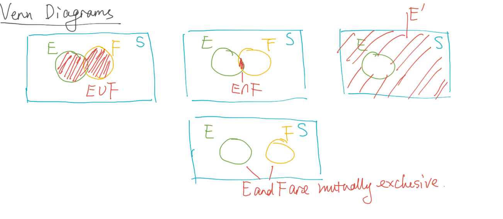

After going over graphical methods in the previous section, we now go over numerical methods.

* Consider a data set $n$ observations. $\{x_{1}, x_{2}, ... , x_{n}\}$
* **Sample mean** $\bar{x}$
$$
\bar{x} = \frac{x_{1} + ... + x_{n}}{n} = \frac{1}{n} \sum_{i=1}^{n} x_{i}
$$
* Similarly, there exists a population mean $\mu$
* **Sample median**, $\tilde{x}$ this is just the middle number in the dataset \
If $n$ is odd:
$$
\tilde{x} = (x_{(n + 1)/2})
$$
If $n$ is even:
$$
\tilde{x} = \frac{1}{2} (x_{\frac{n}{2}} + x_{\frac{n}{2} + 1})
$$
* Example: $\{-3, 0, 4 \}$ \
$$
 \bar{x} = \frac{1}{3} (-3 + 0 + 4) = \frac{1}{3}
$$
$$
\tilde{x} = 0
$$

* **Sample variance** denoted by $s^{2}$
$$
s^{2} = \frac{(x_{1} - \bar{x})^{2} + (x_{2} - \bar{x})^{2} + ... + (x_{n} - \bar{x})^{2}}{n - 1}
$$

* **Population variance** denoted by $\sigma^{2}$

* **Sample standard deviation** is the square root of variance \
$$
s = \sqrt{s^{2}}
$$

* **Population standard deviation** is denoted by $\sigma$

* **Sample range** \
$$
x_{max} - x_{min}
$$

* Example: $\{0, 1, 5 \}$
  * Sample mean \
$$
\bar{x} = \frac{0 + 1 + 5}{3} = 2
$$
  * Sample variance \
$$
s^{2} = \frac{(0 - 2)^{2} + (1 - 2)^{2} + (5 - 2)^{2}}{3 - 1} = 7
$$
  * Sample standard deviation \
$$
s = \sqrt{7}
$$

Now we start talking about probability

* Sample space and events
  * **Set**: Collection of distinct objects
    * Examples:
      * NBA teams: `{ Balls, Lakers }`
      * Fruits: `{ Kiwi, Watermelons, Orange}`
    * **Subset**:
      * Let A and B be two sets.
      * Every element of A is an element of B, then A is a subset of B ($A \subseteq B$)
      * If B does NOT contain additional elements, then A and B are equal
      * However, if B did contain additional elements, then A is a **proper subset** of B ($A \subset B$), because it is not equal to B and is a subset. A subset can include itself, a proper subset cannot.
  * **Experiment**: A process that generates a set of data
  * **Sample Space**: A set of all possible _outcomes_ of a statistical experiment
    * For example, for flipping a coin the *sample space* is `S = {H, T}`
    * Consider flipping two coins, our *sample space* would be `S = {HH, HT, TH, TT}`
    * Another example, tossing two die. The size of the sample space is $6^{2} = 36$
      * `S = {(1, 1), (1, 2), ..., (6, 6)}`
  * **Event**: A subset of *sample space* ($E \subseteq S$)
    * Considering the dice example, if the sum of the dice were 7:
      * `E = {(1, 6), (2, 5), (3, 4), (4, 3), (5, 2), (6, 1)}`
  * 01/26/2021
  * **Union**: Consider two events, `E` and `F`. The union is denoted by $E \cup F$. It is defined to consist of all outcomes that are either in E _or_ F _or_ in both E and F.
    * Example: The sample space of flipping two coins.
      * `S = {HH, HT, TH, TT}`
      * `E = {HH, HT}`
      * `F = {TH}`
      * Then $E \cup F = \{HH, HT, TH\}$
  * **Intersection**: Consider two events, `E` and `F`. The intersection is denoted by $E \cap F$. It is defined to consist of all outcomes that are _common_ to E and F.
    * Example: The sample space of flipping two coins. Consider the same sample space from the union example .
      * Intersection: $E \cap F = \varnothing$
    * Example:
      * `E = {HH, HT, TH}`
      * `F = {HT, TH, TT}`
      * Intersection: $E \cap F = \{HT, TH\}$
    * We say, when $E \cap F = \varnothing$, that E and F are **mutually exclusive** or **disjoint**.
  * **Complement** of E with respect to S is the subset of all elements of S that are not in E, denoted by $E^{'}$
    * Example:
      * `S = {HH, HT, TH, TT}`
      * `E = {HH, HT, TH}`
      * $E^{'} = \{TT\}$
      * `F = {HT, TH, TT}`
      * $F^{'} = \{HH\}$
    * $E$ and $E^{'}$ are mutually exclusive, meaning $E \cap E^{'} = \varnothing$
    * $S^{'} = \varnothing$: Recall $S$ was the set being complemented with respect to, so its complement is just $S \cap S^{'} = \varnothing$

## Venn Diagrams

* **Commutative Laws**: These apply to binary operators like intersection and union.
* **Association Laws**: Also apply to intersection and union.
  * $( E \cup F ) \cup G = E \cup ( F \cup G )$
  * $( E \cap F ) \cap G = E \cap ( F \cap G )$
* **Distributive Laws**
  * $( E \cup F ) \cap G = (E \cap G) \cup (F \cap G)$
  * $( E \cap F ) \cup G = (E \cup G) \cap (F \cup G)$

* **DeMorgan's Laws**:

$$
( \cup_{i=1}^{n} E_{i} )^{'} = \cap_{i=1}^{n} E_{i}^{'}
$$

$$
( \cup_{i=1}^{n} E_{i} )^{'} = \cap_{i=1}^{n} E_{i}^{'}
$$

* Like `!(false or false)` is equivalent to `(not true and not true)`
* I will not eat (ice cream or pizza) = I will (not eat ice cream) and I will (not eat pizza).

Practice: Consider tossing two dice. Let S denote the sample space.

* A: The number on the second die is even
* B: The sum of the two numbers is even
* C: At least one number in the pair is odd

Then:

* $C^{'}$ would be that both numbers are even
* $A \cap B$ would be that both numbers are even
* $A \cap B^{'}$ would be that the second die is even, the first die is odd
* $A^{'} \cup B$ would be the sample space that has:
  * All possibilities where the first and second dice are even (B)
  * All possibilities where the first and second dice are odd (B)
  * All possibilities where the first die is even and second die is odd. ($A^{'}$)
  * Succintly put, (the number on the second die is odd) or (the sum is even).
* $A^{'} \cap C$ would be where the first die can be whatever, but the second die has to be odd. $A^{'}$ would actually be a proper subset of C, so this just evaluates to $A^{'}$
