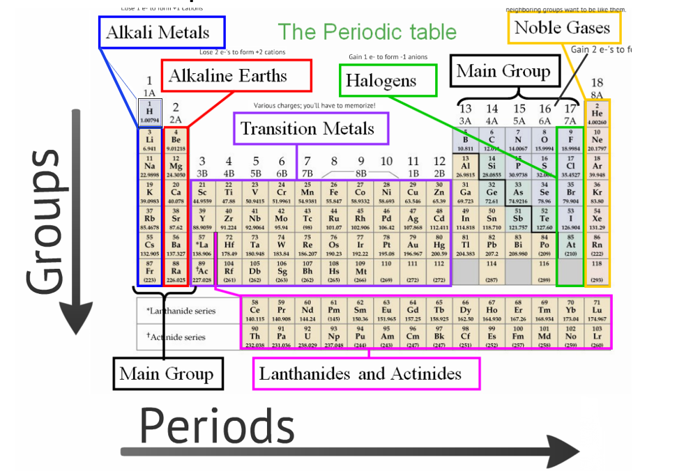

## Fundamental Observations

* Antoine Lavoisier (in 1774) noticed that reactions in sealed containers conserved mass. That is to say, **the mass before the chemical change was equal to the mass after the change**.
  * The Law of Conservation of Mass
* Joseph Proust noticed that when different quantities of material reacted chemically, the ratio of masses of the reactants was equal to the ratio of masses of the products.
  * The Law of Constant Composition -- A chemical compound's components in terms of mass have a fixed ratio
    * Oxygen makes up 8/9 of water and hydrogen makes up the remaining 1/9

## The Law of Constant Composition

Suppose we have 10.0g of some gas, which can be decomposed into two constituent elements: element A and element B.

Suppose that the 10.0g of the compound decomposes into 4.67g of element A and 5.33g of element B. This means that there are 1.14 grams of element B for every 1 gram of element A. This ratio holds for any quantity of the compound gas.

In example, if we had 11.5g of the compound now, this would decompose into 5.37g of element A and 6.13g of element B.

## Dalton's Atomic Theory

* Each chemical element is composed of indivisible particles, _atoms_.
* Atoms of the same element have the same mass (among other properties). Atoms of different elements have different masses (among other properties).
* In compounds, atoms of different elements make up **whole number** ratios.
* Chemical reactions involve rearranging, separating, or combining atoms. We never create or destroy atoms.


## The Law of Multiple Proportions

This one is a bit different than constant composition.

It states that if we have 2 compounds who are composed of the same elements (lets say the compounds were composed of elements A and B), that the ratio of the ratio of A to B (or B to A) of one compound to the other is a whole number. That was a mouthful.

To put it into context, consider the previous compound where we had 1.14 grams of element B for every gram of element A. Then, let's say we have another compound is composed of 69.6% element B and 30.4% element A. The ratio of B to A is 2.28 in this scenario, which evenly divides into 1.14 for a ratio of ratios of 2, a whole number. This tells us that the latter compound has twice as many B atoms for every B atom in the former compound.

How can we explain this? One way we can explain this is that the molecules in the former compound are arranged as AB, and the latter compound is arranged as AB~2~.

And in fact, the values in the example actually correspond to the compound NO and NO~2~.

## Experiments and atom structure

Cathode Ray Tubes were an unlikely place for the next step of chemistry, but it helped us understand the structure of the atom better. JJ Thomson was able to deduce from his experiment involving CRTs the mass-to-charge ratio of the particles in the stream from the CRT. This value was $-5.69 \times 10^{-9}\text{ g/C}$. He was not able to independently determine the mass or charge though.

Robert Millikan on the other hand was able to determine the charge of an electron, measured to be $-1.60 \times 10^{-19}\text{ C}$. Now that we know the charge, we can find the mass via the ratio; this comes out to be $9.10 \times 10^{-31}\text{ kg}$.

These experiments marked the discovery of an electron. We found a subatomic particle, that exhibited the same properties (mass & charge) no matter what electron we sampled.

## So.. what's an atom look like?

We know electrons exist now, but how are they organized in an atom? Well, Thomson proposed the **Plum Pudding model**. This model is named like this, to depict that an atom mostly contains a diffuse positively charged "pudding" (or spread). In the pudding resides small negative charges (electrons), or the plums. Is this correct? Well only one way to find out..

Rutherford comes around and does this experiment where he takes alpha particles and shoots them at a thin sheet of gold foil. Then he figures out what the path of the particles is after impact with the foil.

The results of this experiment was the discovery of the nucleus. Like in biology, the nucleus refers to the center, in this case of the atom. This is an object with a positive charge that is more massive when compared to the alpha particles.

With these new findings in mind, we present the **Nuclear Model of the Atom**: where the positively charged, massive part of the atom (nucleus) resides at the center. The electrons in the atom exist somewhere outside of the nucleus.

To keep scale in mind, it's important to know that the atom itself is MUCH larger than the nucleus. Quantiatively, the nucleus is about 1/20,000th the size of the atom. This means the atom is mostly empty space! This makes sense, because that would explain why the alpha particles were going straight to the foil. Statistically, the nucleus makes up a small part of the atom, so only some were slightly deflected from the foil.

So, what exactly is the nucleus made up of? The nucleus is made up of two fundamental particles: **protons** and **neutrons**. Protons are positively charged, and they are about 2000 times more massive than an electron. Neutrons are neutral as their name implies, but their mass is the same as the proton. Nuclei can contain several protons and neutrons, and more importantly the nucleus composition tells us the _identity_ of the atom.


Information about the subatomic particles:

```{r echo=FALSE, message=FALSE, warnings=FALSE}

particles = c("Electron", "Proton", "Neutron")
charges = c("-1.6 $\\times$ 10^-19^ C", "+1.6 $\\times$ 10^-19^ C", "0 C")
masses = c("9.11 $\\times$ 10^-31^", "1.67 $\\times$ 10^-27^", "1.67 $\\times$ 10^-27^")
amus = c("~0", "1", "1")
df <- data.frame(Particles = particles, ElectricCharge = charges, Mass = masses, Amu = amus, stringsAsFactors = FALSE)
colnames(df) <- c("Particle", "Electric Charge", "Mass", "amu")
knitr::kable(df, escape = FALSE)
```

Important quantities:

* **Mass Number**: # protons + # neutrons
* **Atomic Number**: # of protons
* **Ionic Charge**: # of protons - # of electrons
* **Element Symbol**: (not a quantity, but directly determined by Atomic Number)

### Isotope Notation

A few examples:

* $^{23}_{11}\text{ Na}$ -- This is sodium (which can be uniquely identified by the atomic number), which has a mass number of 23, and a total of 11 protons. That means its atomic number is also 11, and using subtraction we can determine the number of neutrons is 12. Notice, that the number of neutrons can vary without changing the identity of the atom. In fact, if we hold the number of protons constant and vary the number of neutrons, we effectively can vary the mass of the atom without changing its identity; in other words, we can have **isotopes** of the same element (**isotopes** are atoms of the same element that have different masses). We can call this species an **atom** since it has a neutral charge (the number of electrons equals the number of protons, and we know this since no charge is denoted).
* $_{20}\text{ Ca}^{\text{2+}}$ -- This is calcium (which can be uniquely identified by the atomic number), which has 20 protons. That means its atomic number is also 20. We can also notice that this **ion** has a charge of positive 2. An **ion** is a particle which has a non-neutral charge (# of electrons does not equal # of protons). This means it is a **cation**, or an ion which has more protons than electron. Conversely, an ion with more electrons than protons is known as an **anion**.
* $^{19}_{9}\text{ F}^{\text{-}}$ -- This is **Fluorine-19** (notice how we specified the mass after the hyphen, this is a common way to refer to isotopes). It is an ion as it has a charge, and it has 9 protons and 10 neutrons. We can also determine that there are 10 electrons based on the negative charge.

## Periodic Table

It is important to know how the periodic table is laid out, so here's a convenient picture:



### Elements to know by name

Some of these elements' symbols don't exactly match up with their name, so listed below are a few of them to keep them in mind:

* **Na** -- Sodium
* **K** -- Potassium
* **Mn** -- Manganese
* **Fe** -- Iron
* **Cu** -- Copper
* **Ag** -- Silver
* **Sn** -- Tin
* **W** -- Tungsten
* **Au** -- Gold
* **Hg** -- Mercury
* **Pb** -- Lead

## Molecules?

In nature, very _few_ substances exist as just an individual atom. In standard conditions _only_ the noble gasses (that last group in the periodic table) can exist in monatomic, elemental form.

In most cases, we are dealing with substances that exist as **molecules** or **ions**.

So what are molecules? Molecules are **aggregates** of **two or more atoms** in a definite arrangement **held together by chemical forces called bonds**.

The definite arrangement explains the fixed ratios described by the Law of Constant Composition.

Some molecules consist of just two atoms, also known as **diatomic molecules**. Examples include hydrogen gas ($\text{H}_{2}$) and oxygen gas ($\text{O}_{2}$).

Others can contain more than 2, also known as **polyatomic molecules**. Examples include water ($\text{H}_{2}\text{O}$) and ammonia ($\text{NH}_{3}$).

## Ion Naming

For anions the suffix becomes **-ide**.

Some of these ion names just need to be memorized, especially the polyatomic ions..

The monatomic cations/anions are pretty straightforward.

Monatomic transition metal cations to know:

* $\text{Al}^{3+}$
* $\text{Zn}^{2+}$
* $\text{Ag}^{+}$

## Ionic Compounds

Ionic Compounds are electrically neutral, as they are composed of ionic bonds.

* Binary Ionic Compounds -- These will have one metal element with a single possible positive charge as the cation, and one non-metal element with a single possible negative charge as the anion.
* Metal cation with Polyatomic anion -- These will have one metal element with a single possible positive charge as the cation, and a polyatomic anion with a single possible minus charge as the anion (very similar to the binary ionic compound)

### Hydrates

Certain ionic compounds absorb water molecules into their formula structures, known as **hydrates**. In terms of naming, you just append "<prefix>hydrate" to the compound's name.

### Bonding

Types of bonding:

* Covalent bonding (molecular)
* Ionic bonding
* Metallic Bonding (not covered)


```{r echo=FALSE, message=FALSE, warnings=FALSE}
covalent_col = c("Electron Sharing", "Distinct Molecules", "Molecular Formula/Empirical Formula", "Nonmetal & Nonmetal")
ionic_col = c("Electron Transfer", "Crystal Lattice Structures", "Unit Formula", "Metal & Nonmetal")
df <- data.frame(covalent_col, ionic_col, stringsAsFactors = FALSE)
colnames(df) <- c("Covalent", "Ionic")
knitr::kable(df, escape = FALSE)
```

Formulas:

* The **molecular formula** is the actual number of atoms in a type of molecule.
* The **empirical formula** is the smallest whole number ratio of atoms.

## Chemical Formulas

_Distinctions between molecular and empirical formula_

Ethanediol (Ethylene Glycol) is a molecule that consists of 2 carbons, 6 hydrogens, and 2 oxygens.

Molecular formula (actual number of atoms):

$\text{C}_{2}\text{H}_{6}\text{O}_{2}$

Ethanediol empirical formula (smallest whole number ratio):

$\text{C}\text{H}_{3}\text{O}$

Methanol molecular formula:

$\text{C}\text{H}_{4}\text{O}$

Methanol empirical formula:

$\text{C}\text{H}_{4}\text{O}$

A **structural formula** shows the connections/bonds between atoms: depict atoms by their elemental symbol, and draw lines between them to denote the bonds.

A **condensed structural formula** is similar to a structural formula, but it depicts the structure without any lines as contiguous text ($\text{C}\text{H}_{2}\text{O}\text{H}\text{C}\text{H}_{2}\text{O}\text{H}$).

The **line angle formula** shows carbon groups. Each line's ends/angles represent a carbon, and the carbon's other bonds are hydrogen unless explicitly written out.

Dimethyl peroxide is $\text{C}_{2}\text{H}_{6}\text{O}_{2}$. Notice it is the same formula as ethanediol, but these are different molecules. If two molecules have the same molecular formula, but different structural formulas, then they are called **isomers**.

Ionic formulas must use **unit structure**. Consider a NaCl crystal. The crystal lattice might be composed of many sodium and chlorine atoms, but when we use unit structure we describe the atoms in their **smallest whole number ratio**.

## Covalent Compounds

Covalent compounds are always between a non-metal and a non-metal, and their bonds share electrons. In terms of naming, first element keeps its full name, and second element has an "ide" ending. You also use prefixes to denote the number. i.e. CO refers to carbon monoxide and $\text{CO}_{2}$ refers to carbon dioxide.

## Acids

Acids have a hydrogen atom as the first element. 3 categories:

* H with an elemental anion (HF is Hydrofluoric acid)
* H with a polyatomic "ate" anion ($\text{HNO}_{3}$ is nitric acid)
* H with a polyatomic "ite" anion ($\text{HNO}_{2}$ is nitrous acid)

## Introduction to Organic compounds


```{r echo=FALSE, message=FALSE, warnings=FALSE}
nums <- 0:4
nums[1] <- "?"
formula = c("$C_{n}H_{2n+2}$", "$CH_{4}$", "$C_{2}H_{6}$", "$C_{3}H_{8}$", "$C_{4}H_{10}$")
condensed = c("$C_{n}H_{2n+2}$", "$CH_{4}$", "$CH_{3}CH_{3}$", "$CH_{3}CH_{2}CH_{3}$", "$CH_{3}CH_{2}CH_{2}CH_{3}$")
prefix = c("Alk-", "Meth-", "Eth-", "Prop-", "But-")
name = c("Alkane", "Methane", "Ethane", "Propane", "Butane")
df <- data.frame(Nums = nums, Formula = formula, Condensed = condensed, Prefix = prefix, Name = name, stringsAsFactors = FALSE)
colnames(df) <- c("Number", "Formula", "Condensed Formula", "Prefix", "name")
knitr::kable(df, escape = FALSE)
```

### Organic Nomenclature -- Functional Groups

Three examples:

* Hydroxyl Group: -$OH$ alcohol
* Amine Group: -$NH_{2}$ amines
* Carboxyl Group: -$COOH$ carboxylic acid

Examples of the functional groups:

* $CH_{3}CH_{3}$ -- Ethane (Alkane, no functional group)
* $CH_{3}CH_{2}OH$ -- Ethanol (Hydroxyl group)
* $CH_{3}CH_{2}NH_{2}$ -- Ethylamine (Amine group)
* $CH_{3}COOH$ -- acetic acid (Carboxyl group)

## Atomic Mass

Atomic mass is **not** the mass number of an element.

* The mass number is simply the number of protons + number of neutrons, a whole number.
* The atomic mass is the average mass of the isotopes in their natural abundances for a given element
  * Isotopes can have various number of neutrons, which contribute to the mass
  * These masses can be fractions
  * Put simply, atomic mass is the weighted average of the masses of isotopes and their relative abundances

**Example**: Chlorine has two naturally occurring isotopes:

* $^{35}Cl$ 
* $^{37}Cl$

These mass numbers aren't exactly the mass:

* $^{35}Cl$ -- 34.97 amu
* $^{37}Cl$ -- 36.96 amu

We also need the relative abundances

* $^{35}Cl$ -- 75.78% abundance
* $^{37}Cl$ -- 24.22% abundance

To calculate the atomic mass, we take a weighted average with the abundances acting as the weights:

```{r}
weighted_cl35 <- 34.97 * 0.7578
weighted_cl37 <- 36.86 * 0.2422
weighted_cl35 + weighted_cl37
```

## Moles

**Mole**: $6.022 \times 10^{23}$ elementary units per mole (Avogadro's number: $N_{A}$)

Definition: 1 mole of $^{12} C$ atoms has a mass of 12 grams **exactly**. 

$1\text{ g} = 6.022 \times 10^{23}\text{ amu}$

1.27 grams of Carbon to moles?

$$
\frac{1.27\text{ g}}{} * \frac{1\text{ mol}}{12.011\text{ g}} = 0.106\text{ mol of Carbon}
$$

Moles to atoms?

$$
0.10573\text{ mol} * \frac{6.022 \times 10^{23}\text{ atoms}}{\text{mol}} = 6.37 \times 10^{22}\text{ atoms}
$$

## 5 skills of Mass Composition

1. Calculate molar mass of a substance from its formula
2. Convert between grams, moles, molecules, atoms
3. Determine percent composition by mass
4. Determine empirical formula from:
   a. Percent composition
   b. Combustion analysis data
5. Finding a molecular formula from an empirical formula and molar mass

### Example: Molar Mass of a substance

1. What is the molar mass of methanol ($CH_{3}OH$)?

```{r echo=FALSE, message=FALSE, warnings=FALSE}
element_symbols <- c("C", "H", "O")
atoms_quantities <- c(1, 4, 1)
atomic_masses <- c("12.011 g/mol", "1.00794 g/mol", "15.9994 g/mol")
mass_contribution <- c("12.011 g/mol", "4.03176 g/mol", "15.9994 g/mol")
df <- data.frame(element_symbols, atoms_quantities, atomic_masses, mass_contribution, stringsAsFactors = FALSE)
colnames(df) <- c("Elements", "Atoms", "Atomic Mass", "Mass contribution of each element")
knitr::kable(df, escape = FALSE)
```

Sum the mass contribution for each element: $32.04216\text{ g/mol}$. This is the atomic mass of methanol.

### Example: Conversions for mass

Sample of methanol has a mass of 79.18 g. How many atoms are in the sample?

* Total atoms
* Carbon atoms
* Hydrogen atoms

Let's convert from mass to moles. Notice that we have already calculated the molar mass in the previous example: $32.04216\text{ g/mol}$.

$$
\frac{79.18\text{ g}}{} * \frac{1\text{ mol}}{32.042\text{ g}} = 2.47\text{ mol of methanol} 
$$

Moles to molecules

$$
\frac{2.4711364\text{ mol}}{} * \frac{6.022 \times 10^{23}\text{ molecules}}{\text{ mol}} = 1.488 \times 10^{24}\text{ molecules}
$$

Atoms

$$
\frac{1.488 \times 10^{24}\text{ molecules}}{} * \frac{6\text{ atom}}{\text{molecule}} = 8.928 \times 10^{24}\text{ atoms} 
$$

Carbon atoms

$$
\frac{1.488 \times 10^{24}\text{ molecules}}{} * \frac{1\text{ C atom}}{\text{molecule}} = 1.488 \times 10^{24}\text{ atoms} 
$$

Can do the same for hydrogen

## Percent Composition for Chemical Formula

Divide each mass contribution for each element by the total molar mass. This gives you the percent composition.

```{r}
atomic_masses <- c(12.011, 4.03176, 15.9994)
total_mass <- sum(atomic_masses)
((atomic_masses) / total_mass) * 100
```

## Determine empirical formula from mass percent

For a certain compound, the mass percent is:


```{r echo=FALSE, message=FALSE, warnings=FALSE}
symbols <- c("C", "Cl", "H")
percent_mass <- c("24.27%", "71.65%", "4.07%")
df <- data.frame(symbols, percent_mass, stringsAsFactors = FALSE)
colnames(df) <- c("Element", "Percent Mass")
knitr::kable(df, escape = FALSE)
```

What is the empirical formula of this compound?

We can think of this question as:

* Assume a 100g sample, we have:
  * 24.27 g of C
  * 71.65 g of Cl
  * 4.07 g of H

Convert to moles, then divide by smallest value:

```{r}
masses <- c(24.27, 71.65, 4.07)
atomic_masses <- c(12.011, 35.4527, 1.00794)
# Moles conversion
moles <- masses / atomic_masses
# Get smallest value of mole for the empirical formula
smallest_value <- min(moles)
moles / smallest_value
round(moles / smallest_value)
```

### Determine empirical formula from mass percent (second example)

```{r echo=FALSE, message=FALSE, warnings=FALSE}
symbols <- c("Na", "Cr", "O")
percent_mass <- c("17.55%", "39.70%", "42.75%")
df <- data.frame(symbols, percent_mass, stringsAsFactors = FALSE)
colnames(df) <- c("Element", "Percent Mass")
knitr::kable(df, escape = FALSE)
```

```{r}
masses <- c(17.55, 39.70, 42.75)
atomic_masses <- c(22.99, 52.00, 16.00)
# Moles conversion
moles <- masses / atomic_masses
# Get smallest value of mole for the empirical formula
smallest_value <- min(moles)
moles / smallest_value
```

We can double these to get our whole number ratio

```{r}
masses <- c(17.55, 39.70, 42.75)
atomic_masses <- c(22.99, 52.00, 16.00)
# Moles conversion
moles <- masses / atomic_masses
# Get smallest value of mole for the empirical formula
smallest_value <- min(moles)
2 * (moles / smallest_value)
```

## Combustion Analysis

Combustion analysis of a C, H, and N compound.

A sample of 0.1156g yields 0.1638g $CO_{2}$ and 0.1676g $H_{2}O$.

1. Find moles of $CO_{2}$
2. Find moles of $C$
3. Find moles of $H_{2}O$
4. Find moles of $H$
5. Find mass of $C$
6. Find mass of $H$
7. Find mass of $N$
8. Find moles of $N$
9. Find smallest whole number ratio

```{r}
total_sample_mass <- 0.1156
carbondioxide_sample <- 0.1638
water_sample <- 0.1676

carbondioxide_molarmass <- 44.01
carbon_molarmass <- 12.011
water_molarmass <- 18.01
hydrogen_molarmass <- 1.00794
nitrogen_molarmass <- 14.00674

carbondioxide_moles <- carbondioxide_sample / carbondioxide_molarmass
carbon_moles <- carbondioxide_moles
carbon_mass <- carbon_moles * carbon_molarmass

water_moles <- water_sample / water_molarmass
# For every mole of H2O, there are 2 moles of H
hydrogen_moles <- 2 * water_moles
hydrogen_mass <- hydrogen_moles * hydrogen_molarmass

nitrogen_mass <- total_sample_mass - (carbon_mass + hydrogen_mass)
nitrogen_moles <- nitrogen_mass / nitrogen_molarmass

smallest <- min(carbon_moles, hydrogen_moles, nitrogen_moles)
result <- c(carbon_moles, hydrogen_moles, nitrogen_moles) / smallest
paste0("Carbon moles ", result[1])
paste0("Hydrogen moles ", result[2])
paste0("Nitrogen moles ", result[3])
```

So, our empirical formula is: $CH_{5}N$

## Molecular Formula from Empirical Formula and Molar Mass

Say we have this compound: $CH_{2}Cl$

With this molecular mass: 98.95 g/mol

1. Find molar mass of empirical formula

```{r}
carbon_mass <- 12.011
hydrogen_mass <- 1.00794
chlorine_mass <- 35.4527

molar_mass <- 1 * carbon_mass + 2 * hydrogen_mass + 1 * chlorine_mass
molar_mass
```

2. Divide molecular mass by molar mass of empirical formula

```{r}
round(98.95 / 49.47968)
```

3. This represents the scaling factor that we apply to the empirical formula. Apply scale to empirical formula.

```{r}
paste0("Carbon scaled up to ", 2 * 1)
paste0("Hydrogen scaled up to ", 2 * 2)
paste0("Chlorine scaled up to ", 2 * 1)
```

So, the molecular formula is $C_{2}H_{4}Cl_{2}$.

## 5 Skills of Quantifying Substances in Chemical Reactions

1. Writing and balancing chemical reactions
2. Stoichiometry (quantifying substances in chemical rxns)
3. Limiting reagents (reactants that bottleneck the reaction)
4. Excess reagents (reactants leftover due to the bottleneck)
5. Yields (actual yield / theoretical yield is the percent yield, where theoretical is actual if all of the excess could be used)

### 3 Parts to a chemical equation (expression)

$$
A + B \rightarrow C + D
$$

A and B are **reactants (reagents)** (everything on the left hand side of the arrow).

C and D are **products** (everything on the right hand side of the arrow).

Rxn arrow indicates that a chemical reaction takes place.

* $\rightarrow$ indicates forward rxn only (at least for this semester)
* bidirectional arrow indicates equilibrium rxn (not this semester)

Products appear on the right hand side, and represent the results of a rxn.

### Balancing experssions

A couple of heuristics:

1. Look for elements that only appear once on each side, and balance those first.
2. If an element appears by itself, balance last.

### Stoichiometry

1. Find moles of reactant, or the limiting reactant if there is one
2. Ensure that is it not in excess (otherwise, find the limiting reactant)
3. Use mole ratio to find the product
4. Can find mass using molar mass
