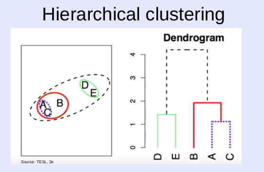
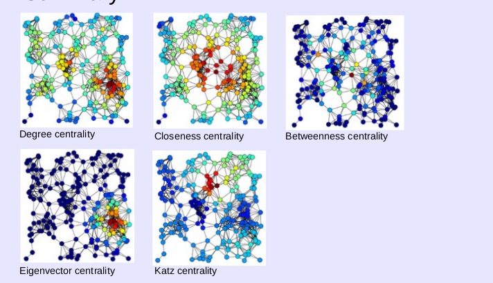

## Outline

> About 80% of the questions will be on materials covered after the midterm, and 20% on materials before the midterm.

Top level items (this document focuses on the boldened bullet points, midterm guide _should_ cover the other topics):

* Learning from data/components of learning: machine learning, data mining, and artificial intelligence.
* Random variables, measures of central tendency, and distributions.
* Linear regression: concepts, use, and interpretation.
* Classification: decision trees and random forests, confusion matrices, performance evaluation of classification.
* **Association rules**: Apriori algorithm,  mining frequent itemsets, mining rules and how to measure the performance of association rules.
* **Clustering**: Representative (k-means), hierarchical clustering density-based clustering, cluster evaluation techniques.
* **Principle component analysis**: interpretation and usage for dimension reduction and extracting insights.
* **Neural networks**: the perceptron model, feed forward neural networks, gradient descent, backpropagation.
* **Recommender systems**: content-based.
* **Social network analysis**: Characteristics of large graphs, centrality measures and their interpretation.

## Neural Networks (Gradient Descent and Backpropagation)

_See midterm guide for notes on perceptrons and feed-forward nets_

### Gradient Descent

The gradient vector in gradient descent describes the weight deltas needed to be applied to the weights. To be precise, the gradient vector is a column vector composed of values which describe the partial derivative of the cost function with respect to each of the weights. It is accompanied with a learning rate ($\eta$) typically (to scale up/down the gradient vector):

Find new weights by subtracting the scaled gradient vector:

$$
w \rightarrow w' = w -\eta \nabla C.
$$

### Backpropagation

See HW7 Part1.1, pretty decent review. Crude review:

* Goal: Find gradient vector
* To find weights that are immediately preceding the outputs (so not a hidden layer), just use chain rule. For example, to calculate $w_{4}$ in the homework:
  $$
\frac{\partial E}{\partial w_{4}} = \frac{\partial E}{\partial \sigma (z_{o})} * \frac{\partial \sigma (z_{o})}{\partial z_{o}} * \frac{\partial z_{o}}{\partial w_{4}}
  $$

  $$
\frac{\partial E}{\partial w_{4}} = (2 * (y - \hat{y}) * -1) * (\sigma (z_{o}) (1 - \sigma (z_{o}) )) * z_{o}
  $$

  $$
\frac{\partial E}{\partial w_{4}} = (2 * (0 - 0.998) * -1) * (0.998) (1 - 0.998) )) * 4
  $$

  $$
    \frac{\partial E}{\partial w_{4}} = 0.020
  $$
* To find weights in hidden layers, i.e. $w_{1}$ in the homework:

  $$
\frac{\partial E}{\partial w_{1}} = \frac{\partial E}{\partial \sigma (z_{o})} * \frac{\partial \sigma (z_{o})}{\partial z_{o}} * \frac{\partial z_{o}}{\partial \text{ReLU} ( z_{1})} * \frac{\partial \text{ReLU} (z_{1})}{\partial z_{1}} * \frac{\partial z_{1}}{\partial w_{1}}
  $$

  $$
\frac{\partial E}{\partial w_{1}} = (2 * (y - \hat{y}) * -1) * (\sigma (z_{o}) (1 - \sigma (z_{o}) )) * w_{4} * \text{ReLU}'(z_{1}) * x
  $$

  $$
\frac{\partial E}{\partial w_{1}} = (2 * (0 - 0.998) * -1) * (0.998) (1 - 0.998) )) * 0.5 * 1 * 4
  $$

  $$
\frac{\partial E}{\partial w_{1}} = 0.010
  $$

## Clustering

The big picture: Dividing data into meaningful groups

### K-means Clustering

Algorithm (parameters: $K$):

1. Select $K$ centroids

Loop:

2. Assign each point to its closest centroid
3. Recompute centroids
4. Break Loop if centroids did not change

Problem: Choosing any initial centroids can lead to bad results, choosing points in a natural cluster can lead to a good solution

### Bisecting K-means Clustering

Start with cluster containing all points, then split into two clusters. Select one of the clusters (the one with higher SSE) to split until you have $K$ clusters.

### Cluster analysis

* Want to maximimize distance between clusters, but minimize distance within clusters.
  * Within Cluster SS is the sum of squares of each point of a cluster to its centroid
  * Total SS is the sum of squares of each point in the data set to the global cluster mean
  * Between SS is (Total SS - the total within cluster SS)
    * Total within cluster SS is just the sum of all Within Cluster SS
  * Variance is the Between SS / Total SS
    * Higher the ratio, the more variance is explained by the clusters.

### Agglomerative Hierarchical Clustering

Algorithm:

1. Compute proximity matrix if necessary

Loop:

2. Merge the closest two clusters
3. Update proximity matrix to reflect the proximity between the new cluster and the others
4. Break if one cluster remains

How to define distance to find closest?

* **Single link "min"**, minimum distance between clusters
* **Complete link "max"**, maximum distance between clusters

### Density-based clustering

It is what it sounds like, clustering based on data point density. Parameters:

* A radius, $\varepsilon$ ("eps") or a neighborhood
* Number of neighbouring points (MinPts, defined by user)

A $\varepsilon$-neighborhood is a cluster with points all within $\varepsilon$ from the source. If the neighborhood contains at least MinPts other points, the source point is considered a high density area.

* Core point: synonymous to point that is high density
* Border point: a point that's not a core point, but in a core point's neighborhood
* Noise point: Neither border nor core

DBSCAN Algorithm:

1. Lable all points as Core, Border, or Noise
2. Eliminate Noise
3. Put edge between all core points that are within Eps of each other
4. Make each group of connected core points into its own cluster
5. Assign each border point to one of the clusters of its associated core points

### Cluster Validation

* **Internal**: Used to measure the goodness of a clustering structure without respect to external information.
  * SSE for example
  * Cohesion: how close are objects in the same cluster, measured by within cluster SSE
  * Separation: how well separated are the clusters
* **External**: Match cluster with external results (class labels)
* **Relative**: Used to compare two different clustering algorithms or clusters

**Silhouette value**: measures the degree of confidence in the clustering assignment of a particular observation, with well-clustered observations having values near 1 and poorly clustered observations having values near -1. See slides for actual formula.

**Dunn index** is the ratio of the smallest distance between observations not in the same cluster to the largest intra-cluster distance. This should be maximized.

## Association Rule Mining

The big picture: observing which items _co-occur_ across transactions.

Example of an **_association rule_**:

{Beer, Bread} -> {Milk}

That is to say, beer and bread co-occur with milk.

Question: What our are requirements to form strong association rules? What are the quantitative thresholds to determine which rules should present, and which should not?

### Transaction Databases

Transactions can be represented in various database formats:

* Binary database: Transactions each contain an itemset, where any the presence of an item of the itemset is denoted as 1 or 0 (1 being present, 0 being not present)
* Transaction database: Transactions each contain an itemset, where present items are listed (any items not present are omitted).
* Vertical database: Items are listed as individual columns, with each column containing a set of transactions the item is present in.

### Association Rule Mining

Itemset measures and preliminaries:

* **Support** of an itemset is defined as the number of transactions which contain the itemset (as an (improper) subset)
* **Relative support** is the fraction of transactions that contain the itemset (containing over total)
  * Thus, this is a ratio/percentage
* $F^{(k)}$ denotes the set of $k$-itemsets, and $F$ denotes the set of all itemsets

The problem:

> Given a minimum support threshold (minsup) find all itemsets $X$, s.t. $sup(X) >= minsup$.

In other words:

1. Find the number of transactions ($n$) in which an itemset is present
2. Accept itemset if $n >= minsup$

Naive algorithm to mine all frequent itemsets incurs a runtime complexity of $O(2^{|I|} * |D| * |I|)$, where the exponential term is the number of candidate itemset subsets, and the remaining terms represent the support computation (must go through each itemset for each transaction).

See HW9 (Chapter 5 Exercise 9a) for an example of a **itemset lattice**, a hierarchical-like diagram which begins with the empty set $k = 0$, and branches to $k + 1$ if is considered a frequent itemset. Children which are omitted are considered "pruned".

The next step is to find _strong association rules_. Steps:

1. Find frequent itemsets -- this is what was shown above, use support threshold to filter out candidates. This is computationally expensive if you consider the power set of $I$, where $I$ represents all items.
2. Extract **high-confidence** rules from the frequent itemsets -- Similar process, but using a confidence value. This measure will be explained later.

### Apriori Approach

The Apriori Approach aims to optimize the frequent itemset generation step. As explained earlier, this step is (naively) computationally expensive. This is because we consider the power set. The optimization Apriori employs is based on whether subsets be prematurely filtered out. This property is demonstrated best in the itemset lattices. The Apriori principle says:

* If an itemset is frequent, its subsets (parents in the itemset lattice) must all be frequent.
* If an itemset is infrequent, its supersets (children) are infrequent (the optimization step, the pruning in the itemset lattice).

This reduces our search space, and reduces the runtime complexity. The theoretical complexity remains the same as bruteforce (as all itemsets may be frequent), but in practice the runtime is lower due to the pruning that occurs.

### Strong Association Rules

A rule is considered strong if its confidence ($conf$) is greater than or equal to the minimum confidence ($minconf$), where $minconf$ is a user-specified threshold.

What is confidence? Confidence states something about an association rule $X \rightarrow Y$. Namely, it tells the ratio of the number of transactions (support) of the union of $X$ and $Y$ to the support of just $X$:

$$
conf(X \rightarrow Y) = \frac{sup(X \cup Y)}{sup(X)}
$$

What does this value practically tell us? It tells us how often $X$ and $Y$ coexist in transactions when compared to transactions where only $X$ is present. In other words, a high confidence means that the number of transactions where $X$ and $Y$ appear is close to the number of transactions where only $X$ appears.

Confidence is neat, so how do we generate association rules using this measure? First, consider the frequent itemsets that were generated. Choose an arbitrary itemset as the antecedent (the $X$ in the association rule), and choose $Y$ as the missing elements (only choose elements which appear in the frequent itemsets for $Y$).

From there, calculate the rule's confidence, and if it's less than the minconf, reject the rule (it is not strong). Thus, if the rule is considered as weak, any subsets of the antecedent can also be removed from the frequent itemsets search space (the support of subsets will only be greater, which means a lower confidence).

### Implications of Thresholds

* If $minsup$ too high, interesting low-support items may be missed.
* If $minsup$ too low, too much information..
* High-confidence can be misleading, the consequent's support might be ignored

### Lift

Lift is a metric which accounts for the consequent, it is defined as:

$$
lift(X \rightarrow Y) = \frac{conf(X \rightarrow Y)}{rsup(Y)}
$$

A lift close to 1 means the support of the rule is expected. We seek for values 1 (above expectation) or much lower than 1 (below expectation).

## Recommender Systems

The goal behind recommender systems

* Consider the set of customers $X$
* Consider the set of items $S$
* Can we assign ratings for each ($X$, $S$) pair (Cartesian product between customers and items)? In other words, can we assign a rating for each movie/item for each customer?
  * As a rating $R$ can be assigned for each customer-item pair, a **utility matrix** can be formed, where the columns represent items, and the rows represent customers. The values are the ratings.

Question: How to populate the utility matrix?

* Ask people to rate themselves? (Turns out this doesn't work well)
* Learn from user actions

Goal: Can we recommend something you haven't watched that you will probably like?

### Problems and Approaches

Problems:

* The matrix is sparse
  * People don't watch everything
  * Even when they do decide to watch something, they often won't rate it themselves
* New customers = blank slate
  * A new customer in the utility matrix is an empty row

Approaches:

* Content-based (the focus of the final)
  * Recommend movies similar to those the customer watched
* Collaborative
  * Person A has similar taste to Person B, recommend a movie Person B watched to Person A?
* Hybrid

### Content-based

Need to build two profiles:

* User profile
* Item profile

### Item Profiles

First, start with the item profile. What defines a movie? How can we say two movies are similar? A profile defines a set of features which we can use to do this comparison.

* For example, in movies, these features can be considered: director, actors, length, genre

How can we determine if a movie exhibits a feature? A text mining heuristic can be considered, such as TF-IDF (Term Frequency * Inverse Document Frequency).

Term frequency (simply the ratio of occurrences of the term over the total terms in the document):

$$
TF_{ij} = \frac{f_{ij}}{max_{k} f_{kj}}
$$

Where:

* $max_{k} f_{kj}$ represents the number of terms in the document $j$
* $f_{ij}$ is the frequency of a term (crudely, a feature) in the document (text container) $j$
* $n_{i}$ is the number of documents which mention $i$
* $N$ is total number of documents
* Inverse Document Frequency: $IDF_{i} = \log \frac{N}{n_{i}}$
  * Normalizes common terms like articles, pronouns, etc.

The TF-IDF score is the product of the term frequency and the inverse document frequency:

$$
w_{ij} = TF_{ij} \times IDF_{i}
$$

A document's profile is then a set of words with the highest TF-IDF scores, with the scores listed in the profile.

### User Profiles

Using item profiles, user profiles can be built. Consider a user has rated items which have profiles $i_{1}...i_{n}$. A simple (weighted) average of the set of item profiles can be taken to construct the user profile.

1. Normalize user ratings by subtracting rating by user's mean of a particular feature
2. Take average of normalized ratings

Then, the resulting user profile vector can be compared to item profiles. Similar profiles are good. How to check for similarity though?

* **Cosine similarity**: Where $x$ is the user profile and $i$ is the item profile:
  $$
  U(x, i) = cos(\theta) = \frac{(x \cdot i)}{(|x| |i|)}
  $$
    * 1 mean similar, 0 or -1 means not similar (in the unit circle, cosine is 1 when angle is small).

### Review: Content-Based Recommendations

Pros:

* Don't need data from other users
* Can recommend items that are unpopular/new
* Can explain why certain items were recommended

Cons:

* Feature set can be hard to determine
* Bubble effect
  * Might just recommend stuff that is within the user's bubble, doesn't allow for diverse content recommendations
* New customer = blank slate
  * Users have to start off with an average profile

## Principle Component Analysis

The big picture: Reduce dimensions (decomplexify feature space) without loss of information

* PCA is a dimensionality reduction technique
  * It is a transformation which results in a smaller number of components that maximizes the variation of the original data set, but in low dimension space

The idea is to choose dimensions which maximize variance. i.e. the example in the slideshow demonstrates a reduction from 3D to 2D, because the z dimension does not show any variance.

An example:

* Dataset of multiple physical traits of people
  * Height, weight, arm length, leg length, hair color, waist circumference, hip circumference, chest circumference

The _principal_ components could conceivably be:

* Size
* Gender

Question: Which components are contributing the most variance?

See propotion of variance contributed by each principal component:

$$
\frac{PC_{i}}{\text{total variation}}
$$

Where the total variation is the sum of the eigenvalues. We can find the variance explained by a principal component by finding its eigenvalue.

### Summary

* PCA can be used as a dimensionality reduction technique
  * A subset of the principal components may explain a high variance, which means the other attributes can be filtered out.
  * Observations much be transformed from natural represntation to PC scores before attempting to use in a model

## Social Network Analysis

> Characteristics of large graphs, centrality measures and their interpretation.

### Power Law in Networks

**Scale-free networks** are networks whose degree distribution follows the power law

In contrast to lattice networks who have very similar number of degrees across nodes, scale-free networks have varying degrees (look up the distribution of a scale-free network's degrees: **very many nodes with only a few links, and a few hubs with large number of links**).

### Graph-theoretic Measures

* **Eccentricity** is the maximum distance between two arbitrary nodes
* **Diameter** is the maximum eccentricity of the entire graph
* **Radius** is the minimum eccentricity of the entire graph
  * Consider $v$ a central point if its eccentricity is the radius

These measures are compute-intensive

### Centrality Measures

**Normalized degree centrality**:

$$
C^{*}_{D}(v) = \frac{1}{n - 1} * C_{D}(v)
$$

Where:

* $C_{D}(v) = \text{deg}(v)$, the **degree centrality**
  * Where deg is the degrees of the vertex
* $n$ is the number of nodes

Pros: Easy to compute and interpret

Cons: Just counts nearest neighbors, not sophisticated

* Disregards importance of connections, the quality of connections is not considered

**Closeness centrality**:

$$
C_{C}(v) = \frac{1}{\sum_{j} d(v, j)}
$$

Where:

* $d(v, j)$ is the shortest path from $v$ to $j$

Normalized version: $C^{*}_{c}(v) = (n - 1) * C_{C}(v)$

Where

* $n$ is the number of nodes

This tells us that a node with high closeness can **quickly interact with others (does not have to hop much)**.

**Betweenness centrality**:

Finds nodes which act as bridges/connect social circles.

$$
C_{B}(v) = \sum_{s \neq t \neq v} \frac{\sigma_{st}(v)}{\sigma_{st}}
$$

Where:

* $\sigma_{st}(v)$ repesent the number of shortest paths from $s$ to $t$ that must go through $v$
* $\sigma_{st}$ repesent the number of shortest paths from $s$ to $t$

To normalize, divide by the maximum possible relevant paths, aka $2 * ((n - 1) \text{choose} 2)$ (the factor of two only applies for undirected graphs, since you can consider point S to point T and point T to point S in an undirected graph).

**Eigenvector centrality** considers the _importance/quality_ of neighbors. It has a neat recursive definition, and a parameter $\lambda$ which is a fixed constant.

**Katz centrality** penalizes based on higher distances. Namely, it has an attenuation parameter $\beta$, which penalizes nodes which are further.

