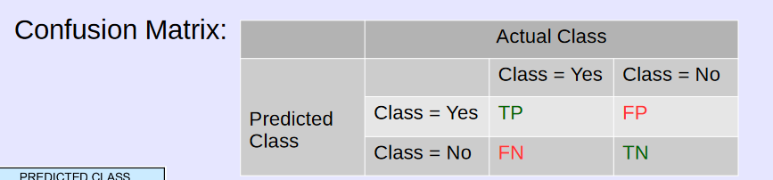

## Introduction

> Know what data mining is and what is its relation to AI, etc.

Data mining is the process of extracting patterns and insights from a data set. The algorithms used in data mining are an essential part in AI.

> Know how AI and machine learning differ from traditional computer science

Traditional computer science focuses on a program, and is often deterministic in nature. A program encodes a set of rules to apply on some input data. AI and machine learning are different in that data is the most important component, not the program. Errors are part of the landscape, and determinism is not the case.

> Know why generalization is important

Generalization is important because it is the concept of predicting an outcome based on unseen, real-world data. In data mining, models can be built upon training data to predict on unseen data. Simply "seeing" all of the data is not practical, and generalization is how we deal with "combinatorial explosion".

## Random variables, measures of central tendency, and distributions

> Know what a r.v. is and how we measure central tendencies

> Know what makes a central tendency robust

> Study the distributions and know their impact when given a vector

A random variable is a variable whose values are chosen based on the outcome of some random phenomenon

* Tossing a coin
* Tossing a die

Distribution functions of interest:

* **PDF (probability distribution function)**: This is a function that shows the probability of each value of the continuous random variable. The discrete counterpart to this is the PMF, or the probability mass function.
* **CDF (cumulative distribution function)**: This is a function that shows the _cumulative_ probability of some random variable (being cumulative, the curve increases up to 1).

Quick run down of central tendencies:

* **Mean**: The average. Problem with mean is if you have extreme outliers, the mean gets skewed quite a bit from it (thus, the mean is _not a robust_ measure of central tredency)
* **Trimmed Mean**: This addresses the non-robustness of the mean, by trimming out extreme values
* **Expected Value**: Kinda like the mean but weighted by probability (the expected value of some random variable is determined by the probability distribution function)
* **Median**: The median is the middle, and it is robust. An extreme value doesn't affect the relative order of everything else, it just goes at one of the extreme ends, so the median is robust. Plus, in contrast to the mean, the median has to be a value that the R.V. has, whereas the mean does not have to be.
* **Mode**: The mode is the most frequent value (or the value at which the PMF attains its maximum value), though this may not be a useful measure of central tendency (what _central_ tendency is it measuring).

Now for the measures of dispersion:

* **Variance and Standard Deviation**: This is a measure of how many values of the random variable deviate from the expected value of the random variable
  $$
  var(X) = \sigma^{2} = \frac{1}{n - 1} \sum_{i=1}^{n} (x_{i} - \hat{\mu})^{2}
  $$

Different distributions of interest:

* **Normal/Gaussian**: Parameterized by the mean $\mu$ and the standard deviation $\sigma$. $\text{mean} = \text{median} = \text{mode}$.
* **Binomial Distribution**: Parameterized by $n$ trials and $p$ (probability of success in each trial)
  * Mean: $np$
  * Median: $\lfloor np \rfloor$ or $\lceil np \rceil$
  * Variance: $np(1-p)$
* **Poisson distribution**: Expresses the probability of a given number events $k$ occurring in a fixed interval of time if these events occur with a known constant mean rate $\lambda$ and independently of the time since the last event.
  * Mean: $\lambda$
  * Median: $\lambda - \ln 2 \leq \nu < \lambda + \frac{1}{3}$
  * Variance: $\lambda$

> Understand multivariate central tendencies, including CDF, variance, etc.

A bivariate can be geometrically envisioned as two column vectors. The variance of the bivariate can be calculated by finding the sum of the individual variances of the column vectors. There are also some other measures of central tendencies for multivariates:

* **Covariance**:
  * The measure of association or linear dependence between two variables, $X_{1}$ and $X_{2}$.
  * $$
  cov(X_{1}, X_{2}) = \frac{1}{n - 1} \sum_{i = 1}^{n} (x_{i1} - \hat{\mu_{1}}) (x_{i2} - \hat{\mu_{2}})
  $$
  * The covariance information between $n$ attributes can be condensed into an $n \times n$ **covariance matrix**. The diagonal has the individual variances of the attributes, and a value at row $x$ and column $y$ is the covariance between attribute $x$ and $y$. i.e. for 2 attributes, we can summarize the covariances in the following 2x2 matrix:
    $$
\begin{matrix}
\hat{\sigma_{1}}^{2} & \hat{\sigma_{12}}^{2} \\
\hat{\sigma_{12}}^{2} & \hat{\sigma_{2}}^{2}
\end{matrix}
    $$
  * Thus, the covariance matrix is square ($n \times n$), symmetrical (the covariance between x and y and y and x are the same..), with the attribute specific variances on the main diagonal. The **total variance** of the attributes is the **sum of the diagonal**, sometimes called the **trace**.
* **Correlation**: Similar to covariance is correlation. The difference? Correlation between two variables $X_{1}$ and $X_{2}$ is the _standardized covariance_ obtained by normalizing the covariance with the standard deviation of each variable: $\hat{\rho_{12}} = \frac{\hat{\sigma_{12}}}{\hat{\sigma_{1}}\hat{\sigma_{2}}}$

Why have both covariance and correlation though?

* Covariance is between $- \infty$ and $\infty$
* Correlation is dimensionless, and it is between -1 and 1.

## Linear regression

> Understand the theoretic underpinnings of regression, the geometric interpretation of regression and how to use the regression equation for prediction

**Linear Regression**: A statistical process to estimate the relationship among variables:

* The response variable, or the dependent variable
* The predictor(s) variable(s), or the independent variables

What is linear regression used for? **Predicting** and **forecasting** are some of the uses of linear regression, as a linear model can be used to predict the fitted values of data that has not been seen yet.

The simple linear regression equation is given by:

$$
Y \approx \beta_{0} + \beta_{1} X
$$

The betas are known as _weights_ (or _parameters_/_coefficients_). A dataset is used to help produce this weights, such that $Y$ can be predicted for values of $X$. As these betas are estimates, error between the actual value (what the dataset says the value should be) and the fitted value (what the model says the value would be) is expected. This error is known as the **residual**, and is formally defined as: $\varepsilon_{i} = y_{i} - \hat{y_{i}}$.

The goal intuitively would be to minimize these residuals. $RSS$, or the residual sum of squares (it is what it sounds like), is the metric that will be optimized. The optimization problem in other words is to minimize the residual sum of squares (least squares estimation technique).

Those weights can be determined analytically via calculus. Once the weights are determined, the linear regression equation can be used to find fitted values, or the predictions.

> Understand how to evaluate a regression model using concepts such as residual analysis, $R^{2}$, etc.

Residual analysis is a tool used to see how **well a model fits the data**.

The following properties of the residuals indicate a good model:

* Residuals should be **homosceadastic**, that is to say the variance of the residual should not vary too much between low and high values of the fitted values.
* The residuals are centered on 0
* The residuals are normally distributed
* The residuals are not correlated to each other

> Understand how we determine how good a regression model is using the four questions we studied for evaluating the fit of the regression model

1. Is at least one of the predictors useful in predicting the response?
   * A high F-statistic (> 1) tells us that at least one of the predictors is useful
2. Do all the predictors help explain the response, or is only a subset of predictors useful?
   * Low p-values ($\alpha = 0.05$ typically) mean that there is some relationship between the predictor and the dependent variable
   * The goal here is _feature selection_, which is a hard problem.
     * Forward selection: Start with no predictors, and add
     * Backward selection: Start with all predictors, and remove (i.e. the ones with the highest p-values)
3. How well does the model fit the data?
   * RSE, $R^{2}$, and RMSE are good statistics for determining whether the model is a good fit
     * $RSE$ is the residual standard error, $RMSE$ is the root mean square error. A low error value corresponds to a good model fit
     * $R^{2}$ is the coefficient of determination. A high value (close to 1) is an indicator of a good model
4. Given a set of predictor values (the $\beta$'s), what response value should we predict and how accurate is our prediction?
   * To understand the accuracy of our predictions, **confidence intervals** are of importance. A confidence interval represents the range of results that would be expected to contain the population parameter of interest. The significance level $\alpha$ is the probability of making the wrong decision given that the null hypothesis is true. The confidence level intuitively is $1 - \alpha$, which represents the probability that if an experiment was repreated several times, the results would be the same. A higher confidence level means a higher range, since we are more confident if we have more values to choose from.

## Components of learning:

> Understand the theory behind how we induce learning (unknown target function, hypothesis set, learning algorithms, etc.)

Principal idea is to induce an approximate function from the hypothesis set which is approximately equal to the unknown target function via a learning algorithm which takes in training examples

> Know the difference between supervised, unsupervised, and reinforcement learning

* **Supervised Learning**: Algorithm takes in input and output pairs
* **Unsupervised Learning**: Algorithm only takes it inputs, and tries to find structure (think of clustering)
* **Reinforcement Learning**: Algorithm considers actions that maximize reward or minimize punishment

> Understand what is the curse of dimensionality and be able to explain it

The curse of dimensionality refers to when data has **too many features**. Why is this a problem?

* Too many features might result in **overfitting**.
  * Dimensionality reduction can help combat overfitting
* The available data becomes sparse as dimensionality increases

> Understand basic data types used in R and concepts such as binarization and discretization

R data types:

* Numeric
* Integer (in contrast to numeric, no decimals)
* Factor (enumeration type, categorical)
  * Ordinal: order matters
  * Nominal: order doesn't matter
* Character (char type or string)

Data transformations:

* **Binarization**: Conversion of a vector into binary attributes
* **Discretization**: Mapping values to discrete categorical values

## Decision trees

> Understand how decision trees are induced, including concepts such as "pure nodes", information gain, entropy, Gini index, etc. are used to create a decision tree.

Decision trees are classifiers which involve a path of decisions in a tree. The decisions are partitioning the different features of the data. The question is, how to choose the best partitioning scheme for the data?

* **Purity**: Defined as the fraction of observations belonging to a particular class in a node
  * A node that contains data which all belong to the same response class is completely pure. A pure node minimizes entropy.
* **Entropy**: Measures purity. The amount of uncertainty involved in the value of a random variable, or the measure of disorder in a system.
  * $-\sum_{i=0}^{c-1} P(Y = y_{i}) \log_{2} P(Y = y_{i})$
    * Notice that if all data in a node belongs to a single class, the entropy is 0, and the purity is maximized.
* **Gini Index**: Another measure of purity
  * $1 - \sum_{i=0}^{c-1} p_{i}^{2}$
    * Notice that if all data in a node belongs to a single class, the gini index is 0, and the purity is maximized.
* **Information Gain (IG)**: $IG = E_{i} - E_{f}$
  * Information gain is the difference between the entropy before the split and the entropy after the split
    * If the entropy reduces after a split, the node becomes more pure, or there is information gain since $E_{i} > E_{f}$.
    * The best split can be found by maximizing the information gain.

> Know how to evaluate a decision tree through confusion matrices and ROC curves

The **confusion matrix** is a widely used measure to _evaluate the performance of a model_.

Can evaluate different statistics like true positive rate (sensitivity) and true negative rate (specificity).

The **ROC (Receiver Operating Characteristics) curve)** is also a good option. ROC curve plots TPR against FPR. A higher area under the curve is generally an indicator of good performance of the model.

The focus is on the **predictive capability** of the model, not other factors like training time.

> Understand how model selection and model checking work through cross validation, etc.

Model Checking -- If we divide a dataset into a training set and test set, this could result in test points which are not representative of the population. How do we combat this?

Model Selection -- Tradeoff between complexity 

* **Cross validation** -- Create and evaluate multiple models on multiple subsets of the data
  * The point of these holdout methods is to find a stopping point with respect to the error
    * Balance between underfitting and overfitting

> Understand concepts such as overfitting, underfitting, bias variance decomposition, class imbalance and how to potentially deal with it, how to prune trees, why we need to prune trees, etc.

Overfitting is when the model is fit too much to the training data set, such that it does not predict well on real world data. Underfitting is the opposite, where the model is not trained eugh to predict on real world data.

Pruning is used to mitigate overfitting. Nodes can be trimmed in a bottom-up fashion. There are two approaches:

* **Prepruning**: Halt growith based on some constraint. When to stop though?
* **Post-pruning**: Grow tree to maximum, then trim. Wastes cycles building the entire tree just to cut some nodes off though.

Class imbalance is the norm, not the exception. Correctly classifying the minority class has greater value than correctly classifying the majority class. Imbalanced classes though present a number of problems to classificaiton algorithms:

* Accuracy is no longer a reasonable measurement
* Balanced accuracy is a _better_ measurement

> Understand what are ensemble methods and how Random Forest works.

The idea behind ensemble methods is to **create multiple classifiers and combine them**.

When are these ensemble methods better than their normal counterparts? The individual classifiers of ensemble methods should demonstrate some _instability_, that is to say their predictions should be independent.

## Perceptrons and Neural Networks

> Know the strengths and limitations of a perceptron (and neural networks)

Perceptrons are linear classifiers:

* **Strengths**: Binary classification, can be extended for multi-class problems
* **Limitations**: Can't recognize an XOR function 

> Know how a perceptron (and neural networks) performs computations using the weights and inputs

Perceptron has:

* Set of weights ($w_{1}, w_{2}, ..., w_{n}$)
* A bias $b$
* Perceptron turns on if $w_{1} x_{1} + w_{2} x_{2} + ... + w_{n} x_{n} + b > 0$
  * Represent "off" and "on" using an activation function

> Know how a perceptron makes a prediction

$\text{sign}(w^{T} * x)$

> Understand the concept of an activation function in neural neworks

> Understand the concept of a "deep neural network" (layers)

Layers are needed if the data must be separated using a non-linear boundary.

> Understand how a neural network makes a prediction

> Understand backpropagation (forward pass), including how to compute the output of a neural network

For a neuron $h$, the network input to the neuron is:

$$
z_{h} = w^{T} x = \sum_{i=1}^{n} = w_{1} x_{1} + ... + w_{n} x_{n}
$$

The output is simply

$$
\sigma (z_{h})
$$

Where $\sigma$ is the activation function (i.e. sigmoid)

The first layer's output are just the predictor inputs.

Calculating average error:

$$
\frac{1}{n} * \sum_{i=1}^{n} (\hat{y_{1}} - y_{1})^{2}
$$

How to reduce error?

* Using chain rule from calculus, derive **gradient** vector
* Gradient will be the error function with respect to each function
* Can use gradients to find local/absolute minima of the loss function
