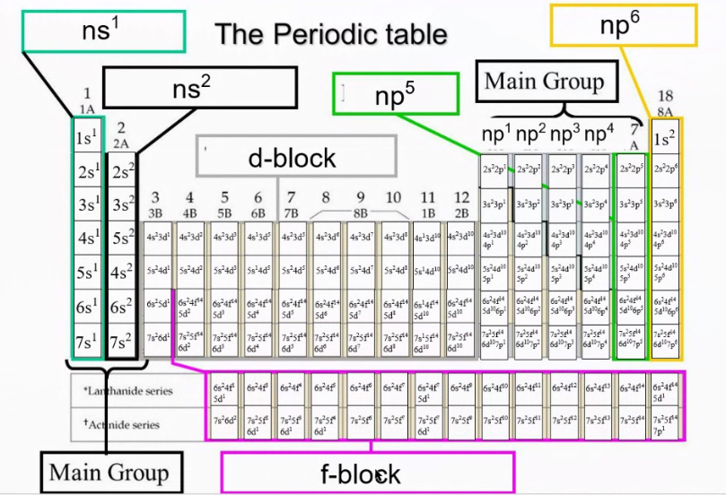
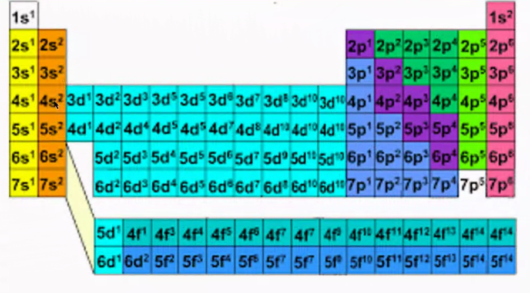
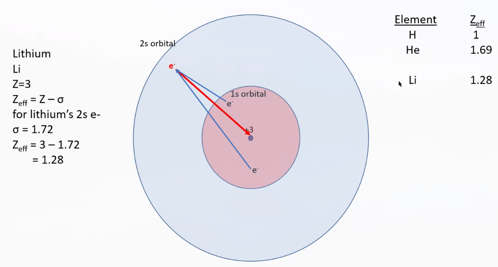
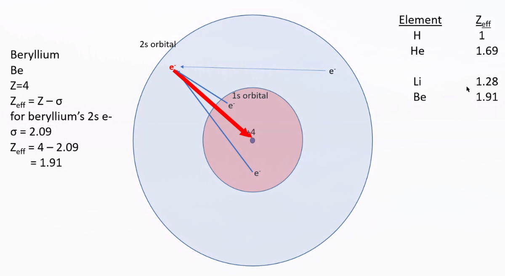
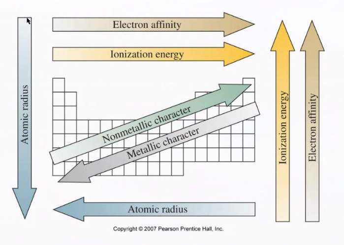
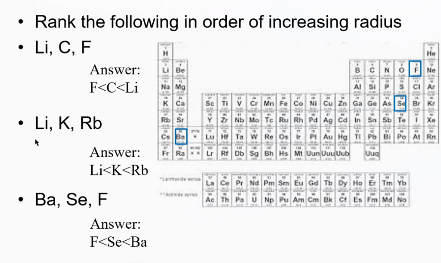
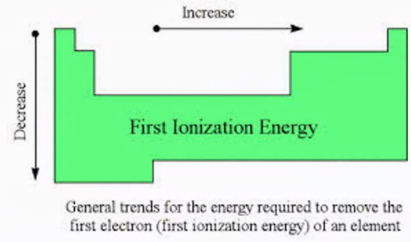
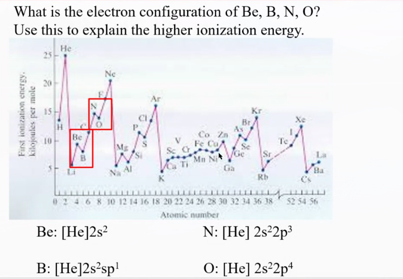

## Periodic Trends

Trends to consider:

- **Atomic Radius** -- How big are the atoms of the different species?
- **Ionic Radius** -- How big are different ions? Relative to different species, charges of the same type?
- **Ionization Energy** -- How much energy does it take to get an electron away from an atom?
- Electron Affinity
- Electronegativity

## Periodic Table Layout

Groups related to electron configuration:

## Explanation of Trends

Explaining the vertical:

- $n$, the principle quantum number, increases as we move **down** the periodic table.
- As $n$ in increases, the size of the outer-most shell increases with it
  - As such, valence electrons move further away from nucleus
  - Thus, the nucleus's grasp on the valence electrons get weaker (further away)
  - These properties affect the trends mentioned above

Explaining the horizontal:

- $Z_{eff}$ is effective nuclear charge
  - Describes nuclear charge with respect to shielding effects
  - Hydrogen has a +1 charge
    - Its nuclear charge, $Z$, is +1.
    - Its effective nuclear charge, $Z_{eff}$, is the same then, as there are no shielding effects
  - $Z_{eff} = Z - \sigma$
    - $\sigma$ represents the shielding constant (so effective nuclear charge respects this value)
    - Consider Lithium and Beryllium (see image below)
      - Two electrons may interfere with how strong the Coloumbic force of the nucleus (due to the repelleing effects of the electrons)
  - **Increases** as we go **left to right** on the periodic table
    - This can explain a few things
    - Atomic radius will increase right to left since a tighter grasp on the electrons means a smaller radius
    - Ionization Energy has inverse trend of Atomic Radius: because as the shielding effect gets stronger, need more energy to break that attraction

## Trend Chart

## Example Questions

Simple trend identification:

For that last question, we can see that Oxygen must have greater atomic radius than Fluorine (as it is to the left), and that Selenium has greater atomic radius than Oxygen (as it is down).

Questions such as O, Al, Ge are undeterminable since it is not on a diagonal.

## Ionic Radius

- Cations are smaller than their parent atom
  - Must remove electrons, creates weaker shielding effect, stronger attraction, decreases atomic radius
- Anions are bigger than their parent atom
  - Must add electrons, creates stronger shielding effect, weaker attraction, increases atomic radius

## Isoelectronic ions

Isoelectronic ions simply mean that the set of ions contain the same number of ions.

- i.e. the following series all have 18 electrons: $S^{-2}, Cl^{-}, Ar, K^{+}, Ca^{+2}$

Draw an arrow from the smallest to largest species in the following isoelectronic series.

- The protons determine the ordering here
- Ionic radius is greatest for the **lowest** number of protons, so in the above series it would be the sulfur minus two ion.
  - Simply because the attraction is weaker so the radius increases.

## First Ionization Energy

**Definition:** Minimum energy to remove an electron from its ground state

First ionization energy:

$$
Ne_{(g)} \rightarrow Ne_{(g)}^{+} + e^{-}
$$

Second ionization energy:

$$
Ne_{(g)}^{+} \rightarrow Ne_{(g)}^{2+} + e^{-}
$$

Big idea: How much energy does it take to seperate the electron?

Exceptions:

The important two to remember:

- Boron IE less than Beryllum
- Oxygen IE less than Nitrogen
