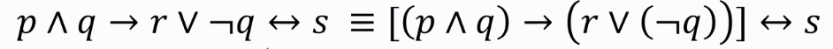

## Program Verification

Formally checking that a program is **correct**

- Gives the right answer
- Does not take too long
- Has the right effects
- Has the right security properties

Usually: that it meets a _specification_

## Testing is not enough

Sure, you could iteratively debug, but for programs which are more critical, testing is not enough:

- Software that runs in medical contexts
- Software that runs in planes

Even if your code covers...:

- Unexpected inputs
- Unexpected user behavior
- Concurrency problems (e.g., race conditions)
- Changes in code
- Changes in requirements

## Verification

### Not Perfect

- Difficult to get right, even for small programs
- Automated tools can help (but then you have to trust those..)
- Have to get the specification right as well

`sort` example, tempted to say the return value of a `sort` subroutine is just a sorted list, but that doesn't cut it:

- More correct: Permutation of input list in ascending order


Static types can be seen as a form of verification:

OCaml: `sort : int list -> int list`

- Weak form of verification for our sort function, only guarantees our output value is of the correct type, not necessarily the correct value

Coq: `sort : forall (l1 : list int), exists (l2: int list), Sorted l2 /\ Permutation l1 l2`


### Connection logical specs and formal semantics

Can think of logical specs as C assertions.

```{c, results = FALSE}
#include <assert.h>

void f(int x) {
    int y;
    if (x > 0) {
        y = x * 2;
    } else {
        y = x * - 2;
    }
    assert(y >= 0);
}
```

How do we know that this code does what it does?

- Semantics of the language
- C semantics does not necessarily match our expectation in this case:
  - Integer overflow..
  - Floating point adherence

_Formal specifications_ are mathematical descriptions of what the code does

## Programming?

- Will no thave to learn a new language
- Mostly theory, some proofs
    - Will have to express them formally so that they can be checked by a computer
    - Proofs _about_ programs: we will be using a small language
    - May have to write some small programs in this small language

## Logistics

- 40/15/15/30 grading split (homework, e1, e2, final)
- Curve applied at end of semester
- 2 Midterms not cumulative
- Final cumulative
- Some notes allowed
- 8 late days (24 hour pass, can only use 2 per any assignment)
  - Penalty is 10% without late days
- No work accepted more than 2 days late
- Collaboration:
  - Mutually working on homework to understand questions/strategies, but at the end of the day submit independently
  - Standard stuff

Help resources:

- Office hours (course/hw questions)
- Discord (general hw/logistic questions)
- Email (for personal matters/accomodations)
- ARC

## Syntax, Semantics, and Equality

Syntactic (program in written form) equality: ($\equiv$) _written_ the same (disregarding parens)

$2 + 2 - 3 \equiv 2 + 2 - 3 \equiv (2 + 2) - 3$

$2 + 2 - 3 \not\equiv 1$

$1 + 2 \not\equiv 2 + 1$

Semantic (what a program means) equality: (=) has the same meaning

$2 + 2 - 3 = (2 + 2) - 3 = 4 - 3 = 1$

$1 + 2 = 2 + 1$

## Propositional Logic

- Primitives: boolean variables
- Composite expressions: connectives learned in discrete math. Listed in precedence:
  - Negation (not)
  - Conjunction (and)
  - Disjunction (or)
  - Conditional (implies, one way)
  - Biconditional (iff/if any only if, both ways)

<span></span>

## Semantics of a proposition are their truth values in different states

- State $\sigma$: Assignment of truth values (T, F) to proposition values
- Written as: ${ P = T, Q = F}$
- Only one assignment per variable
- Only assign to variable
- A state fitting these requirements is _well formed_ (otherwise ill formed)

Conditionals:

Consider: if a then b

- Inverse: if not a then not b
- Converse: if b then a
- Contrapositive: if not b then not a


To determine truth value, a state must be _proper_: that it is defines truth values for **all variables in the proposition**


A proposition can be a _tautology_, _contradiction_, or _contingency_:

- These are properties of the proposition: so state independent
- Tautology: For all $\sigma$ proposition is satisfied
- Contradiction: For all $\sigma$ proposition is not satisfied
- Contingency: Neither a tautology or a contradiction (some states satisfy, others don't)
