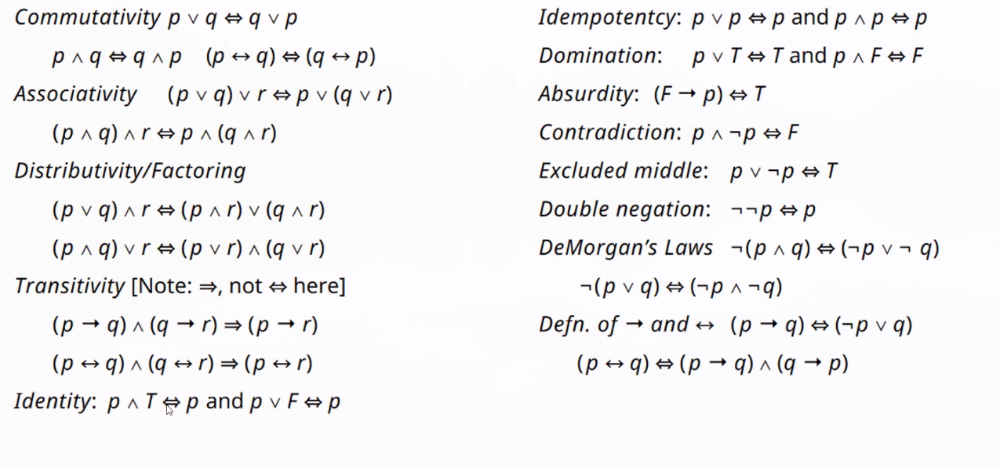
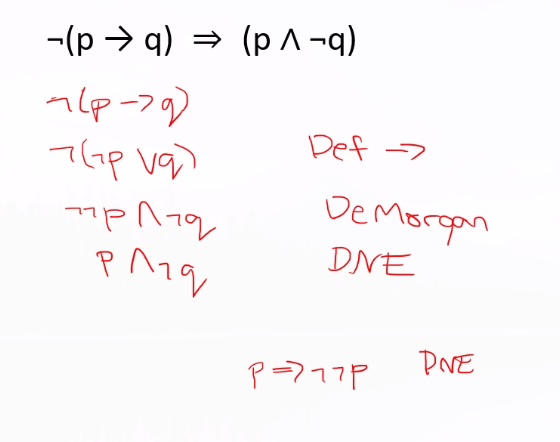
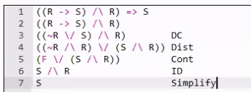
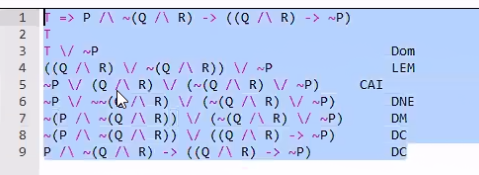

Logical implication: $\Rightarrow$:

- NOT used in propositions, used to _talk about_ propositions
- $p \Rightarrow q$ means that if $p$ is true, $q$ is true
  - Not the same as $p \rightarrow q$
- $\Leftrightarrow$ means $p \Rightarrow q$ and $q \Rightarrow p$, describes semantic equivalence

Example proof:

Modus Ponens proof:

Can prove tautology by proving $T \Rightarrow expr$...:

## Predicate (First-Order) Logic

- Predicates are functions of variables which evaluate to T or F
- Extends propositional logic

Quantifiers can also introduce variables (for all/there exists).

DeMorgan's law for quantifiers:

- "There does not exist" means "For any you can think of, it is not"
- "Not for all.." means "There exists a case where not"
